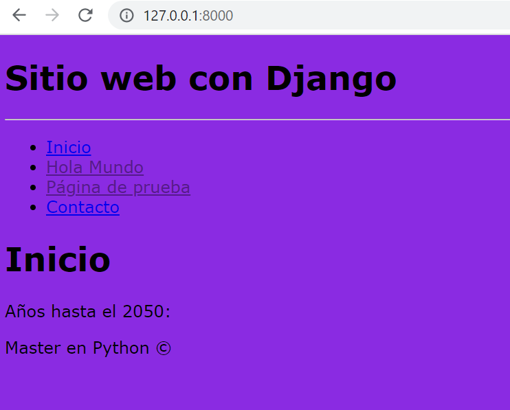

## Vincular hojas de estilo CSS en Django. 

[Regresar](/CodingBootcampsESPOL-RDDW/)

Hojas de Estilo en Cascada (del inglés Cascading Style Sheets) o CSS es el lenguaje de estilos utilizado para describir la presentación de documentos HTML o XML. CSS describe como debe ser renderizado el elemento estructurado en la pantalla, en papel, en el habla o en otros medios.

+ Continuamos trabajando el proyecto AprendiendoDjango específicamente en la carpeta miapp en la que se creará una nueva carpeta con el nombre static. De ahí se crea una nueva carpeta con el nombre de css. Luego, dentro de la carpeta css se procede a crear el archivo styles.css. 

```css
body{
    font-family: Verdana, Geneva, Tahoma, sans-serif;
    background-color: blueviolet;
}
```

+ Para que el estilo css se visualize en la web debemos usarla dentro de cada archivo de la carpeta template. En este caso nos basaremos en el archivo layout.html, añadiendo el href y al inicio cargando los archivos static.


```html

<!DOCTYPE html>
<html lang="es">
<head>
    <meta charset="utf-8"/>

    <title> 
        
        
        
    </title>

    <link rel="stylesheet" type="text/css" href="" />
</head>
```

+ Abrir la consola y ubicarse en el directorio de AprendiendoDjango y ejecutamos el comando `python manage.py runserver`. 

<p align="center">

</p>