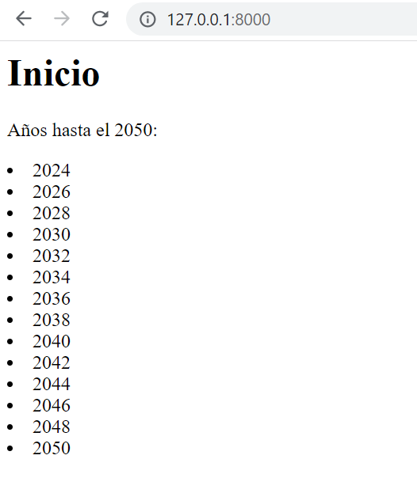

## Ejemplo con las vistas

[Regresar](/CodingBootcampsESPOL-RDDW/)

+ En el la sección anterior de [múltiples vistas de django](./multiples-vistas.md) se trabajó con la creación de una vista, continuaremos editando el archivo views.py y urls.py. 

+ En el archivo view.py veremos una alternativa de devolver el mismo h1 pero ahora usando una variable. 

```python
def index(request):
    html = """
        <h1> Inicio </h1>
    """
    return HttpResponse(html)
```

+ También se puede hacer uso de bucles y concatenación, mostraremos un ejemplo que muestre los años hasta el 2050.

```python
def index(request):
    html = """
        <h1> Inicio </h1>
        <p> Años hasta el 2050: </p>
    """

    year = 2023

    while year <=2050:
        html += f"<li>{str(year)}</li>"
        year +=1

    html += "</ul>"
    
    return HttpResponse(html)
```

+ Ahora un ejemplo que muestre el año solo si es par, el código quedaria de la siguiente manera.

```python
def index(request):
    html = """
        <h1> Inicio </h1>
        <p> Años hasta el 2050: </p>
    """

    year = 2023

    while year <=2050:

        if year % 2 ==0:
            html += f"<li>{str(year)}</li>"
        year +=1

    html += "</ul>"

    return HttpResponse(html)
```

+ Accede en el navegador web al enlace  http://127.0.0.1:8000/ y visualizarás el contenido que se encuentra en la función index en este caso que se muestre los años par hasta el 2050. 

<p align="center">

</p>