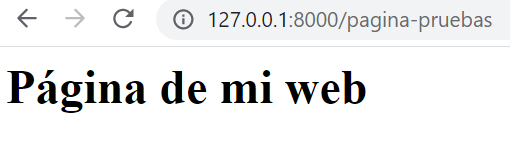

## Múltiples vistas y url

[Regresar](/CodingBootcampsESPOL-RDDW/)

+ En el la sección anterior de [vistas de django](./apps-Django.md) se trabajó con la creación de una vista, continuaremos editando el arhcivo views.py y urls.py. 

+ Dentro del proyecto general de AprendiendoDjango se encuentra una subcarpeta con el mismo nombre y ahí se encontrará el archivo urls.py  y agregamos la ruta. 

```python
path('', views.index, name="index")
```

+ En el archivo views.py, agregamos una nueva función relacionada con el index de nuestra página.

```python
def index(request):
    return HttpResponse(
        """
        <h1> Inicio </h1>
        """
    )
```

+ Es momento de abrir la terminal ubicandose en la carpeta de AprendiendoDjango, y ejeuctar el comando:

```
python manage.py runserver
```

+ Crearemos una nueva función en views.py.

```python
def pagina(request):
    return HttpResponse(
        """
        <h1> Página de mi web </h1>
        """
    )
```

+ Ahora agregaremos una nueva url asociada a nuestra función pagina creada anteriormente. 

```python
path('pagina-pruebas', views.pagina, name="pagina")
```
+ Accede en el navegador web al enlace  http://127.0.0.1:8000/pagina-pruebas y visualizarás el contenido que se encuentra en la función página. 
<p align="center">

</p>