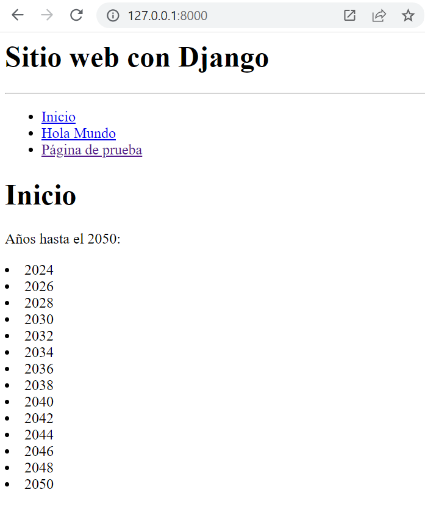

## Navegación entre rutas 

[Regresar](/CodingBootcampsESPOL-RDDW/)

+ En el la sección anterior de [ejemplos de vistas de django](./ejemplo-vistas.md) se trabajó con varios ejemplos de una vista, continuaremos editando el archivo views.py y urls.py para agregar un menú de navegación 


+ Para el menú de navegación utilizando el layout insertaremos las siguientes líneas de código en el archivo main.py que se ecnuentra en el directorio AprendiendoDjango/miapp/views.py. 

```python
layout ="""
<h1> Sitio web con Django </h1>
<hr/>
<ul>
    <li>
        <a href="/inicio"> Inicio </a>
    </li>
    <li>
        <a href="/hola-mundo"> Hola Mundo </a>
    </li>
    <li>
        <a href="/pagina-pruebas"> Página de prueba </a>
    </li>
</ul>
</hr>
"""
```
+ Para visualizar el menú de navegación en cada return de las funciones asociadas a las rutas concatenar la varaiable layout. 

```python
return HttpResponse(layout+html)
```
+ Si ya tienes ejecutando el servidor puedes acceder a cualquiera de las vistas y visualizarás el menú. 

<p align="center">

</p>