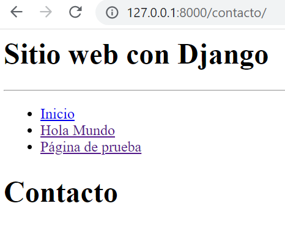

## Parámetros en rutas

[Regresar](/CodingBootcampsESPOL-RDDW/)

+ En el la sección anterior de [navegación de rutas de django](./navegacion-rutas.md) se trabajó con varios ejemplos de una vista, continuaremos editando el archivo views.py y urls.py.

+ Agregaremos una nueva página y por ende una nueva función en el archivo views.py. 

```python
def contacto(request):
    return HttpResponse(layout+"<h1>Contacto</h1>")
```
+ Luego crearemos la ruta para asociarla a las vista que se encuentra en la función contacto. En el archivo url.py añadir la siguiente línea de código. 

```python
path('contacto/', views.contacto, name="contacto")
```

+ Ejecuta el servidor en el archivo AprendiendoDjango con el comando  `python manage.py runserver` e ingresa en tu navegador a http://127.0.0.1:8000/contacto/

<p align="center">

</p>

+ Ahora si pasar mediante la url un nombre es decir pasarle un parámetro y que se muestre por pantalla debemos hacer las siguientes modificaciones. En el archivo urls.py modificar la url correspondiente a contacto. 

```python
path('contacto/<str:nombre>', views.contacto, name="contacto")
```
+ Ahora en el archivo views.py pasarle ese párametro y asi visualizarlo. 

```python
def contacto(request, nombre):
    return HttpResponse(layout+f"<h1>Contacto {nombre}</h1>")
```

+ Ahora agregaremos el parámetro apellido con los siguientes cambios. 

```python
path('contacto/<str:nombre>/<str:apellido>', views.contacto, name="contacto")
```
```python
def contacto(request, nombre,apellido):
    return HttpResponse(layout+f"<h1>Contacto {nombre} {apellido}</h1>")
```

## Parámetros opcionales en las rutas

+ En el archivo urls.py añadir lo siguiente.

```python
path('contacto/', views.contacto, name="contacto"),
path('contacto/<str:nombre>/', views.contacto, name="contacto"),
```
+ En el archivo views.py también se den realizar modificaciones.

```python
def contacto(request, nombre="",apellido=""):
    html = ""
    if nombre and apellido:
        html +="<p>El nombre completo es: </p>"
        html = f"<h3> {nombre} {apellido} </h3>"
    return HttpResponse(layout+f"<h1>Contacto</h1>"+html)
```