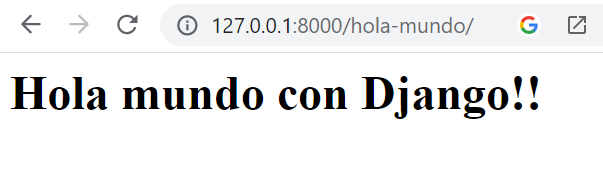

## Plantillas en Django

[Regresar](/CodingBootcampsESPOL-RDDW/)

Al ser un marco web, Django necesita una forma conveniente de generar HTML dinámicamente. El enfoque más común se basa en plantillas. Una plantilla contiene las partes estáticas de la salida HTML deseada, así como alguna sintaxis especial que describe cómo se insertará el contenido dinámico.

+ En la carpeta miapp crear una subcarpeta con el nombre templates y de ahi un archivo index.html que tendrá la plantilla relacionada al index.

```html
<h1> Inicio </h1>
<p> Años hasta el 2050: </p>
```

+ En el archivo views.py hay que mandarle el template mediante renderización. 

```python
return render(request, "index.html")
```

+ En el proyecto AprendiendoDjango existe una subcarpeta con el mismo nombre y en el arreglo INSTALLED_APPS añadir la siguiente instrucción.

```python
'miapp',
```

+ Realizaremos el mismo procedimiento para la función hola_mundo utilizando el render. Creamos dentro de la carpeta template el archivo hola_mundo.html.

```html
<h1> Hola mundo con Django!!</h1>
```

+ Ahora modificar en el archivo views.py la función hola_mundo. 

```python
def hola_mundo(request):
    return render(request, "hola_mundo.html")
```

+ En la carpeta AprendiendoDjango ejeucte el comando `python manage.py runserver` y visualize que sale el contenido que tiene en el archivo hola_mundo.html.

<p align="center">

</p>

+ En la carpeta template creamos el archivo pagina.html con el siguiente contenido.

```html
<h1> Página de mi web </h1>
```

+ Ahora en el archivo views.py enviarle mediante el render el template pagina.html.

```python
return render(request, "pagina.html")
```