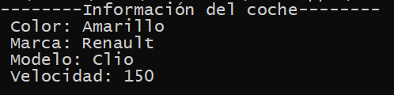

## Constructor

[Regresar](/CodingBootcampsESPOL-RDDW/)

Los constructores se utilizan para poder crear instancias sobre los objetos de una clase. La función de los constructores es asignar valores a los elementos de clase cuando se crea un objeto de esa misma clase. 
Existen dos tipos de constructores: uno es el constructor por defecto, al cual no se puede agregar ningún argumento; mientras que el segundo constructor, el constructor parametrizado, cuando ingresa su primer parámetro siempre es el propio objeto, es decir, self. El resto de parámetros los ingresa el usuario o programador.

+ Para el tema de constructores, dentro de la carpeta RDDD-apps, crearemos un nuevo directorio con el nombre de POO-constructor.

+ Dentro de este nuevo directorio crearemos 2 archivos: main.py y coche.py. En el archivo coche.py reutilizaremos el código base anterior que es el siguiente:

```Python
# Programación orientada a objetos

#Definir una clase

class Coche: 

    # Atributos o propiedades
    color = "Rojo"
    marca = "Ferrari"
    modelo="Aventador"
    velocidad = 300
    caballaje = 500
    plazas = 2


    # Métodos, son acciones que hace el objeto Coche

    def acelerar(self):
        self.velocidad += 1

    def frenar(self):
        self.velocidad -= 1

    def getVelocidad(self):
        return self.velocidad

    # Getters y setters

    def setColor(self, color):
        self.color = color 

    def getColor(self):
        return self.color
    
    def setModelo(self, modelo):
        self.modelo = modelo 

    def getModelo(self):
        return self.modelo
    
#fin definición clase
```
+ Ahora definiremos un constructor. 

```Python
#CONSTRUCTOR

    def __init__(self, color, marca, modelo, velocidad, caballaje, plazas):
        self.color = color
        self.marca = marca
        self.modelo = modelo
        self.velocidad = velocidad
        self.caballaje = caballaje
        self.plazas = plazas 
```

+ En el archivo main.py, importaremos el archivo coche y crearemos un nuevo objeto. 

```Python
#importar el archivo coche
from coche import Coche

carro = Coche("Amarillo", "Renault", "Clio", 150,200,4)
```

+ Para la clase coche crearemos los métodos getters y setters para el atributo marca.

```Python
def setMarca(self, marca):
        self.marca = marca

    def getMarca(self):
        return self.marca
```

+ En la clase coche será necesario crear un nuevo método para obtener toda la información del coche. 

```Python
 def getInfo(self):
        info = "--------Información del coche--------"
        info += "\n Color: " + self.getColor()
        info += "\n Marca: " + self.getMarca()
        info += "\n Modelo: " + self.getModelo()
        info += "\n Velocidad: " + str(self.getVelocidad())
        return info
```
+ En el archivo main.py realizaremos un print para obtner la información del carro creado.

```Python
print(carro.getInfo())
```
<p align="center">

</p>

+ Ahora haremos un ejemplo creando varios objetos de tipo coche. 

```Python
carro = Coche("Amarillo", "Renault", "Clio", 150,200,4)
carro1 = Coche("Verde", "Seat", "Panda", 240,145,4)
carro2 = Coche("Rojo", "Mercedes", "Xara", 100,210,4)

print(carro.getInfo())
print(carro1.getInfo())
print(carro2.getInfo())
```

<p align="center">

</p>