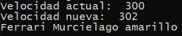

## Getters y Setters

[Regresar](/CodingBootcampsESPOL-RDDW/)

Se utilizará el archivo main.py que se trabajó en la sección de [clases-objetos](./clases-objetos.md). 

+ Iniciaremos creando el metodo **setColor**. A esta función de setColor se le pasará 2 parámetros, el primero es la palabra rservada **self** y el segundo parámetro será el color. 

```Python
def setColor(self, color):
        self.color = color
```

+ Crearemos el método getColor para obtener el atributo de color correspondiente. 

```Python
def setColor(self, color):
    self.color = color 

def getColor(self):
    return self.color
```

+ Podemos repetir el proceso para el atributo modelo.

```Python
def setModelo(self, modelo):
    self.modelo = modelo 

def getModelo(self):
    return self.modelo
```
+ Ahora se utilizará los métodos creados. Recordemos que teniamos el objeto creado coche y en dicho objeto usaremos los métodos. 

```Python
coche.setColor("amarillo")
coche.setModelo("Murcielago")

print(coche.marca, coche.getModelo(), coche.getColor())
```

+ Para visualizar el funcionamiento de los métodos, en la carpeta de POO-clases abrir la terminal  y se ejecutará el archivo main.py con la siguiente instrucción `python main.py`. Recordemos que por defecto el objeto tenia color rojo y su modelo era aventador. Con el uso de setters ahora el coche tiene color amarillo y su modelo es Murcielago.

<p align="center">

</p>