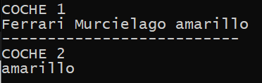
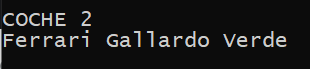

## Múltiples objetos

[Regresar](/CodingBootcampsESPOL-RDDW/)

Para continuar con la creación de más objetos, crearemos un nuevo archivo que contendrá como base el [código de getters y setters](./getters-setters.md).

+ Crearemos un nuevo coche que tendrá las mismas propiedades y métodos que fueron definidos para la clase coche.


```Python
coche2 = Coche()
```
+ Verificamos los métodos del nuevo coche2 usando el método print que imprima el color. 

```Python
print("COCHE 2 ")
print(coche2.getColor())
```
+ Usando en la consola el comando `python <<nombre_archivo>>`, veremos el color del coche 2. 

<p align="center">

</p>

+ Modiferemos el color y el modelo del coche 2 con los métodos **setColor** y **setModelo**.

```Python
coche2.setColor("Verde")
coche2.setModelo("Gallardo")
```
+ Añadimos un print para visulizar los cambios.

```Python
print(coche2.marca, coche2.getModelo(), coche2.getColor())
```

<p align="center">

</p>

