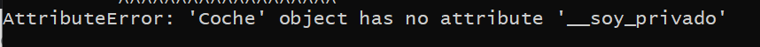

## Visibilidad de atributos

[Regresar](/CodingBootcampsESPOL-RDDW/)

Para poder dar acceso a los métodos y atributos de un objeto dentro de la Programación Orientada a Objeto utilizamos la visibilidad.  Estas son:

+ **Public**
 Un método o atributo tiene una visibilidad pública cuando todas las demás clases pueden acceder a ellos. Nos referimos a otra clase o una subclase.
+ **Private**
 Tan solo se puede ver y acceder a ellos desde el propio código de la clase.
+ **Protected**
 Solo desde el propio código de su clase o de sus subclases pueden acceder.

Para poner en práctica este concepto de visibilidad de atributos, utilizaremos el código de [tipado de objetos](./tipado-objetos.md).

En python para representar a los atributos privados utilizamos los dos guiones bajos "__".
+ En el archivo coche.py dentro de la clase añadimos el siguiente código.

```Python
soy_publico = "Hola, soy un atributo público"
__soy_privado = "Hola, soy un atributo privado"
```
+ En el archivo main.py, accederemos a los atributos definidos anteriormente, para ello imprimiremos el acceso al atributo soy_publico del objeto coche.

```Python
# Visibilidad
print(carro.soy_publico)
```

<p align="center">

</p>

+ Ahora intentemos imprimir el acceso al atributo privado y nos dará un error.

```Python
print(carro.__soy_privado)
```

<p align="center">

</p>

+ Para acceder a ese atributo privado, crearemos un método en el archivo coche.py.

```Python
    def getPrivado(self):
        return self.__soy_privado
```
+ Utilizaremos el método getPrivado y ejecutamos el archivo para ver el resultado.

```Python
print(carro.getPrivado())
```

<p align="center">

</p>