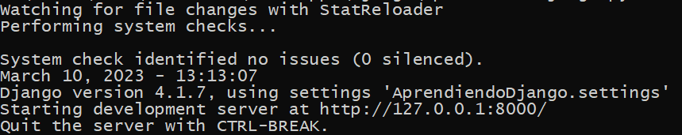
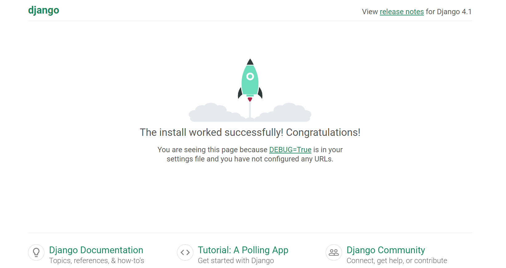

## Primer proyecto de Django

[Regresar](/CodingBootcampsESPOL-RDDW/)

+ En la carpeta de RDDD-apps, crear una subcarpeta con el nombre django.

+ Abrimos la terminal y nos dirigimos a la ruta donde se encuentre nuestra carpeta django. 

+ Ejecutaremos el comando para iniciar con nuestro primer proyecto en Django. 

```
django-admin startproject AprendiendoDjango
```
Ahora visualizarás que en la carpeta django se ha creado una nueva carpeta con el nombre de AprendiendoDjango. 

+ Para ver si funciona nuestro proyecto ejecutaremos el siguiente comando en la terminal, que nos generará una base de datos para la aplicación web.  

```
python manage.py migrate
```

+ Ahora ejecutaremos el servidor local con el comando:

```
python manage.py runserver
```
+ Con la ejecución anterior nos aparecerá la URL donde tendremos acceso a la aplicación web. 

<p align="center">

</p>

+ En esta primera instancia tenemos la página mostrando que efectivamente se ha instalado Django.

<p align="center">

</p>