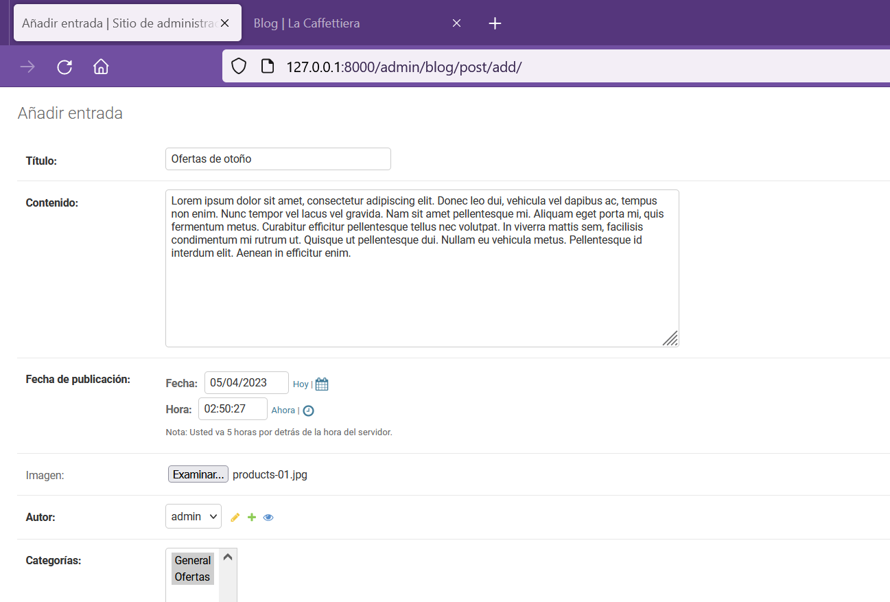
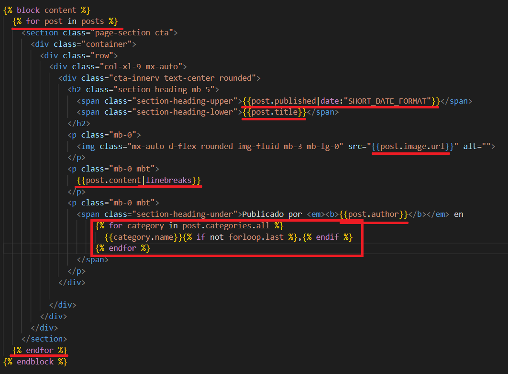

## App blog

[Regresar](/CodingBootcampsESPOL-RDDW/)

* Estando en la carpeta webpersonal abrimos la terminal y ejecutamos:

```
python manage.py startapp blog
```
* En la nueva carpeta blog  se encuentra el archivo models.py(webpersonal\blog\models.py) en donde estaremos trabajando.

```py
from django.db import models
from  django.utils.timezone import now
from django.contrib.auth.models import User
# Create your models here.
class Category(models.Model):
    name = models.CharField(max_length=100, verbose_name="Nombre")
    created = models.DateTimeField(auto_now_add=True, verbose_name="Fecha de creación")
    updated = models.DateTimeField(auto_now=True, verbose_name="Fecha de edición")

    class Meta:
        verbose_name = "categoría"
        verbose_name_plural = "categoría"
        ordering = ['-created']

    def __str__(self):
        return self.name
    
class Post(models.Model):
    title = models.CharField(max_length=200, verbose_name="Título")
    content = models.TextField(verbose_name="Contenido")
    published = models.DateTimeField(verbose_name="Fecha de publicación", default=now)
    image = models.ImageField(verbose_name="Imagen", upload_to="blog", null=True, blank=True)
    author = models.ForeignKey(User, verbose_name="Autor", on_delete=models.CASCADE)
    categories = models.ManyToManyField(Category, verbose_name="Categorías")
    created = models.DateTimeField(auto_now_add=True, verbose_name="Fecha de creación")
    updated = models.DateTimeField(auto_now=True, verbose_name="Fecha de edición")

    class Meta:
        verbose_name = "entrada"
        verbose_name_plural = "entradas"
        ordering = ['-created']

    def __str__(self):
        return self.title
```

* En el archivo de settings.py(webpersonal\webpersonal\settings.py) agrega la app blog en INSTALLED_APPS. 

<p align="center">

</p>

* En la consola ejecutamos el comando para hacer la migración. 

```
python manage.py makemigrations blog
```

* Ahora ejecuta la siguiente instrucción.

```
python manage.py migrate blog
```

* Ya podemos crear un administrador para el blog, inserta el siguiente código en el archivo admin.py(webpersonal\blog\admin.py).

```py
from django.contrib import admin
from .models import Category, Post
# Register your models here.

class CategoryAdmin(admin.ModelAdmin):
    readonly_fields = ('created', 'updated')

class PostAdmin(admin.ModelAdmin):
    readonly_fields = ('created', 'updated')

admin.site.register(Category, CategoryAdmin)
admin.site.register(Post, PostAdmin)
```

* Ejecuta el servidor y accede al panel de administración y podrás crear nuevas categorías. 

<p align="center">

</p>

* Además puedes crear una entrada de prueba.

<p align="center">

</p>

Personalizando el administrador
===========

* * *

* En el archivo admin.py(webpersonal\blog\admin.py) de la app blog realizamos la siguiente modificación.

```py
from django.contrib import admin
from .models import Category, Post
# Register your models here.

class CategoryAdmin(admin.ModelAdmin):
    readonly_fields = ('created', 'updated')

class PostAdmin(admin.ModelAdmin):
    readonly_fields = ('created', 'updated')
    list_display = ('title', 'author', 'published', 'post_categories')
    ordering = ('author', 'published')
    search_fields = ('title', 'content', 'author__username', 'categories__name')
    date_hierarchy = 'published'
    list_filter = ('author__username', 'categories__name')

    def post_categories(self, obj):
        return ", ".join([c.name for c in obj.categories.all().order_by("name")])

    post_categories.short_description = "Categorias"
admin.site.register(Category, CategoryAdmin)
admin.site.register(Post, PostAdmin)
```
* Revisa los cambios que se realizaron.

<p align="center">

</p>

Creando las vistas del Blog
===========

* * *

Se crearán 2 vistas: una para la entrada y otra para las categoriás.

* La vista de blog que se encontraba en views.py(webpersonal\core\views.py) de la app core la eliminaremos de ahí porque será trasladada dentro del archivo views de la app Blog.

* En el archivo de views.py de la app Blog escribiremos la siguiente función:

```py
from django.shortcuts import render
from .models import Post
# Create your views here.
def blog(request):
    posts = Post.objects.all()
    return render(request, "blog/blog.html", {'posts':posts})
```

* En la app Blog se creará la carpeta templates  y a su vez la subcarpeta **blog**.

* En la app core dentro de los templates teniamos el archivo blog.html que ahora lo moveremos a la subcarpeta blog(webpersonal\blog\templates\blog\blog.html) de templates.

* Ahora configuraremos las url así que en el archivo urls.py(webpersonal\core\urls.py) de la app core deberás eliminar la url correspondiente a blog.

* En la app blog crea el archivo urls.py(webpersonal\blog\urls.py) que tendrá la siguiente estructura.

```py
from django.urls import path
from blog import views

urlpatterns = [
    path('', views.blog, name="blog"),
]
```
* En el archivo global de urls.py(webpersonal\webpersonal\urls.py) realiza la siguiente modificación.

<p align="center">

</p>

* Ahora editaremos el archivo blog.html(webpersonal\blog\templates\blog\blog.html) que es el template de la app blog.

<p align="center">

</p>

### Vista Categoría

* Para la vista de categoría crearemos una función en el archivo views.py(webpersonal\blog\views.py).

```py
from .models import Post, Category
from django.shortcuts import render, get_object_or_404
def category(request, category_id):
    category = get_object_or_404(Category, id=category_id)
    return render(request, "blog/category.html", {'category':category})
```

* En el archivo urls.py(webpersonal\blog\urls.py) añadirás el path de category.

```py
urlpatterns = [
    path('', views.blog, name="blog"),
    path('category/<int:category_id>/', views.category, name="category"),
]
```

* En la carpeta blog de los templates de la app blog está el archivo blog.html al cuál le haras una copia y le modificarás el nombre a **category.html**.(webpersonal\blog\templates\blog\category.html)


<p align="center">

</p>

* En el archivo blog.html(webpersonal\blog\templates\blog\blog.html) agrega también la parte de los enlaces que se definió en el archivo category.html.

<p align="center">

</p>


* Finalmente en el archivo models.py(webpersonal\blog\models.py) agrega lo siguiente:

<p align="center">

</p>

<p align="center">

</p>