## App contact

[Regresar](/CodingBootcampsESPOL-RDDW/)

* Estando en la carpeta webpersonal abrimos la terminal y ejecutamos:

```
python manage.py startapp contact
```

* En el archivo views.py(webpersonal\core\views.py) de la app core debemos eliminar la función correspondiente a contact.

* Ahora en el archivo views.py(webpersonal\contact\views.py) de la app contact.

```py
def contact(request):
    return render(request, "contact/contact.html")
```

* En el archivo urls.py(webpersonal\core\urls.py) de la app core debemos eliminar la ruta correspondiente a contact.

* En el archivo urls.py(webpersonal\contact\urls.py) de la app contact agregamos el siguiente código.

```py
from django.urls import path
from contact import views

urlpatterns = [
    path('', views.contact, name="contact"),
]
```

* Añadiremos las urls de contact en el archivo global de urls.py(webpersonal\webpersonal\urls.py).

<p align="center">
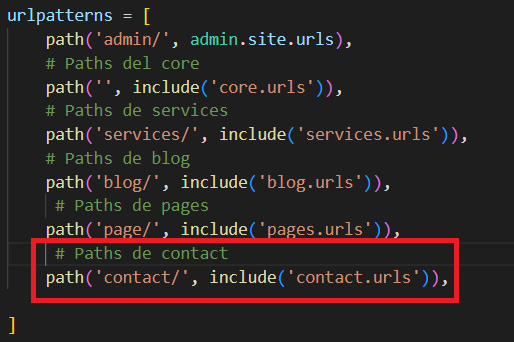
</p>

* Añadiremos la app en el archivo settings.py.(webpersonal\webpersonal\settings.py)

```py
INSTALLED_APPS = [
    'contact',
]
```

* En la carpeta de contact creamos la subcarpeta **templates** y a la vez la carpeta contact(webpersonal\contact\templates\contact). Ahora en la app core se encuentra el archivo contact.html(webpersonal\core\templates\core\contact.html) que se moverá a la carpeta contact que creamos.

* Ejecuta el servidor y visita la [página de contact](http://127.0.0.1:8000/contact/)

<p align="center">
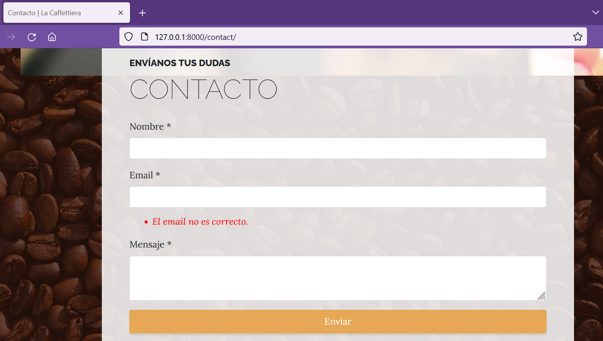
</p>

* En la app contact crearemos el archivo forms.py(webpersonal\contact\forms.py).

```py
from django import forms

class ContactForm(forms.Form):
    name = forms.CharField(label="Nombre", required=True)
    email = forms.EmailField(label="Email", required=True)
    content = forms.CharField(label="Contenido", required=True, widget=forms.Textarea())
```

* En el archivo contact.html comentaremos la parte del form.

<p align="center">
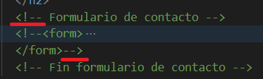
</p>

* Al archivo views.py de la app realizaremos la siguiente modificación.

```py
from django.shortcuts import render
from .forms import ContactForm
# Create your views here.

def contact(request):
    contact_form = ContactForm()
    return render(request, "contact/contact.html", {
        'form':contact_form
    })
```

* En el template de contact.html(webpersonal\contact\templates\contact\contact.html) agregamos el formulario.

<p align="center">
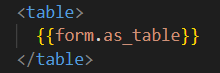
</p>

* Ejecuta el servidor y accede a la [página de contact](http://127.0.0.1:8000/contact/), en donde visualizarás el formulario que creamos.

<p align="center">
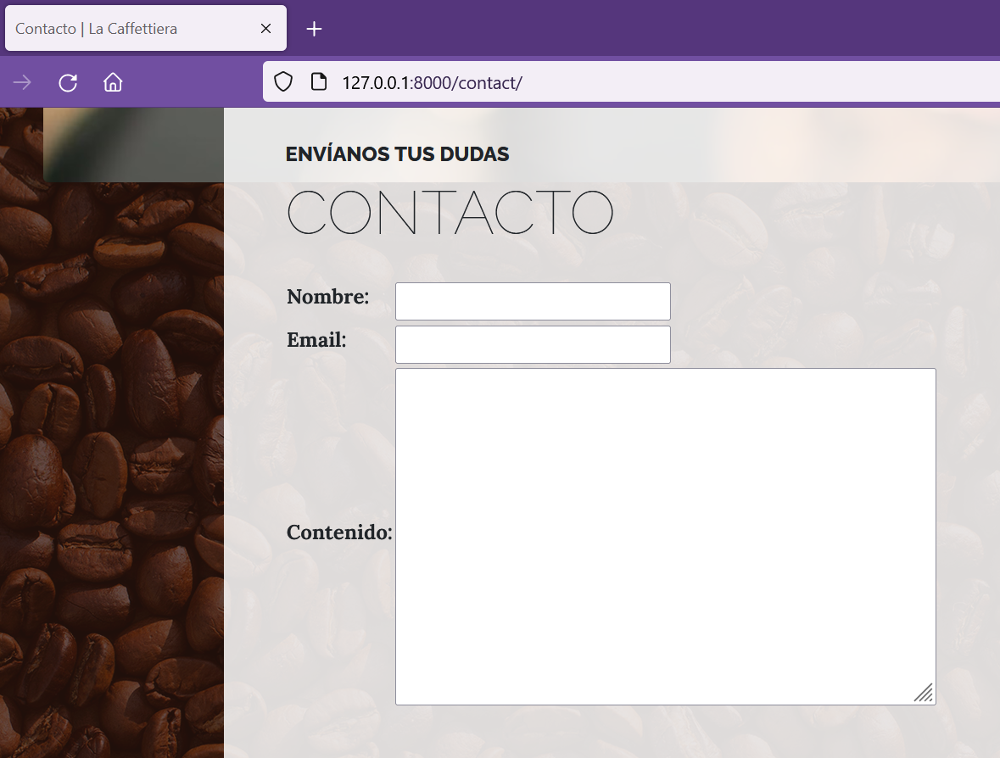
</p>

Procesado y validación
===========

* * *

A nuestro formulario aún le faltan campos que en esta sección se crearán.

* En el archivo de contact.html agregamos la etiqueta de form con la acción y método correspondiente.

<p align="center">
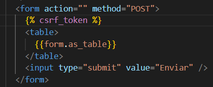
</p>

* Modifica el archivo views.py(webpersonal\contact\views.py) de la app contact para validar los datos del formulario y hacer la renderización mostrando que se envió correctamente. 

<p align="center">
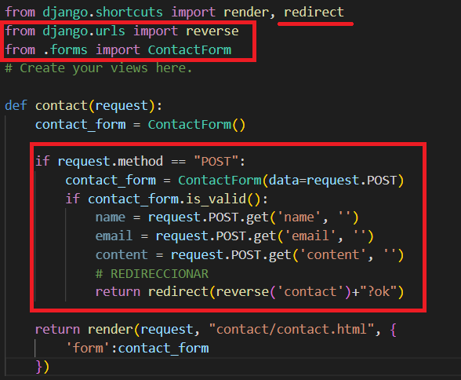
</p>

* En el archivo contact.html(webpersonal\contact\templates\contact\contact.html) haz la validación para que se muestre el mensaje de que se ha enviado correctamente.

<p align="center">
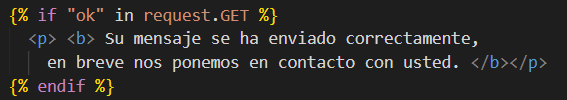
</p>

* Accede al formulario de contacto y envia datos. Visualizarás la configuración del redirect y del botón enviar.

<p align="center">
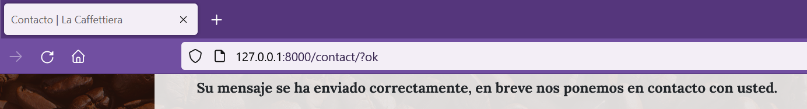
</p>

Fusionando el formulario
===========

* * *
Ahora veremos como usar la misma maquetación que venia por defecto en el contact.html, pero en este caso sustituyendo las partes dinámicas.

* En el archivo contact.html(webpersonal\contact\templates\contact\contact.html)  realiza la siguiente modificación. Por tal razón, debes comentar el form que habíamos realizado y ahora descomentar el form que estaba por defecto, agregándole los nuevos cambios.

<p align="center">
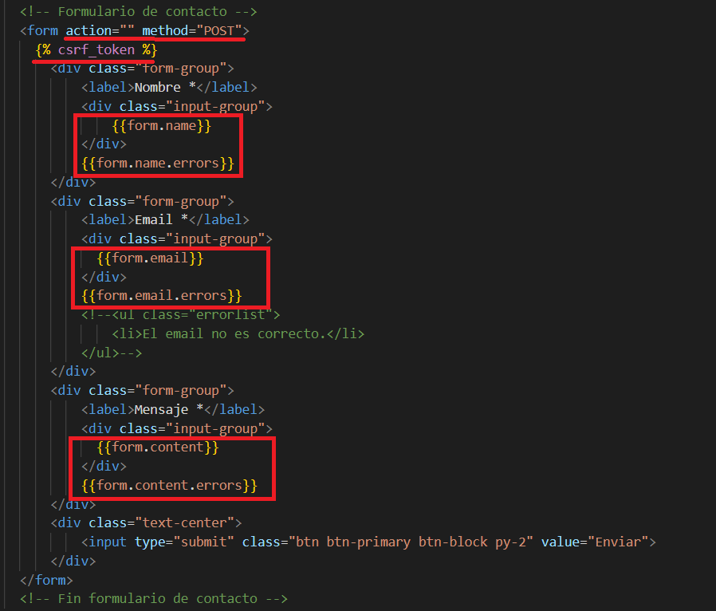
</p>

* Configuraremos el estilo bootstrap de los campos haciendo usando del parámetro **widget** en el archivo forms.py(webpersonal\contact\forms.py).

<p align="center">
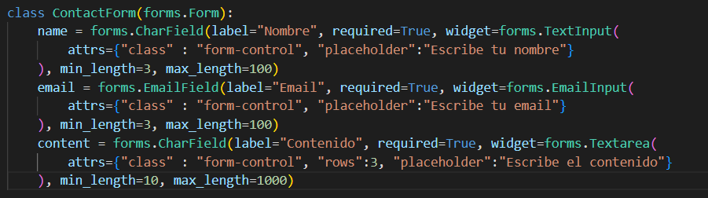
</p>

* Ejecuta el servidor y visualiza las nuevas modificaciones al formulario.

<p align="center">
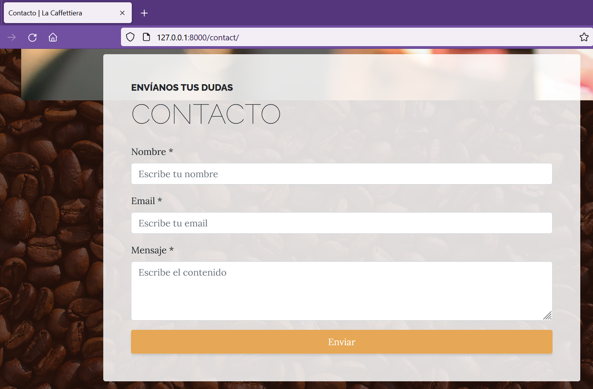
</p>

Enviando emails de pruebas
===========

* * *

Para los emails de prueba haremos uso de mailtrap que es gratis y que nos permitirá crear cuentas de correo.

* Accede al sitio de [mailtrap](https://mailtrap.io/). En el botón de "sign up" haz el registro con la cuenta de tu preferencia. 

* Una vez creada la cuenta accede a la página de [inboxes](https://mailtrap.io/inboxes) y da clic a la bandeja de prueba.

<p align="center">
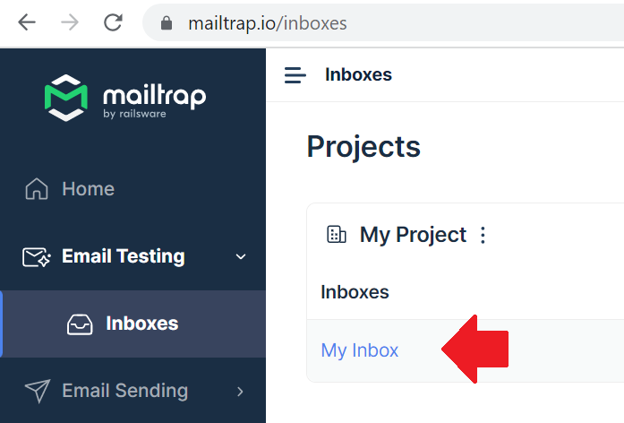
</p>

* Ahí aparecerá un panel en el que en la sección de Integrations busca la opción de Django.

<p align="center">
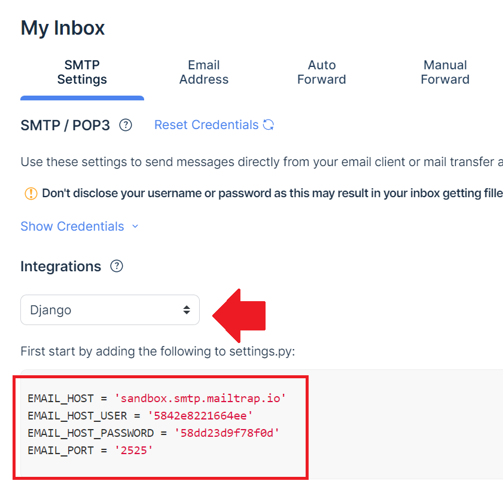
</p>

* Ahora copia la configuración que resalta en la imagen anterior. En el archivo settings.py(webpersonal\webpersonal\settings.py) añade al final dicha configuración.

```py
# Email config 

EMAIL_HOST = 'sandbox.smtp.mailtrap.io'
EMAIL_HOST_USER = '5842e8221664ee'
EMAIL_HOST_PASSWORD = '58dd23d9f78f0d'
EMAIL_PORT = '2525'
```

* En el archivo de views.py haremos uso de la clase email de django para hacer el envio del correo.

<p align="center">
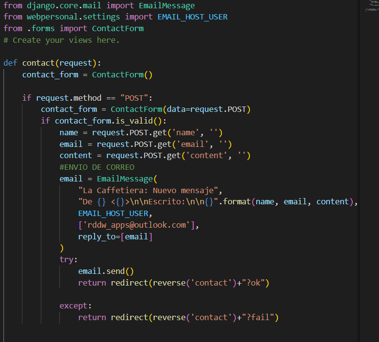
</p>

Personalizando el administrador
===========

* * *

En esta sección haremos uso de los grupos y permisos de usuario. Django proporciona un sistema de autenticación y autorización ("permisos"), que le permite verificar credenciales de usuario y definir que acciones puede realizar cada usuario. El framework incluye modelos para Users y Groups (una forma genérica de aplicar permisos a más de un usuario a la vez), permisos/indicadores (permissions/flags) que designan si un usuario puede realizar una tarea, formularios y vistas para iniciar sesión en los usuarios, y view tools para restringir el contenido.

* Accede al [panel de administración](http://127.0.0.1:8000/admin/), en donde crearemos un grupo para el personal que accederá al panel. 

* En la sección de grupos da clic en añadir.

<p align="center">
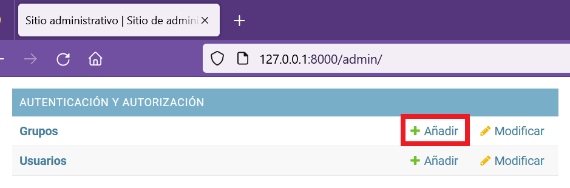
</p>

* Al nombre del grupo le pondremos "Personal". En la lado izquierdo se encuentran los permisos, debes seleccionar el permiso que deseas darle al grupo del personal. Das clic en el permiso y con la flecha derecha otorgas el permiso al personal. Para la app de pages, blog, services se le otorgaron todos los permisos; en la app social solo el permiso de editar.

<p align="center">
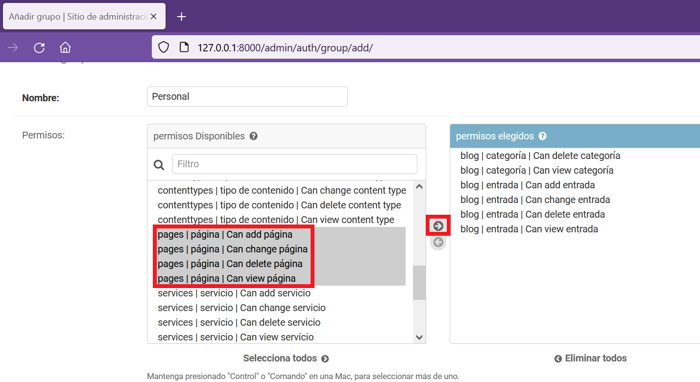
</p>

<p align="center">
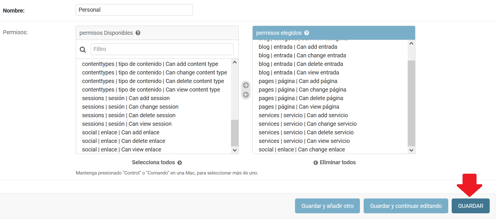
</p>

* Accede a la página para añadir un [nuevo usuario](http://127.0.0.1:8000/admin/auth/user/add/).

<p align="center">
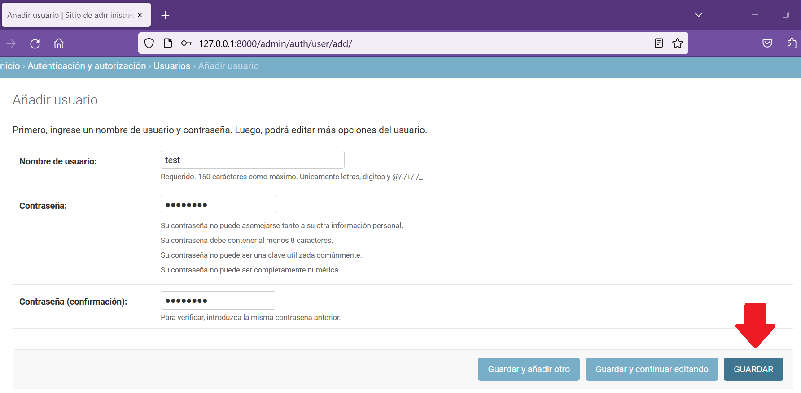
</p>

* Luego de guardar el usuario, debes activar el casillero de staff. Además de asignarle el grupo de personal. 

<p align="center">
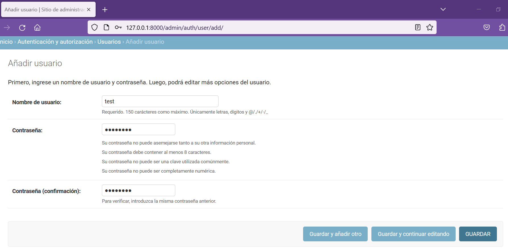
</p>

* Cierra sesión y accede con el usuario que creamos en el paso anterior.

<p align="center">
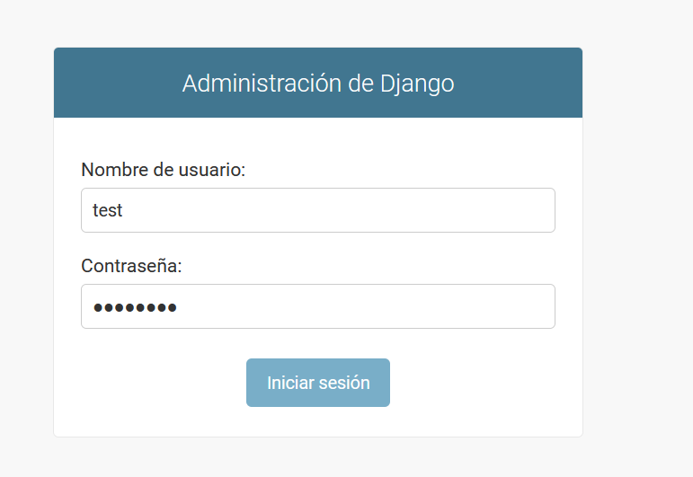
</p>

* Cuando ya accedes al panel de administración notarás los permisos del usuario "test".

<p align="center">
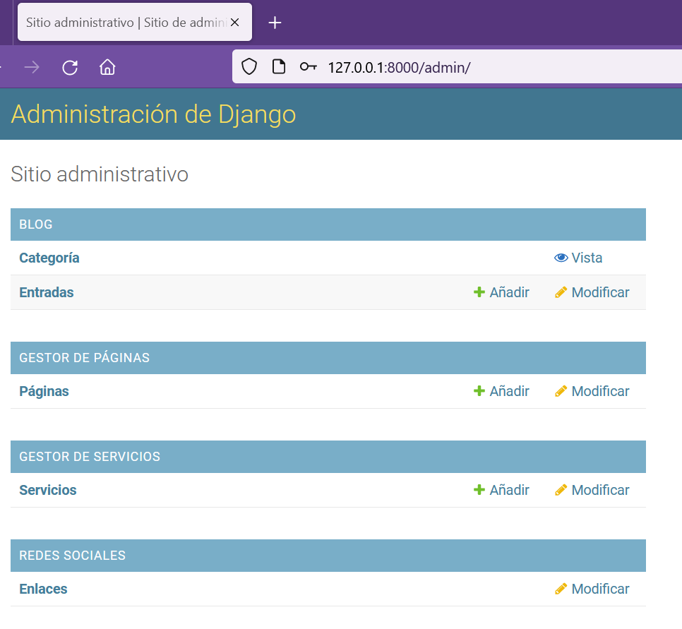
</p>

* Ahora será necesario que los campos de nombre de clave del modelo de Enlace sean solo de lectura para ello haremos la siguiente modificación en el archivo admin.py(webpersonal\social\admin.py) de la app social. Además, se no mostraremos los campos de updated y created.

<p align="center">
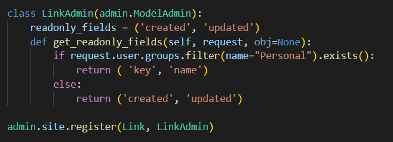
</p>

* Accede a modificar alguno de los enlaces y se reflejarán los nuevos cambios. Y así el proyecto quedó finalizado.

<p align="center">
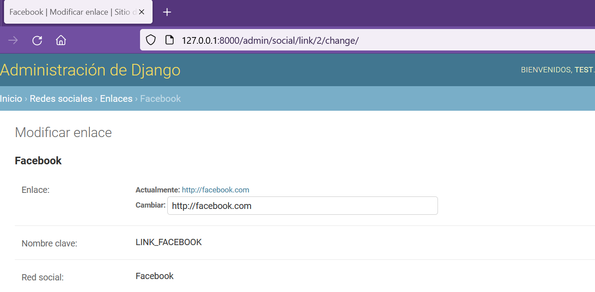
</p>