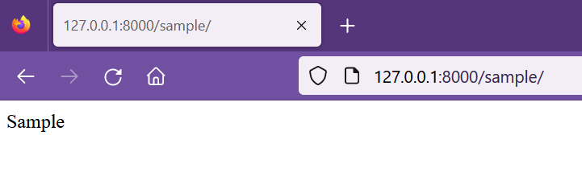

## App Core

[Regresar](/CodingBootcampsESPOL-RDDW/)

Como se mencionó en el [diseño web](./dise%C3%B1o-web-empresarial.md) nuestro proyecto tendrá la app Core que gestionará las páginas estáticas: portada, historia y visítanos.

* En la ruta que desees crea la carpeta **proyectoRDDW** y en la terminal ejecuta el comando:

```
django-admin startproject webpersonal
```

* Ahora crea la app **Core** con el siguiente comando:

```
python manage.py startapp core
```

* Usando Visual Studio Code abre el archivo view.py(webpersonal\core\views.py) de la carpeta core.

En la app Core se creará una vista para cada página de la cafetería, se deberá añadir las respectivas URL y lograr que todo funcione. Por ahora se puede devolver un HttpResponse simple con el nombre de las página:

* Inicio home/

* Historia about/

* Servicios services/

* Visítanos store/

* Contacto contact/

* Blog blog/

* Sample sample/ (esta es para páginas de prueba)

En el archivo views.py se añadirá todas las vistas requeridas.

```py
from django.shortcuts import render, HttpResponse

# Create your views here.

def home(request):
    return HttpResponse("Inicio")

def about(request):
    return HttpResponse("Historia")

def services(request):
    return HttpResponse("Servicios")

def store(request):
    return HttpResponse("Visítanos")

def contact(request):
    return HttpResponse("Contacto")

def blog(request):
    return HttpResponse("Blog")

def sample(request):
    return HttpResponse("Sample")
```

* El archivo urls.py(\webpersonal\webpersonal\urls.py) tendrá la siguiente estructura.

```py
from core import views

urlpatterns = [
    path('admin/', admin.site.urls),
    # Paths del core
    path('', views.home, name="home"),
    path('about/', views.about, name="about"),
    path('services/', views.services, name="services"),
    path('store/', views.store, name="store"),
    path('contact/', views.contact, name="contact"),
    path('blog/', views.blog, name="blog"),
    path('sample/', views.sample, name="sample"),
]
```

* Ejecuta el servidor en la carpeta webpersonal.

```
python manage.py runserver
```

<p align="center">

</p>

Organizando mejor las URLS
===========

* * *

* En la carpeta core crea un nuevo archivo urls.py.

```py
from django.urls import path
from core import views

urlpatterns = [
    # Paths del core
    path('', views.home, name="home"),
    path('about/', views.about, name="about"),
    path('services/', views.services, name="services"),
    path('store/', views.store, name="store"),
    path('contact/', views.contact, name="contact"),
    path('blog/', views.blog, name="blog"),
    path('sample/', views.sample, name="sample"),
]
```

* En el archivo urls.py de la carpeta webpersonal se usará el include para añadir las rutas de la app core.

```py
from django.contrib import admin
from django.urls import path, include


urlpatterns = [
    path('admin/', admin.site.urls),
    # Paths del core
    path('', include('core.urls')),
    
]
```
