## App pages

[Regresar](/CodingBootcampsESPOL-RDDW/)

* Si accedes a la [página de sample](http://127.0.0.1:8000/sample/) verás un ejemplo de página génerica que es lo crearemos mediante una app.

* Estando en la carpeta webpersonal abrimos la terminal y ejecutamos:

```
python manage.py startapp pages
```

* Utilizando el verbose_name haremos el cambio del nombre a la app en el archivo apps.py(webpersonal\pages\apps.py). Añade la siguiente línea de código dentro de la clase.

```py
verbose_name = "Gestor de páginas"
```

* Añadiremos la app en el archivo settings.py.(webpersonal\webpersonal\settings.py)

<p align="center">
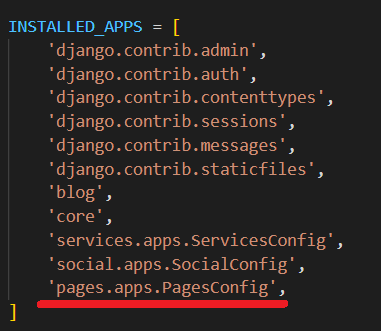
</p>

* En la nueva carpeta pages correspondiente a la app pages  se encuentra el archivo models.py(webpersonal\pages\models.py) en donde estaremos trabajando.

```py
from django.db import models

# Create your models here.

class Page(models.Model):
    title = models.CharField(verbose_name="Título", max_length=200)
    content = models.TextField(verbose_name="Contenido")
    created = models.DateTimeField(auto_now_add=True, verbose_name="Fecha de creación")
    updated = models.DateTimeField(auto_now=True, verbose_name="Fecha de edición")

    class Meta:
        verbose_name = "página"
        verbose_name_plural = "páginas"
        ordering = ['title']

    def __str__(self):
        return self.title 
```

* Además, crearemos un administrador para la app de páginas, inserta el siguiente código en el archivo admin.py(webpersonal\pages\admin.py).

```py
from django.contrib import admin
from .models import Page
# Register your models here.

class PageAdmin(admin.ModelAdmin):
    readonly_fields = ('created', 'updated')

admin.site.register(Page, PageAdmin)
```

* En la consola ejecutamos el comando para hacer la migración. 

```
python manage.py makemigrations pages
```

* Ahora ejecuta la siguiente instrucción.

```
python manage.py migrate pages
```

* Ejecuta el servidor y accede al panel de administración y podrás crear nuevos páginas en la app de pages. 

<p align="center">
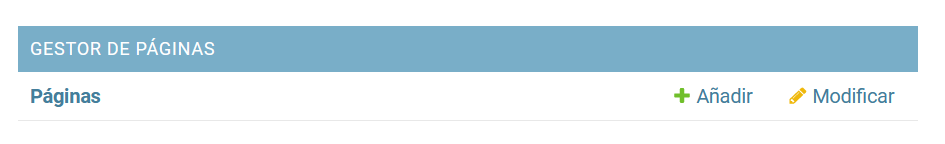
</p>

* Se procedió a crear 3 páginas como se visualiza en la imagen.

<p align="center">
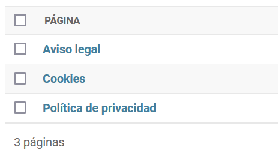
</p>

* En el archivo de views.py(webpersonal\pages\views.py) gestionaremos para que se pueda acceder a las páginas que hemos creado desde el administrador. Teniendo la siguiente estructura: path /**page**/**<page_id>**.

```py
from django.shortcuts import render, get_object_or_404
from .models import Page

def page(request, page_id):
    page = get_object_or_404(Page, id=page_id)
    return render(request, 'pages/sample.html', {'page':page})
```

* En la carpeta de pages crearemmos la subcarpeta templates que a su vez tendrá la carpeta pages.

* De la app core arrastraremos el archivo sample.html(webpersonal\core\templates\core\sample.html) a la carpeta **pages**(webpersonal\pages\templates\pages) que se encuentra en templates.

* En el archivo views.py(webpersonal\core\views.py) de la app core elimina la función de sample que se habia definido, ya que crearemos otra en la app de pages. En el archivo urls.py de la app core también se eliminará la ruta de sample.

* En la carpeta de la app pages crea el archivo urls.py(webpersonal\pages\urls.py).

```py
from django.urls import path
from . import views

urlpatterns = [
    path('<int:page_id>/', views.page, name="page"),
]
```
* Agregaremos la url de la app page en el archivo global de urls.py(webpersonal\webpersonal\urls.py).

<p align="center">
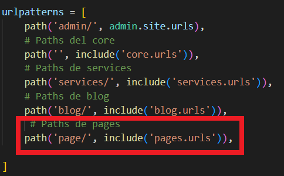
</p>

* En el archivo sample.html(webpersonal\pages\templates\pages\sample.html) realizaremos la siguiente modificación.

<p align="center">
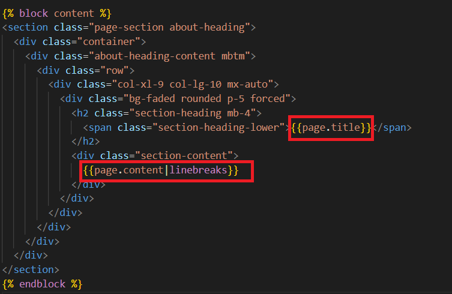
</p>

* Ejecuta el servidor y accede mediante el id a cada página que creamos en el administrador.

<p align="center">
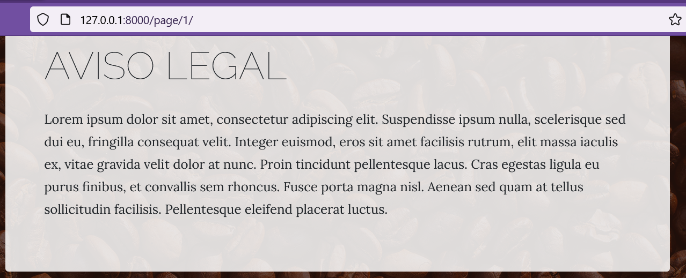
</p>

Templates tags propios
===========

* * *

La creación del template tag nos ayudará a visualizar contenido personalizado, en este caso, lás paginas que creamos.

* En la carpeta de la app pages creamos la subcarpeta **templatetags**(webpersonal\pages\templatetags). Luego añadimos el archivo __init__.py para indicar que es un paquete; también deberás crear el archivo pages_extras.py(webpersonal\pages\templatetags\pages_extras.py).

* El archivo pages_extras.py tendrá la siguiente estructura con el objetivo de mostrar la lista de páginas y que se muestren en el template.

```py
from django import template
from pages.models import Page

register = template.Library()

@register.simple_tag
def get_page_list():
    pages = Page.objects.all()
    return pages
```

* Para que se cargue el template tag deberás reiniciar el servidor.

* En el archivo base.html(webpersonal\core\templates\core\base.html) modificaremos la parte donde se encuentran los enlaces colocando las siguientes líneas de código.

<p align="center">
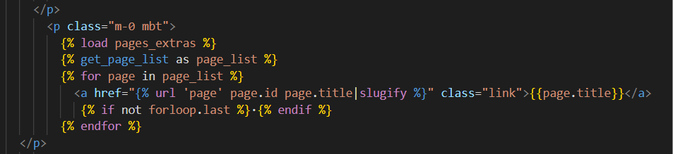
</p>

* En el archivo views.py(webpersonal\pages\views.py) añade el parámetro de page_slug a la función.

<p align="center">
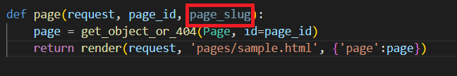
</p>

* En el archivo urls.py(webpersonal\pages\urls.py) también deberás añadirle el page_slug.

<p align="center">
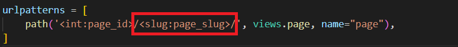
</p>

* Ejecuta el servidor y accede a cada uno de los enlaces de las páginas.

<p align="center">
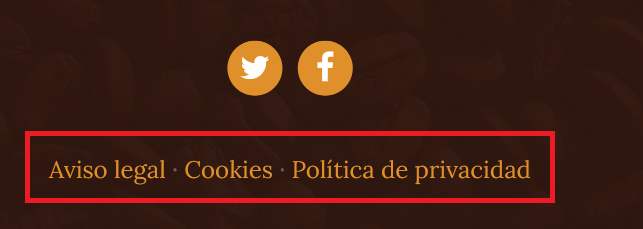
</p>

Ordenación y edición de páginas
===========

* * *

* A nuestra app pages le añadiremos un nuevo campo para la ordenación de páginas, este campo se añade dentro de la clase **Page** del archivo models.py(webpersonal\pages\models.py).

```py
order = models.SmallIntegerField(verbose_name="Orden", default=0)
```

* En el mismo archivo se encuentra la clase Meta en el que añadiremos el parámetro de ordering.

```py
ordering = ['order','title']
```

* En la consola ejecutamos el comando para hacer la migración. 

```
python manage.py makemigrations pages
```

* Ahora ejecuta la siguiente instrucción.

```
python manage.py migrate pages
```

* En el archivo admin.py(webpersonal\pages\admin.py) agregamos un list_display dentro de la clase PageAdmin.

```py
list_display = ('title', 'order')
```

* Ejecutamos el servidor y accede al panel de administración en la sección de [pages](http://127.0.0.1:8000/admin/pages/page/), visualizarás que cada página tiene el campo orden con un valor por defecto de 0.

<p align="center">
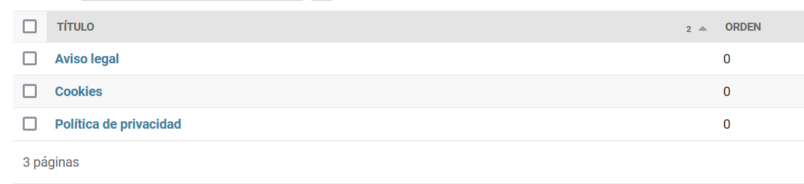
</p>

Ahora realizaremos la edición de páginas teniendo como base de que el usuario este autenticado y así puede editar algun contenido mostrándose un enlace que lo redireccione al panel de administración. 

* En el archivo sample.html(webpersonal\pages\templates\pages\sample.html) inserta lo siguiente.

<p align="center">
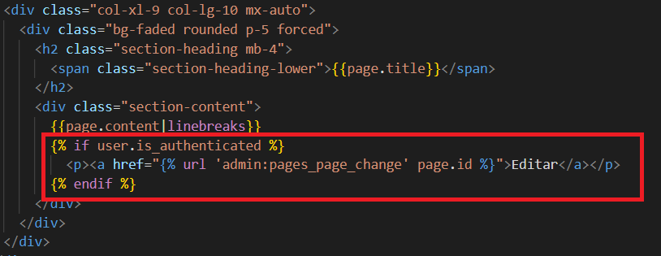
</p>

* Accede a una de las páginas de la app pages y verás que aparece el enlace de **Editar**.


<p align="center">
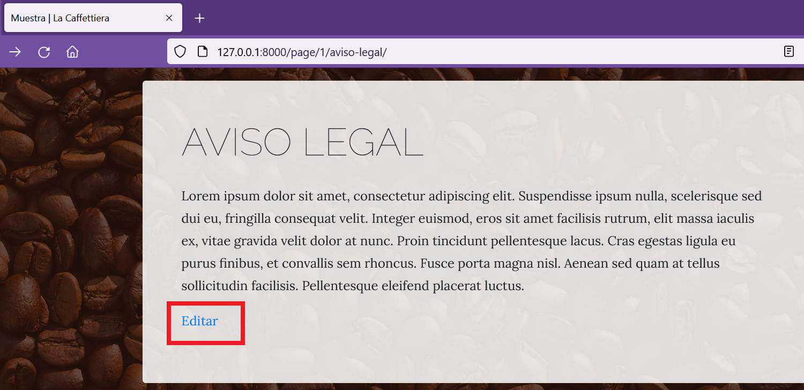
</p>

<p align="center">
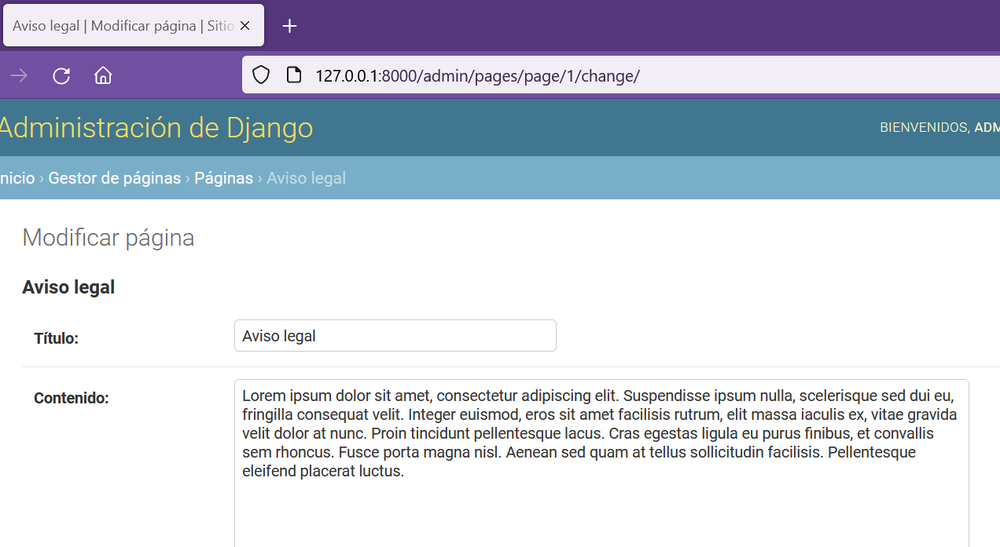
</p>

Personalizando el administrador
===========

* * *

Para los campos de editor de texto añadiremos el editor WYSIWYG que proviene del inglés "What You See Is What You Get".

* Tenemos que instalar el paquete de ck-editor, por tal razón, ejecuta el siguiente comando en la consola.

```
pip install django-ckeditor
```

* En el archivo settings.py añadiremos el ck-editor.

<p align="center">
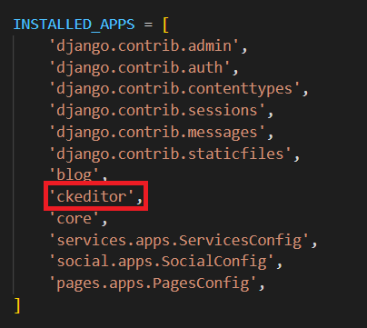
</p>

* En la carpeta de la app **pages** se encuentra el archivo models.py en donde añadiremos el ck-editor en los campos de texto.

<p align="center">
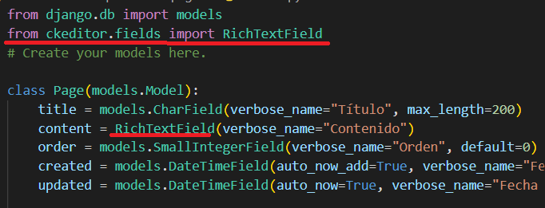
</p>

* Volvemos a ejecutar la migración en la consola para que se efectuen los cambios.

```
python manage.py makemigrations pages
```

* Ahora ejecuta la siguiente instrucción.

```
python manage.py migrate pages
```

* Ejecuta el servidor y accede a la edición de alguna de las páginas y visualizarás el editor WYSIWYG.

<p align="center">
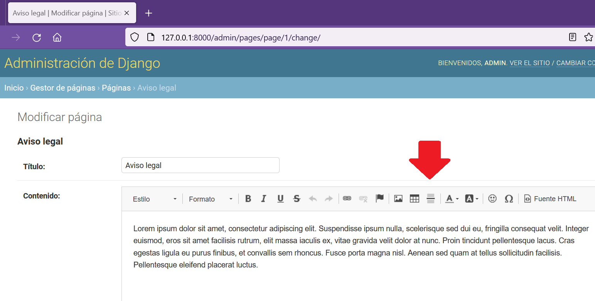
</p>

* Para personalizar el ck-editor añadiremos la siguiente configuración en el archivo de settings.py(webpersonal\webpersonal\settings.py).

```py
# Ckeditor
CKEDITOR_CONFIGS = {
    'default': {
        'toolbar': 'Custom',
        'toolbar_Custom': [
            ['Bold', 'Italic', 'Underline'],
            ['NumberedList', 'BulletedList', '-', 'Outdent', 'Indent', '-', 
             'JustifyLeft', 'JustifyCenter', 'JustifyRight', 'JustifyBlock'],
            ['Link', 'Unlink']
        ]
    }
}
```

* La configuración anterior se la obtuvo de la documentación oficial de [ck-editor](https://github.com/django-ckeditor/django-ckeditor), ahi encontrarás mayor información sobre las distintas configuraciones que puedes hacerle al editor de texto.

<p align="center">
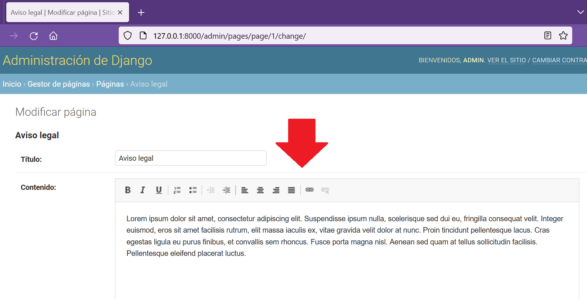
</p>

* En el archivo sample.html debes configurar para que interprete el código html que se envia desde el ck-editor cuando utilizas el editor de texto.

<p align="center">
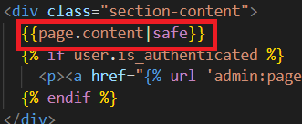
</p>