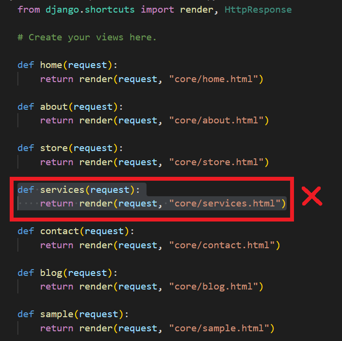

## App services

[Regresar](/CodingBootcampsESPOL-RDDW/)

A continuación se encuentran las indicaciones:

- Empezarás por crear el modelo y configurando el panel de administrador.

- Configura los ficheros media que funcionen en el servidor de desarrollo.

- Crea una app Services y añádela a la lista INSTALLED_APPS en settings.py.

- El modelo Service constará de 6 campos obligatorios, podéis utilizar de referencia el modelo Project de la app Portfolio del primer proyecto:

    + **Title**: Un título con 200 caracteres de longitud máxima.

    + **Subtitle**: Un subtítulo con 200 caracteres de longitud máxima.

    + **Content**: Un texto de tamaño indefinido.

    + **Image**: Una imagen para mostrar de fondo almacenada en el directorio services (dentro de media).

    + **Created**: Un campo automático para gestionar la fecha y hora de creación.

    + **Updated**: Un campo automático para gestionar la fecha y hora de última actualización.

- Haz una migración completa (makemigrations y migrate a secas, sin especificar nombre de app) y crea un superusuario para poder acceder al panel de administrador.

- Ahora configura la app para ser manejable desde el panel de administrador. Debes mostrar los campos especiales Created y Updated en modo sólo lectura.

- Toda la información de la app deberá aparecer en español (admin en general, nombre de la app, nombre del modelo y sus campos).

Es momento de realizar la práctica de esta sección.

* En el directorio raíz de nuestro proyecto crea la carpeta **media**(webpersonal\media).

* En el archivo settings.py(webpersonal\webpersonal\settings.py) se realizará la configuración para los archivos media.

```py
import os
# Media config
MEDIA_URL = '/media/'
MEDIA_ROOT = os.path.join(BASE_DIR, 'media')
```

* En el archivo urls.py(webpersonal\webpersonal\urls.py) añade el siguiente código.

```py
from django.conf import settings

if settings.DEBUG:
    from django.conf.urls.static import static
    urlpatterns += static(settings.MEDIA_URL, document_root=settings.MEDIA_ROOT)
```

* En el directorio de webpersonal abre la consola y ejecuta el comando para crear la app de services.

```
python manage.py startapp services
```

* En el archivo settings.py(webpersonal\webpersonal\settings.py) agrega la app de services en el array de INSTALLED_APPS.

<p align="center">

</p>

* Ahora crearemos el modelo de services en el archivo models.py de la carpeta services.

```py
class Services(models.Model):
    title = models.CharField(max_length=200, verbose_name="Título")
    subtitle = models.CharField(max_length=200, verbose_name="Subtítulo")
    content = models.TextField(verbose_name="Contenido")
    image = models.ImageField(verbose_name="Imagen", upload_to="services")
    created = models.DateTimeField(auto_now_add=True, verbose_name="Fecha de creación")
    updated = models.DateTimeField(auto_now=True, verbose_name="Fecha de edición")

    class Meta:
        verbose_name = "servicio"
        verbose_name_plural = "servicios"
        ordering = ['-created']

    def __str__(self):
        return self.title
```

* En la consola ejecuta el siguiente comando, recuerda estra ubicado en la carpeta de webpersonal.

```
python manage.py makemigrations
```

* Ahora ejecuta el siguiente comando:

```
python manage.py migrate
```

* Es momento de crear un superusuario ejecutando el siguiente comando:

```
python manage.py createsuperuser
```

* Para que la app de services sea accesible desde el panel de administración debe añadir la siguiente codificación en el archivo admin.py(webpersonal\services\admin.py).

```py
from django.contrib import admin
from .models import Services
# Register your models here.

class ServiceAdmin(admin.ModelAdmin):
    readonly_fields = ('created', 'updated')

admin.site.register(Services, ServiceAdmin)
```

* Ejecuta el servidor y accede al [panel de administración](http://127.0.0.1:8000/admin/) con el usuario que creaste.

```
python manage.py runserver
```

<p align="center">

</p>

* Finalmente cambiamos la configuración de Django al español, accede a settings.py en la que modificarás lo siguiente.

```py
LANGUAGE_CODE = 'es'
```

* En el archivo apps.py(webpersonal\services\apps.py) agrega lo siguiente:

```py
verbose_name = "Gestor de servicios"
```

* Modifica el archivo settings.py. 

<p align="center">

</p>

Vista y template
===========

* * *

Las vistas y templates son las segunda parte de esta práctica. Deberás seguir las siguientes isntrucciones:

- Crea algunos servicios de prueba utilizando el panel de administrador, puedes utilizar la maqueta del frontend y sus imágenes (directorio img).

- Traslada el template services.html a un directorio templates/services en su propia app.

- Traslada la vista services a su propia app (no olvides borrar su path en las urls de Core) y renderiza el template anterior.

- Configura la vista que has creado en un fichero urls.py de app (services/urls.py) tal como hicimos con la app Core en las urls del proyecto, de manera que funcione en la url /services/ de la web.

- Finalmente fusiona el template para que muestre los servicios creados en el panel de administrador.

* Iniciaremos creando algunos servicios de prueba en el panel de administración. Toma como referencia los servicios que se encuentra en el zip del frontend.

<p align="center">

</p>

* A continuación se detallan los productos que fueron creados. Cabe recalcar que puedes añadir la información que requieres, lo que se muestra a continuación son ejemplos.

<p align="center">

</p>
<p align="center">

</p>
<p align="center">

</p>

* En la carpeta services crea un subcarpeta **templates**(webpersonal\services\templates) y ahí también debe haber una carpeta con el nombre de la app services.

* En la app core se encuentra el template de services.html(webpersonal\core\templates\core\services.html) que debes mover a la carpeta de services(webpersonal\services\templates\services).

*  Debemos eliminar la vista de services que se encontraba en el archivo views.py(webpersonal\core\views.py) de la app core.

<p align="center">

</p>

* Y la que habiamos eliminado ahora estará en el archivo views.py(webpersonal\services\views.py) pero de la app services.

```py
def services(request):
    return render(request, "services/services.html")
```
* También en el archivo urls.py(webpersonal\core\urls.py) de la app core eliminarás la url correspondiente a la página de services.

* En la carpeta services crea un nuevo archivo urls.py(webpersonal\services\urls.py) que tendrá las siguientes líneas de código.

```py
from django.urls import path
from . import views

urlpatterns = [
    path('', views.services, name="services"),

]
```
* Se procede a configurar dicha url en el archivo global de urls.py(webpersonal\webpersonal\urls.py).

<p align="center">

</p>

* Ejecuta el servidor y accede a la página de [services](http://127.0.0.1:8000/services/) y verifica que funcione correctamente.

<p align="center">

</p>

* Ahora debemos cargar los servicios que se crearon desde el panel de administración y no los del archivo html. En el archivo views.py de la app service realiza lo siguiente:

```py
from .models import Services
# Create your views here.

def services(request):
    services = Services.objects.all()
    return render(request, "services/services.html", {'services':services})
```

* Creamos un bloque for para acceder a los servicios que creamos y que se muestren en el template, estos cambios lo harás en el archivo services.html(webpersonal\services\templates\services\services.html).

<p align="center">

</p>

*  Ejecuta el servidor y accede a la página de [services](http://127.0.0.1:8000/services/) y verifica que funcione correctamente, los datos que se muestran son extraídos de la base de datos.

<p align="center">

</p>