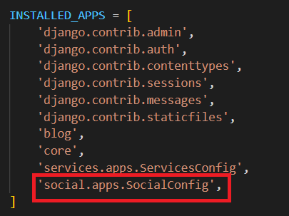
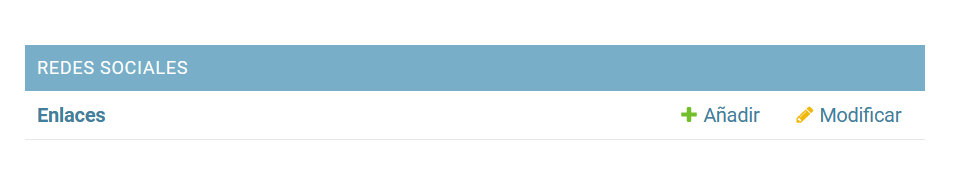
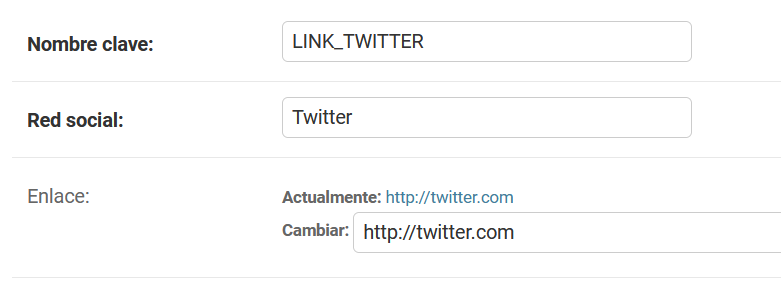
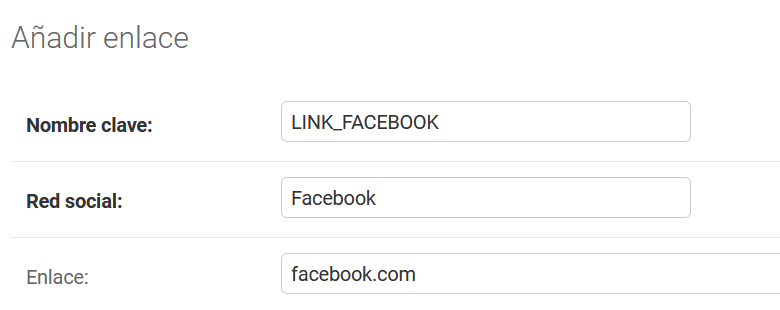
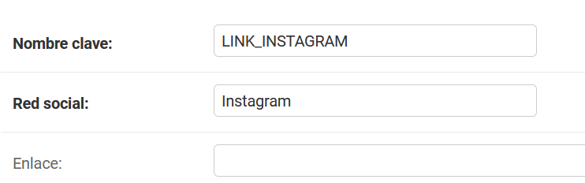
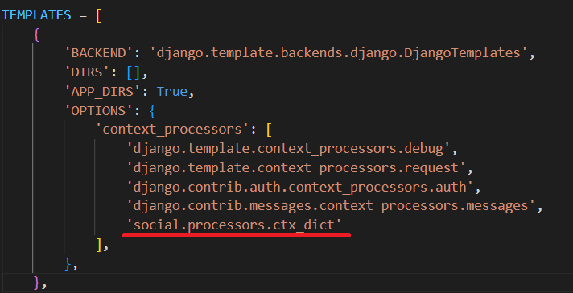
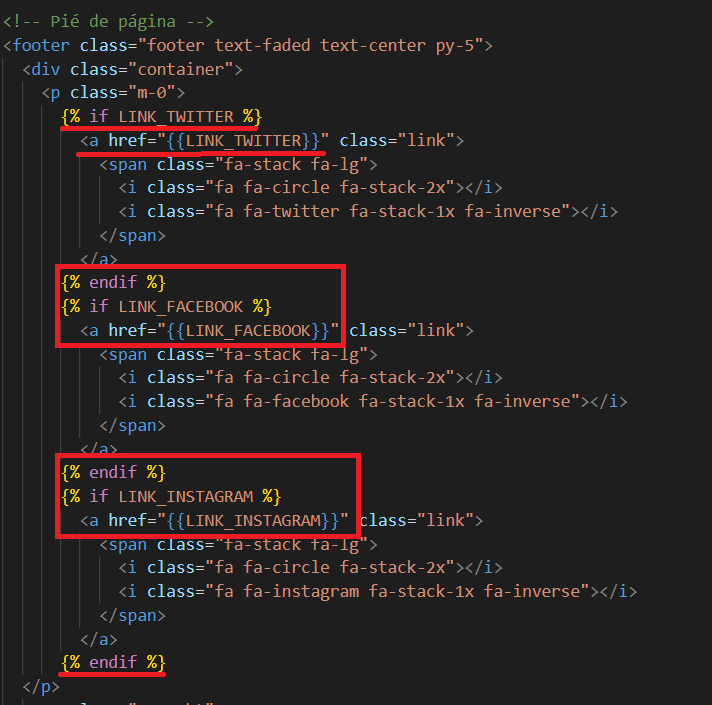
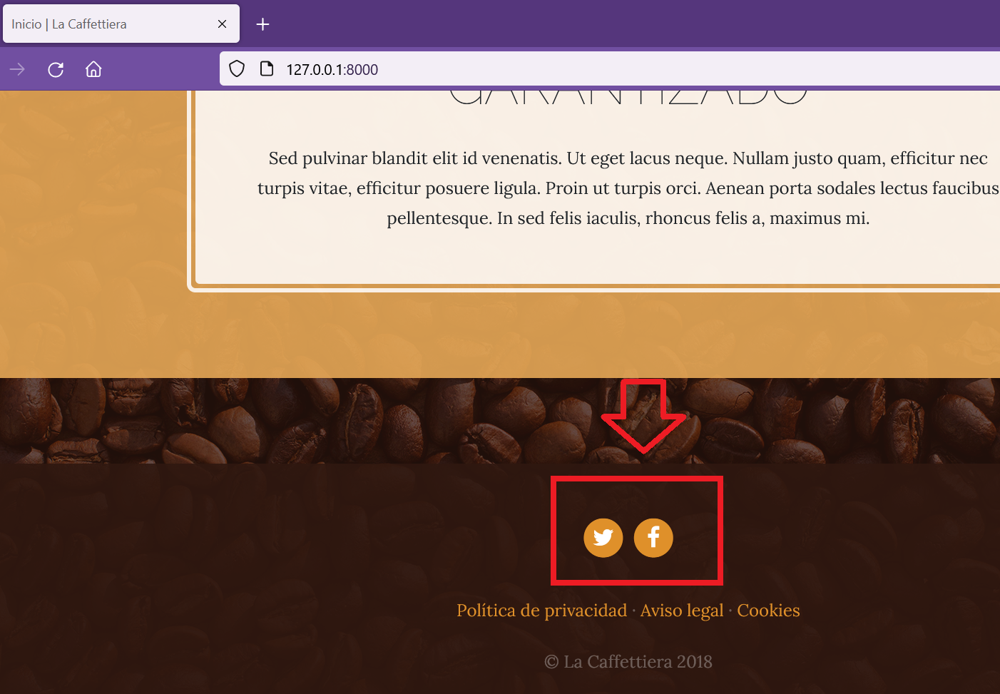

## App Social

[Regresar](/CodingBootcampsESPOL-RDDW/)

* Estando en la carpeta webpersonal abrimos la terminal y ejecutamos:

```
python manage.py startapp social
```
* En la nueva carpeta social correspondiente a la app social  se encuentra el archivo models.py(webpersonal\social\models.py) en donde estaremos trabajando.

```py
from django.db import models

# Create your models here.

class Link(models.Model):
    key = models.SlugField(verbose_name="Nombre clave", max_length=100, unique=True)
    name = models.CharField(verbose_name="Red social", max_length=200)
    url = models.URLField(verbose_name="Enlace", max_length=200, null=True, blank=True)
    created = models.DateTimeField(auto_now_add=True, verbose_name="Fecha de creación")
    updated = models.DateTimeField(auto_now=True, verbose_name="Fecha de edición")

    class Meta:
        verbose_name = "enlace"
        verbose_name_plural = "enlaces"
        ordering = ['name']

    def __str__(self):
        return self.name
```

* Utilizando el verbose_name haremos el cambio del nombre a la app en el archivo apps.py(webpersonal\social\apps.py). Añade la siguiente línea de código dentro de la clase.

```py
verbose_name = "Redes sociales"
```

* Añadiremos la app en el archivo settings.py.(webpersonal\webpersonal\settings.py)
<p align="center">

</p>

* En la consola ejecutamos el comando para hacer la migración. 

```
python manage.py makemigrations social
```

* Ahora ejecuta la siguiente instrucción.

```
python manage.py migrate social
```

* Ya podemos crear un administrador para la app de redes sociales, inserta el siguiente código en el archivo admin.py(webpersonal\social\admin.py).

```py
from django.contrib import admin
from .models import Link
# Register your models here.

class LinkAdmin(admin.ModelAdmin):
    readonly_fields = ('created', 'updated')

admin.site.register(Link, LinkAdmin)
```

* Ejecuta el servidor y accede al panel de administración y podrás crear nuevos enlaces en la app de redes sociales. 

<p align="center">

</p>

<p align="center">

</p>

<p align="center">

</p>

<p align="center">

</p>

Procesadores de contexto
===========

* * *

Ahora realizaremos la parte de activar los enlaces de redes sociales que se encuentra en la parte inferior de las distintas páginas. La solución que aplicaremos es utilizar procesadores de contexto. Un procesador de contexto es sencillamente una función que recibe un argumento request y retorna un diccionario de elementos (contexto).

* En la app social crearemos un procesador de contexto específicamente agregando el archivo processors.py(webpersonal\social\processors.py) dentro de la app social. Y agrega lo siguiente:

```py
from .models import Link

def ctx_dict(request):
    ctx = {}
    links = Link.objects.all()
    for link in links:
        ctx[link.key] = link.url
    return ctx
```

* Realizaremos una configuración para que el diccionario se extienda al contexto global. Por tal razón en archivo settings.py(webpersonal\webpersonal\settings.py) añade el context processors en el lugar correspondiente.

<p align="center">

</p>

* Añadiremos los enlaces respectivos a cada red social en la template de base.html.(webpersonal\core\templates\core\base.html)

<p align="center">

</p>

* Ejecuta el servidor y visualiza que aparecen ya los enlaces en los íconos de las redes sociales. Pero, como se había ejemplicado de que Instagram no tenia enlace por tal razón no aparece, si deseas que aparezca, prueba modificando y añadiendo el enlace correspondiente mediante el panel de administración.

<p align="center">

</p>