## Fusiona el Frontend y el Backend

[Regresar](/CodingBootcampsESPOL-RDDW/)

En esta práctica deberás realizar la fusión del frontend y backend. A continuación se muestran las instrucciones:

Identifica las partes comunes en todas las maquetas HTML y crea una estructura con herencia (base.html, home.html...). Deberás lograr un menú funcional y que se carguen correctamente los ficheros estáticos (css, javascripts, imágenes) de todos los templates.

**Notas:** No olvides activar la app Core y reiniciar el servidor para poder utilizar los recursos estáticos cargándolos con  en su respectivo template.

Dada las instrucciones, empezemos con la ejecución de las mismas.

* En la carpeta core crea la subcarpeta **templates**(webpersonal\core\templates) y **static**(webpersonal\core\static).

* Tanto en la carpeta templates como en la de static crea la subcarpeta **core**.

En la sección de recursos se tendrá la [plantilla de frontend](./webempresa_Frontend.zip) de la cafetería en la que deberás descargarlo y copiar los archivos .html y pegarlos en la subcarpeta core(webpersonal\core\templates\core) de templates.

<p align="center">
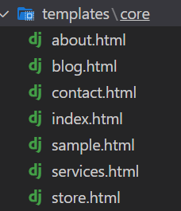
</p>

* En la [plantilla de frontend](./webempresa_Frontend.zip) también se encuentra las carpetas css, img y vendor que deberás copiarlas en la carpeta static(webpersonal\core\static\core) de la app core.

* Ahora debemos cargar los archivos estáticos y lo de template, por tal razón activaremos la app en settings.py(webpersonal\webpersonal\settings.py). 

<p align="center">
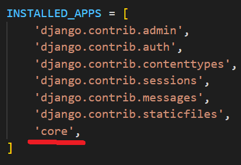
</p>

* El archivo views.py ahora tendrá la siguiente estructura usando render.

```py
from django.shortcuts import render, HttpResponse

# Create your views here.

def home(request):
    return render(request, "core/home.html")

def about(request):
    return render(request, "core/about.html")

def store(request):
    return render(request, "core/store.html")

def services(request):
    return render(request, "core/services.html")

def contact(request):
    return render(request, "core/contact.html")

def blog(request):
    return render(request, "core/blog.html")

def sample(request):
    return render(request, "core/sample.html")
```

* En las templates de core cambia el nombre del archivo index.html a home.html. Y así ejecutamos el servidor y visualizamos que se ha cargado la estructura inicial.

<p align="center">
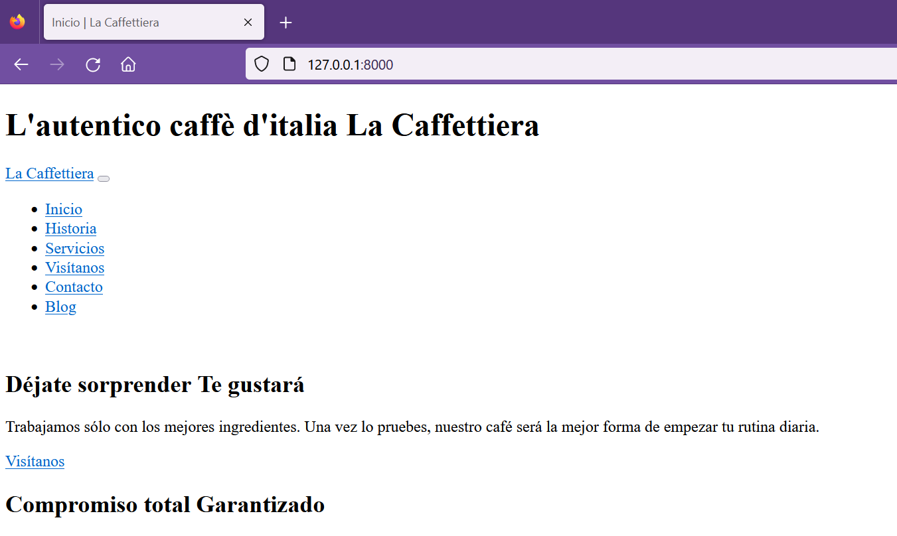
</p>

* Para cargar los ficheros estáticos usando la siguiente línea de código en el archivo home.html que esta en la carpeta templates.

<p align="center">
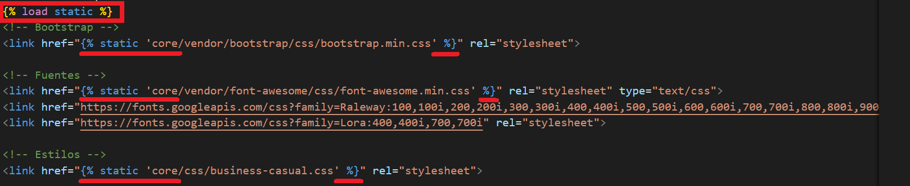
</p>

<p align="center">
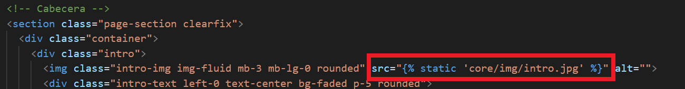
</p>

<p align="center">
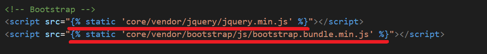
</p>

* En el carpeta core está el archivo home.html el cual lo vas a copiar y pegar en la misma carpeta pero con el nombre de **base.html**. En el archivo base.html eliminarás de sección de cabecera y mensaje. 

<p align="center">
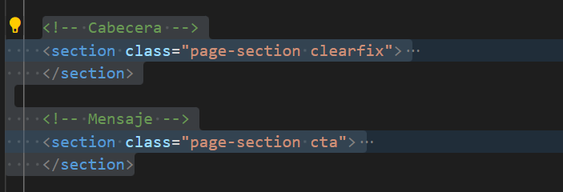
</p>

* Incluirás la parte del content.

<p align="center">
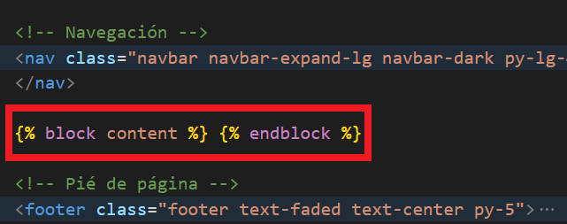
</p>

* En el archivo home.html(webpersonal\core\templates\core\home.html) solo dejarás la parte de cabecera y mensaje, lo demás será eliminado. Luego, agregas el código que se visualiza en la imagen.

<p align="center">
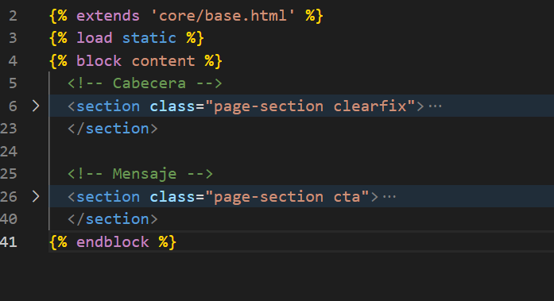
</p>

* En el archivo base.html, nos ubicamos en la parte de navegación y cambiamos los enlaces a html al nombre de los urls que ya habiamos configurado anteriormente.

<p align="center">

</p>

* Recuerda que anteriormente solo habíamos modificado el home.html añadiendo y elimando ciertas partes del código. Por tal razón, debes hacer lo mismo para las demás páginas de: contacto, servicios, blog, etc.

* Una vez realizada todas las modificaciones podrás acceder a todas las páginas.

<p align="center">
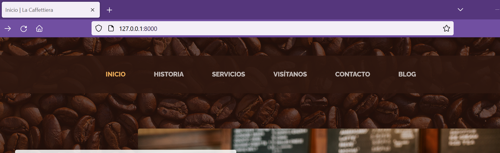
</p>

Resaltando sección actual
===========

* * *

Algo que notamos en nuestra página web es que al momento de visitar una página distinta al home igual continua resaltado el home en la barra de navegación. A continuación, se muestra que estamos en la página de **contact** y en la barra se resalta el home. 

<p align="center">
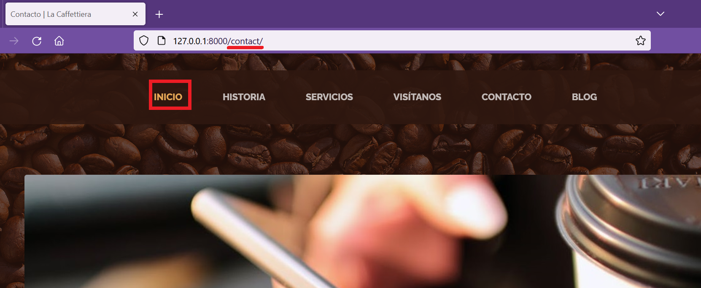
</p>

* En el archivo base.html(webpersonal\core\templates\core\base.html) insertaremos un condicional en cada elemento de la barra de navegación y de esa forma activar el sombreado en la página correspondiente.

<p align="center">
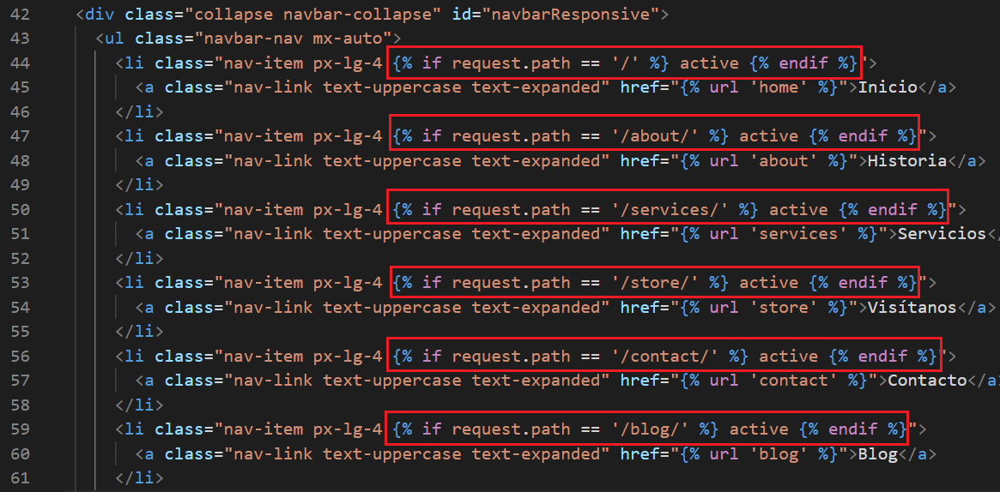
</p>

* Con el servidor en ejecución, visualiza los cambios respectivos.

<p align="center">
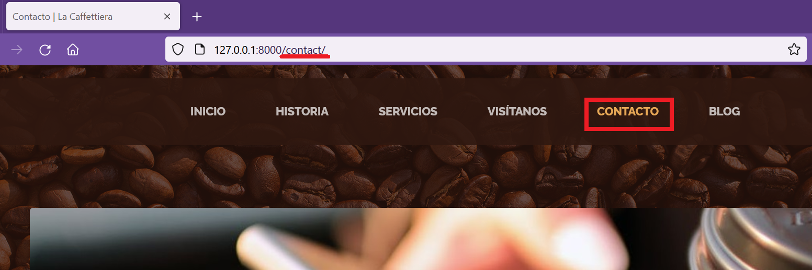
</p>