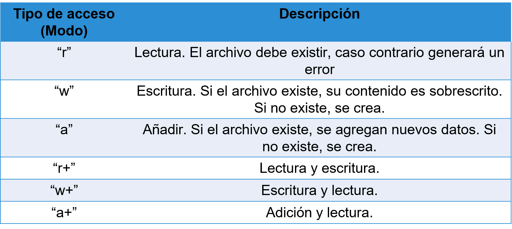

## Archivos

[Regresar](/CodingBootcampsESPOL-RDDW/)

La información de un archive que se guarda en variables es **temporal**.
 - Todo	lo	que	se	almacena	en	variables	se	pierde	cuando	el	programa	se  termina.
 - La información de un archive se almacena realmente en memoria (RAM).

<p align="center">

</p>

Para poder guardar información de forma permanente, ésta debe ser  almacenada en archivos. De esta forma, la información se mantendrá aún  cuando el programa haya terminado su ejecución.

Ejemplos:
- Puntajes en los juegos, como el Buscaminas.
- Notas de estudintes en una hoja electronica.
- Voces grabadas usando el computador.

Archivos de texto
===========

* * *

Los archivos pueden almacenar todo tipo de información y dependiendo de ella tienen un **tipo**, el mismo que se reconoce en Windows por la **extension**.

En los archivos de texto plano **.txt**, el acceso se lo realiza de forma secuencial.

<p align="center">

</p>

Abrir / cerrar archivos
===========

* * *

Antes de que podamos leer el contenido de un archivo, tenemos que decirle a  Python con qué archivo vamos a trabajar y qué es lo que haremos con él.
Esto se hace con la función open().
   * **open()**: devuelve	un “file handle”, variable	que se usa para realizar operaciones en el archivo.
Es parecido a “Archivo” – “Abrir” en el procesador Word.
   * **close()**: se utiliza cuando se termina de trabajar  en el archivo – para cerrar.

open()
===========

* * *

<p align="center">

</p>

Devuelve un	“handle” para manipular un archivo.
“filename” es una secuencia de caracteres.
“mode” es opcional y sería “r” si lo que queremos es leer el archivo y “w”
si vamos a escribir en el archivo.

open()
===========

* * *

```python
fhand = open(“mbox.txt”, “r”)
fhand.close()
```
Si en el nombre del archivo no se incluye la ruta donde está almacenado,  Python asume el directorio de trabajo actual.
El archivo se debe cerrar una vez que se ha terminado de trabajar con él.

¿Qué es handle?
===========

* * *

Handle es un puntero inteligente a un tipo de objeto de Python; contiene un puntero de tipo T*, donde T es su parámetro de plantilla. 

```python
fhand = open(“mbox.txt”, “r”)
fhand.close()
```

<p align="center">

</p>

Abrir / Cerrar archivos
===========

* * *

<p align="center">

</p>

Operaciones de entrada
===========

* * *

<p align="center">

</p>

Operaciones de salida
===========

* * *

<p align="center">

</p>

Para recordar ...
===========

* * *

+ **Archivos de texto:** 
Sólo almacena caracteres ASCII y Unicode


+ **Caracteres ASCII:**
Es una codificación basado en el alfabeto latino donde a cada carácter se les asigna un código.


+ **Caracteres Unicode:**
Es una que facilita el tratamiento informático, transmisión y visualización de textos de múltiples  lenguajes. Especifica un nombre e identificador numérico único para cada carácter o símbolo.

+ **Archivos de binarios:**
Contiene otra información q no necesariamente es texto. Archivo binario  podría ser una imagen.

<p align="center">

</p>

File Handle
===========

* * *

* Función para abrir el archivo (devuelve un manejador del archivo) este manejador es f.
* Al abrir uso el nombre del archivo pero de ahí en adelante uso f, el nombre del archivo puede ser un string o una variable.
* f = open(filename, "r") # nombre del archivo es lo q ingresa el usuario.  Filename – corresponde al nombre del archivo que ingresa el usuario.

Diferencias entre modos de acceso
===========

* * *

* **r**
Modo lectura –sino existe el archivo obtengo una excepción.

* **w**
Modo escritura –sino existe el archivo lo crea, caso contrario si existe sobrescribe el  contenido.

* **a**
Añade información en la posición donde se encuentra el manejador.

Funciones para leer un archivo
===========

* * *

* **f.read()**
Lee todo el archivo y lo pone en un string.

* **f.readline()** 
Solamente lee una línea del archivo, para eso busca un enter (\n) por tanto  lee esa línea y m la retorna como un string.

* **f.readlines()** 
Lee línea por línea y m devuelve una lista de líneas.

* **for line in f:** 
Toma cada línea del archivo, la coloca en un variable string (file), y sigue  moviendo el handle.

```python
f = open("texto.txt", "r")
f.readline() #salto la primera línea
```

**NOTA:** si tengo un archivo con una línea, lee todo y después empieza a devolver una
lista vacía.

* **Seek**
Mueve el puntero del archivo por bytes.

```python
f.read()  0
f.seek(0) # regresa el manejador al inicio
f.read()
"hola mundo\n"
```

* **f.write(arg)**
Se puede concatenar todo lo que uno desee escribir pero tiene q ser un solo string. Por tanto, se debe concatenar previo a enviarlo como argumento.
