## Arreglos

[Regresar](/CodingBootcampsESPOL-RDDW/)

Arreglos N-dimensionales
===========

* * *

Agrupación de elementos del mismo tipo de dato  (homogéneos) y con un tamaño definido.

+ **Dimensión 1:** Arreglos
[2 3 4]

+ **Dimensión 2:** Matriz
[[2 3 4]
[4 3 4]]

Numpy
===========

* * *

Librería de Python que permite realizar  operaciones con arreglos n-dimensionales  (arreglos y matrices).

```python
import numpy as np
```


<p align="center">

</p>

Creación de arreglos
===========

* * *
Creando un arreglo a partir de una lista.

<p align="center">
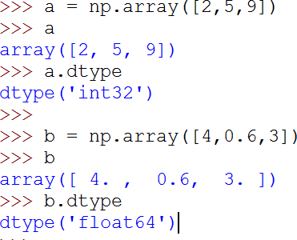
</p>

Cuando se crea un arreglo se puede especificar el tipo de dato de los  elementos que tendrá el arreglo.

<p align="center">
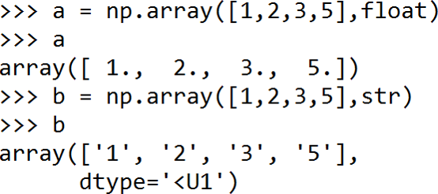
</p>

Errores de creación de arreglos
===========

* * *

a = np.array(1,2,3,4)     ❌

b = np.array ([1,2,3,4])  ✅ 

Propiedades de arreglos n-dimensionales
===========

* * *

<p align="center">
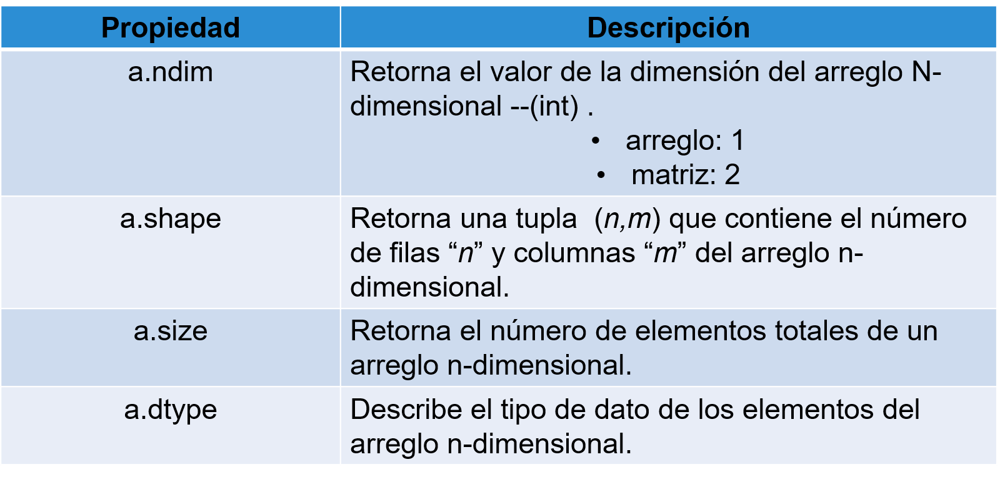
</p>
<p align="center">
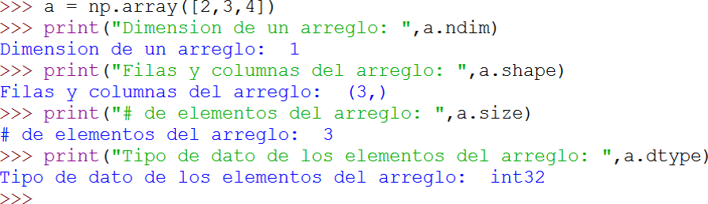
</p>

Propiedades de las matrices
===========

* * *

<p align="center">
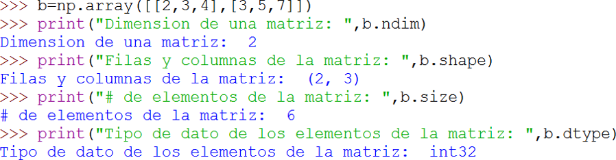
</p>

Inicialización de arreglos n-dimensionales
===========

* * *

<p align="center">
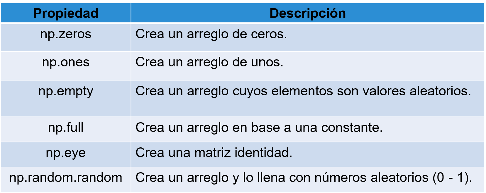
</p>

<p align="center">
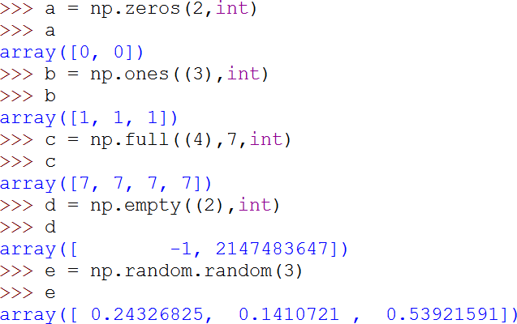
</p>

Inicialización de matrices
===========

* * *

<p align="center">
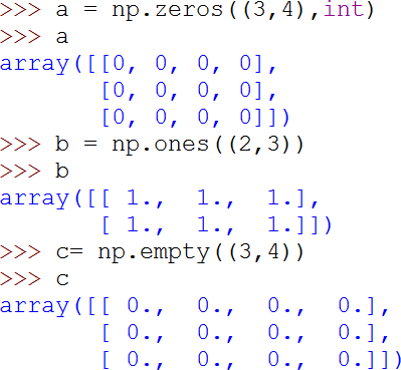
</p>

<p align="center">
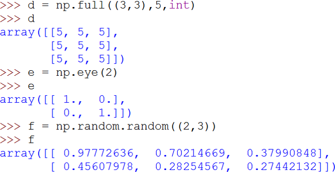
</p>

Modificar arreglos n-dimensionales
===========

* * *

+ **Fill:** Llena las posiciones de un arreglo previamente creado con valor específico.

<p align="center">
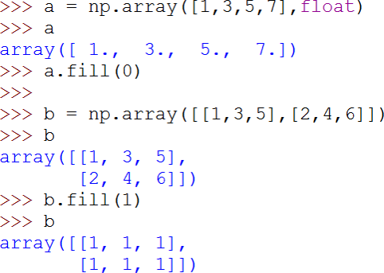
</p>

+ **Concatenate:** Permite concatenar 2 o más arreglos n-dimensionales.

<p align="center">
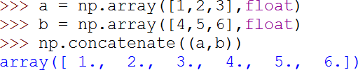
</p>

Operaciones con escalares
===========

* * *

Se puede realizar operaciones aritméticas entre los arreglos n-  dimensionales y escalares. El resultado de esta operación afecta a los  elementos del arreglo n-dimensional.

<p align="center">
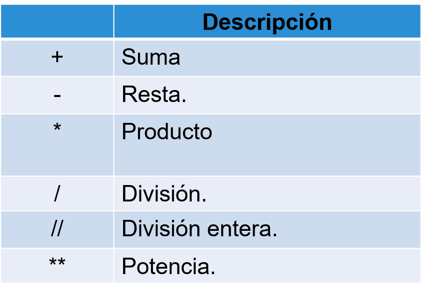
</p>

Operaciones en arreglos n-dimensionales
===========

* * *

<p align="center">
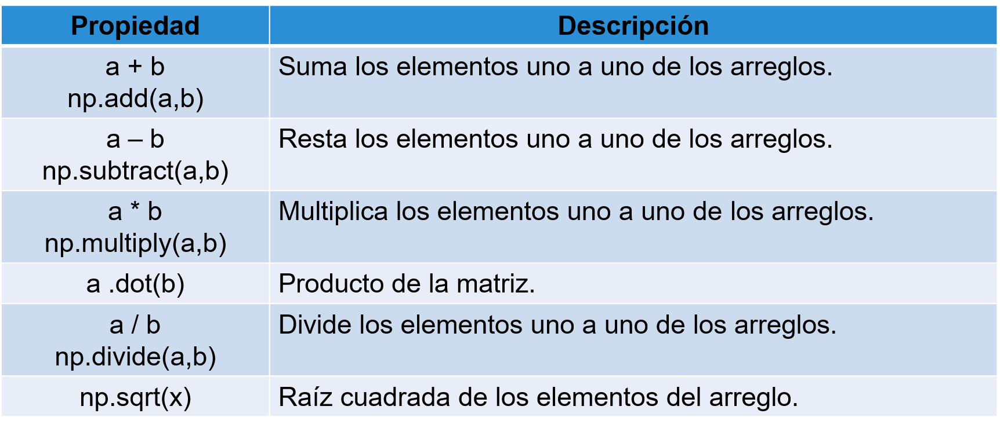
</p>

<p align="center">
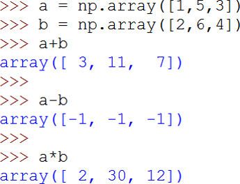
</p>

Operaciones en matrices
===========

* * *

<p align="center">
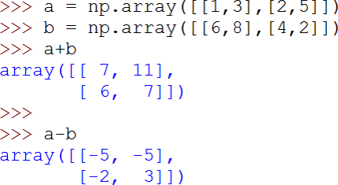
</p>

Operaciones adicionales
===========

* * *

<p align="center">
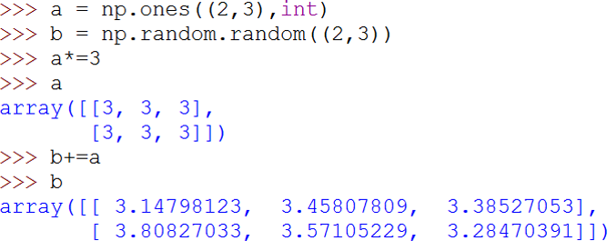
</p>

Asignaciones en arreglos
===========

* * *

<p align="center">
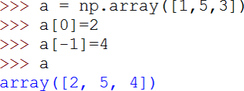
</p>

Slicing en arreglos
===========

* * *

<p align="center">
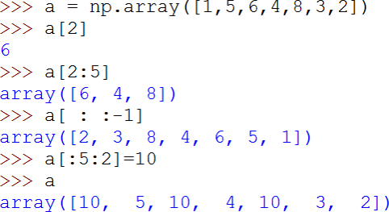
</p>

Slicing en matrices
===========

* * *

<p align="center">
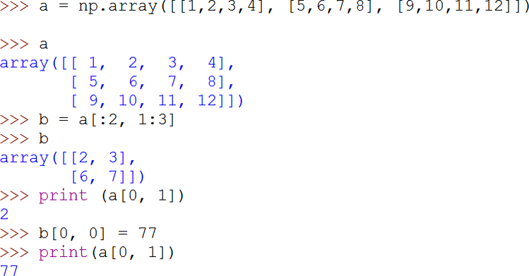
</p>

Funciones en arreglos n-dimensionales
===========

* * *

<p align="center">
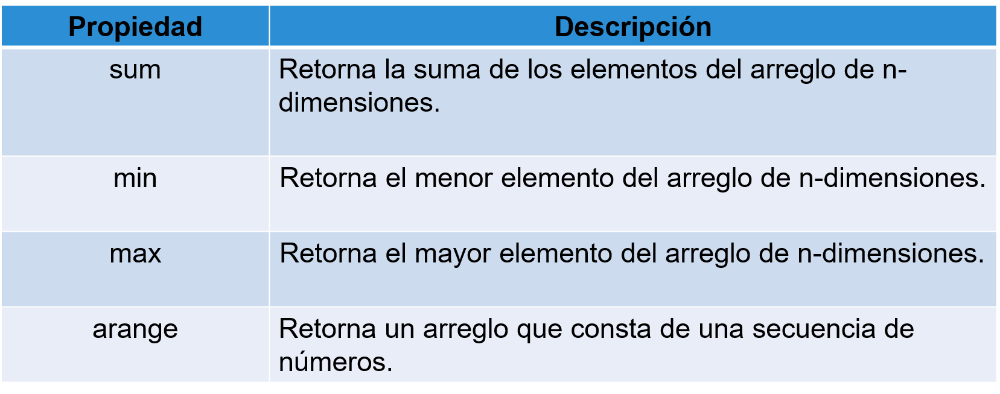
</p>

Operaciones básicas
===========

* * *
<p align="center">
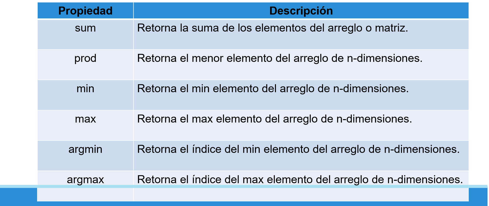
</p>

Operaciones estadísticas
===========

* * *
<p align="center">
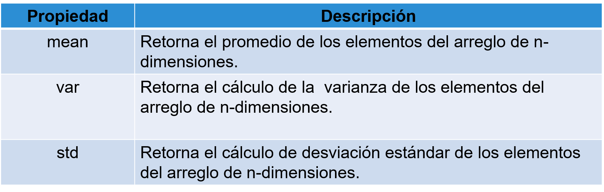
</p>

<p align="center">
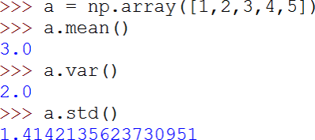
</p>

Función arange: arreglos
===========

* * *

<p align="center">
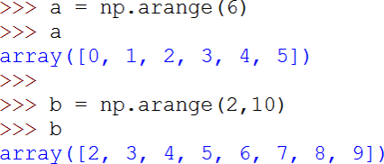
</p>

Transformar un arreglo en matriz:  reshape
===========

* * *

La	función	reshape	recibe	la	forma	del	nuevo	arreglo	n	dimensional.	La  forma debe corresponder a la cantidad de elementos que tiene el arreglo.

<p align="center">
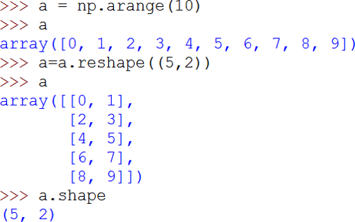
</p>

Función reshape: matrices
===========

* * *

<p align="center">
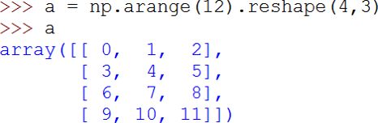
</p>

Transformar una matriz en un  arreglo: ravel
===========

* * *
La función ravel transforma cualquier arreglo n-dimensional en un arreglo  de una dimensión.

<p align="center">
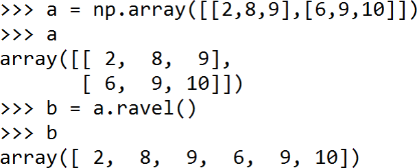
</p>

Función where
===========

* * *
Retorna un nuevo arreglo a partir de 2 arreglos (x, y), con elementos que  dependen de una condición booelana. La condición booleana es usada como  filtro para elegir entre elementos de los 2 arreglos.


<p align="center">
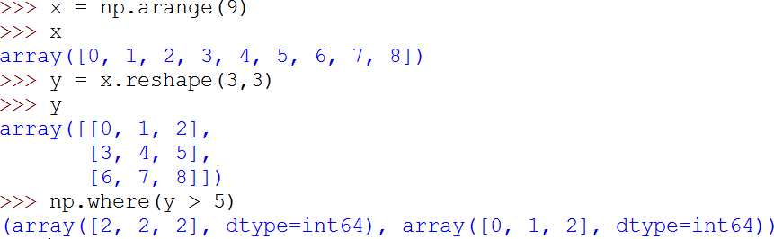
</p>

Función en matrices (copy)
===========

* * *
<p align="center">
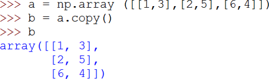
</p>

Indexación booleana
===========

* * *
<p align="center">
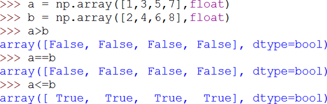
</p>

<p align="center">
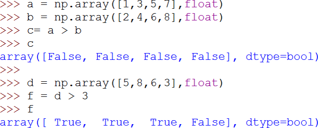
</p>