## Estructuras de control

[Regresar](/CodingBootcampsESPOL-RDDW/)

Las estructuras de control son un conjunto de sentencias que se ejecutan, de forma condicional. Existen 2 tipos:

* **Condicionales**

Verifican la condición y las sentencias  se ejecutan dependiendo del valor de  verdad de la condición.

* **Iterativas**

Puede iterar verificando una condición mientras sea verdadera. 

<p align="center">

</p>


Sentencia if 
===========

* * *

 Ejecuta un grupo de sentencias solamente​ si la condición es verdadera, caso contrario​ las sentencias no son consideradas. Su sintaxis es la siguiente:

```python
if <condition>:
<body>
```
```python
x = 1
if(x != 10 ):
    print("Ganó")

```

Expresiones Booleanas (Condiciones)
===========

* * *

* **Boolean Data type:** corresponde a 2 valores booleanos – True or False.
* **Boolean expression:** es una expression que evalúa un valor booleano.
Se requiere de un operador relacional para evaluar una expresión booleana.

<p align="center">

</p>

Sentencia if 
===========

* * *

```python
# Determinar si un estudiante es becario de Espol, de  acuerdo a su promedio.

promedio = float(input("Ingrese su promedio: "))

if(promedio >= 9.0):
print("Usted es becario ESPOL")
print("Encuesta realizada")
```
Ahora se solicita al usuario el ingreso de su nota de HDC y determinar si aprobó o no la materia.  Hint: Nota >= 60 aprobó la materia.
<p align="center">
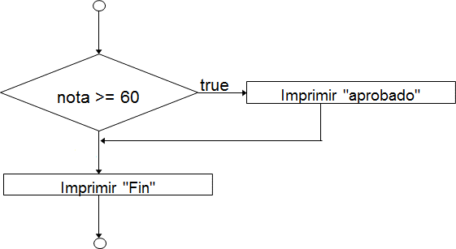
</p>

nota = int(input("Ingrese su nota: "))

```python
if nota > 60:
print("Aprobo la materia con %d" %nota)
print ("Su nota ya esta registrada en el Academico.")
```

Sentencia if-else
===========

* * *

A continuación se mostrará la sentencia del if-else.

```python
if <condition>:
<statements>  else:
<statements>
```

<p align="center">
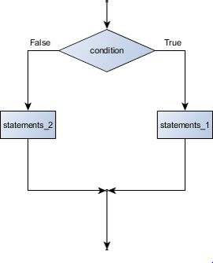
</p>

A continuación se mostrará un ejemplo de la sentencia if-else. 

```python
x = 15
if(x >= 18):
print("Eres mayor de edad")  else:
print("Eres menor de edad")

```

Ejercicio - control de flujo
===========

* * *

El ejercicio consiste en calcular el valor absoluto de un número. El algoritmo es el siguiente:
1. Pedir número n.
2. Calcular valor absoluto multiplicando número n por -1.
3. Mostrar un mensaje junto al valor absoluto del número. 

<p align="center">
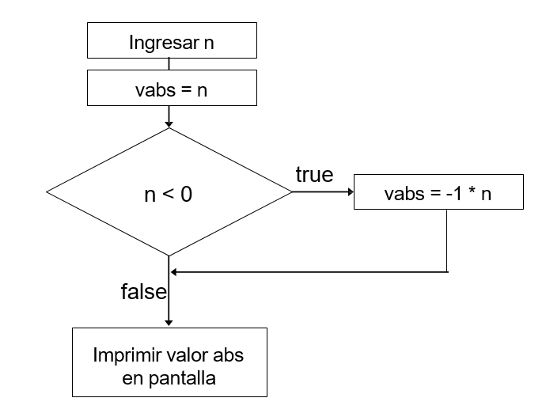
</p>

```python
num = int(input("Ingrese un numero: "))  if(num <0):
valorAbs = num * -1
print("El valor absoluto de %d es %d" % (num, valorAbs))
else:
print("El valor absoluto	de %d es %d" %(num, num))
```

Ejercicio - if-else
===========

* * *

Escriba un programa que solicite al usuario la edad  y a partir de ese dato determine si el usuario puede  sufragar o no.

```python
edad = int(input("Ingrese su edad: "))

if edad >=18:
print("Usted puede sufragar.")  else:
print("Usted no puede ejercer su derecho al voto.")
```

Ejercicio - if- elif - else
===========

* * *
Imprimir el porcentaje de impuestos a pagar de acuerdo al ingreso. 

<p align="center">
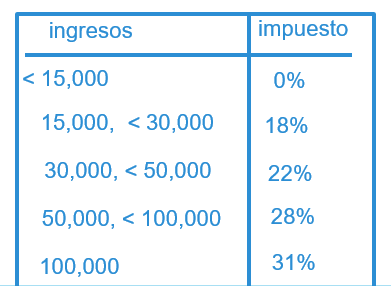
</p>

```python
ingresos = int(input("Escriba su ingreso: "))
if ingresos < 15000:
    print("No tax")  
elif ingresos < 30000:
    print("18% tax")  
elif ingresos < 50000:
    print("22% tax")
elif ingresos < 100000:  
    print("28% tax")
else:
    print("31% tax")
```

Ahora se debe crear un programa en el que se imprima la letra correspondiente de los alumnos que obtienen notas en letras de acuerdo a la siguiente tabla. 

Nota mayor o igual que 90  "A"
Nota entre  80 y 89        "B"
Nota entre  70 y 79        "C"
Nota entre  60 y 69        "D"
En otro caso               "F"

```python
nota = int(input("Escriba su nota: "))  
if nota >= 90:
    print("A")
elif nota >= 80:
    print("B")
elif nota >= 70:  
    print("C")
elif nota >= 60:
    print("D")
else:
    print("Failed")

```

Iteraciones: Lazos
===========

* * *

<p align="center">
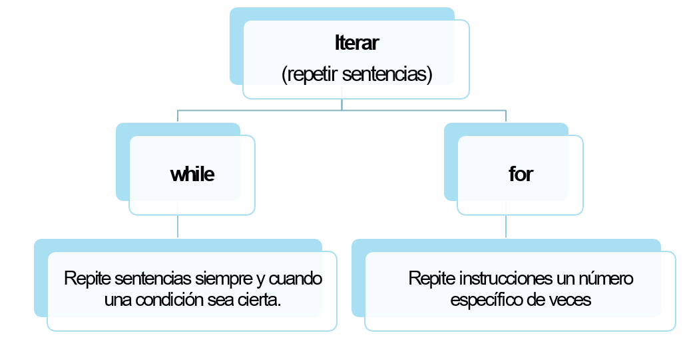
</p>

Lazo: for
===========

* * *

+ La sentencia for nos permite iterar sobre una secuencia de valores.

+ for <var> in <sequence>:
      <body>
+ La variable var toma cada valor sucesivo en la secuencia y por cada valor  se ejecutarán las declaraciones descritas en el cuerpo del lazo.

+ Cuando	se	ejecuta	el	último	elemento	del	grupo	de	valores,  automáticamente, el lazo termina.

For: definite loop
===========

* * *

Recordemos:
+ **for** es un lazo definido, es decir que el número de iteraciones es determinado cuando el lazo inicia.

+ No se puede usar lazos al menos que conozcamos el número de iteraciones desde un inicio.

 ➡️ range(inicio, fin) me permite  defiier una lista de números  entre el valor inicio y el valor fin-1.
>> range(0,4)
[0,1,2,3]


```python
for i in range(1,4):
    print (i)
print ("Fin del programa“)
```
Contando de dos en dos. 

```python
for i in range(2,10,2):  print (i)
print("Finalizó el conteo.")
```

Escribir un programa que nos ayude a contar regresivamente  los números del 5 al 0.
Finalmente imprimir un mensaje “Felíz Año Nuevo”.

```python
print("Iniciando el conteo regresivo:")

for i in range(5,0,-1):
    print (i)  
print("Felíz Año Nuevo.")
```

Usar el lazo for para construir un rectángulo de estrellas que tenga 4 filas de alto y 6 columnas de ancho. 

```python
for i in range(4):  
    print('*' *(6))
```
<p align="center">
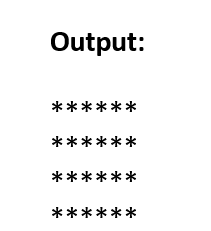
</p>

Lazo while
===========

* * *

```python
while <condition>:
<body>
```

+ **condition** es una expression booleana que verifica el valor de una  variable.

    + Inicializar la variable fuera del lazo
    + Actualizar variable en el lazo (siguiente slide muestra un ejemplo)
+ **El body** es una sequencia de una o más instrucciones.
+ Semánticamente, el body continua su  ejecución repetidamente mientras las  condición sea True. Cuando la condición  es False, el lazo termina.
+ Si el valor de la variable verificada en la  condición no se actualiza, se tendría un  lazo infinito.

<p align="center">
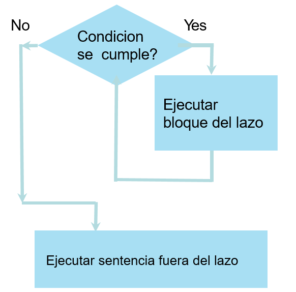
</p>

Ejemplo de lazo while
===========

* * *

```python
count = 4
while count > 0 : 
    print (count)  
    count = count	- 1
print ("Game over")  
print (count)
```
<p align="center">
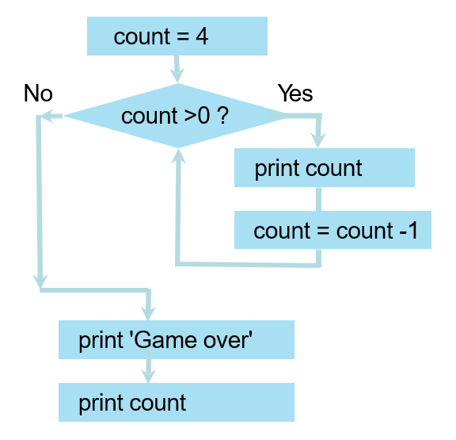
</p>

<p align="center">
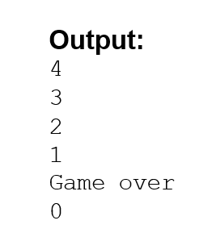
</p>

Lazos: while y for
===========

* * *
<p align="center">
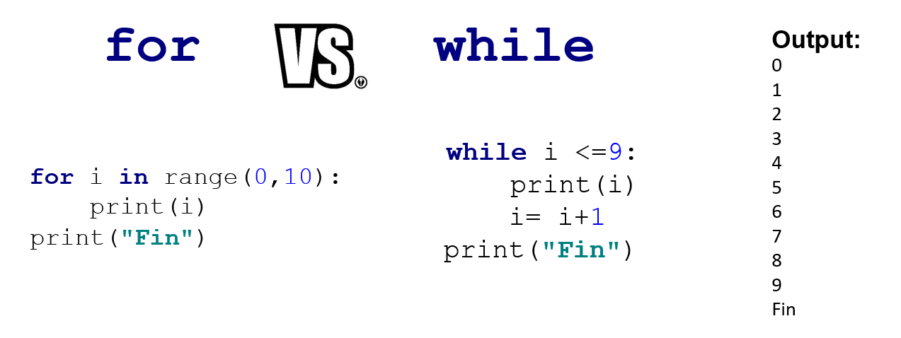
</p>

<p align="center">
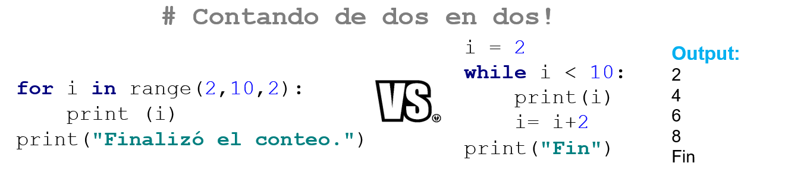
</p>

Break: terminar un lazo
===========

* * *

```python
while True:
    linea = input('> ')  if linea == "salir":
break
print(linea)
print("Programa Finalizado")
```
Otro ejemplo de break.

```python
while True:
    usr_command = input("Enter your command: ")  
    if usr_command == "quit":
        break  
    else:
        print("You typed " + usr_command)
```

Continue: omitir parte de un lazo 
===========

* * *

```python
for letter in 'ESPOL':  
    if letter == 'O':
        continue
    print ('Letra actual :', letter)
```

Lazos anidados
===========

* * *
+ **Outer loop(n iteraciones):** El lazo externo se ejecutará el número de veces
definidas (n veces).

+ **Inner loop(m iteraciones):** El lazo interno se ejecutará por completo cada  vez que se ejecute el lazo externo (n*m).

```python
for i in range(1, 11):
for j in range(1, 11):  print("*“)
print('\n')
```