## Funciones

[Regresar](/CodingBootcampsESPOL-RDDW/)

Principio y conceptos fundamentales de diseño
===========

* * *

Entre los principios y conceptos fundamentales de diseño están: abstracción, descomposición de  programas, encapsulamiento y ocultamiento de información, separación entre  comportamiento e implementación.

+ **Abstraer:** Formar una idea mental de un objeto extrayendo sus rasgos esenciales  desde una perspectiva en particular.

<p align="center">
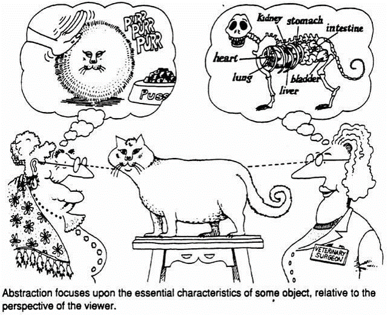
</p>

+ **Encapsular:** meter en cápsula o cápsulas. 

<p align="center">

</p>

Funciones
===========

* * *

+ Repetir código fuente en un programa, hace a éste difícil de leer y de mantener.

+ Dividir un programa en funciones favorece la reutilización de código.

<p align="center">
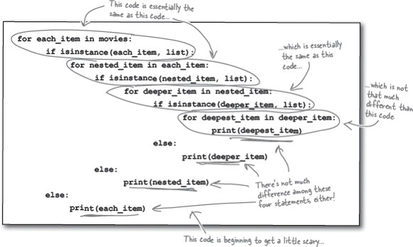
</p>

+ Una función en Python es un código reutilizable que toma argumento (s) como entrada,  hace algún cómputo y retorna un resultado o resultados.

+ Se define una función usando la palabra reservada **def**.


+ Llamamos o invocamos a la función escribiendo su nombre, paréntesis y argumento en
una expresión. 

Definición de una función 
===========

* * *

<p align="center">
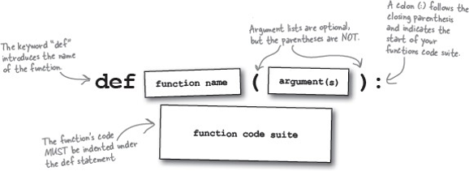
</p>

<p align="center">
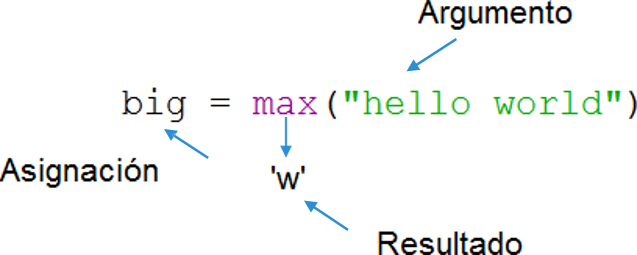
</p>

<p align="center">
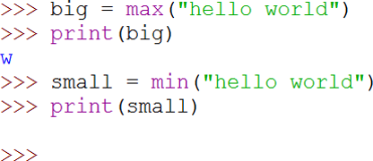
</p>

Función max
===========

* * *

Una función es un código  almacenado que usamos tantas  veces como queramos. Toma una  entrada y produce una salida.

<p align="center">
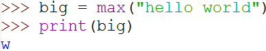
</p>

<p align="center">
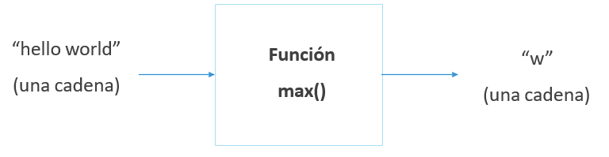
</p>

Conversión de tipo
===========

* * *

int(), float()

<p align="center">
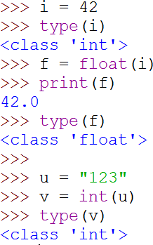
</p>

Abstracción 
===========

* * *

La abstracción nos permite concentrarnos en el gran problema sin preocuparnos de los  detalles. Así, se puede usar una función sin preocuparse en los detalles de como esta  lleva a cabo su tarea.
Por ejemplo, cuando se realiza el pedido de un combo de hamburguesa en un local de  comidas rápidas, el comprador no necesita preocuparse de servir la bebida, preparar la  hamburguesa, freír las papas, lavar los implementos, etc.


Implementación de una función 
===========

* * *
<p align="center">
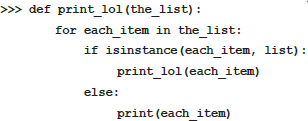
</p>

+ Creamos una función mediante la palabra clave def, seguida por parámetros dentro del  paréntesis.
+ Indentación para el cuerpo de la función.

Encapsulamiento
===========

* * *

+ Ninguna variable que se crea en una función, incluyendo sus parámetros, pueden ser  accedidos directamente fuera de la función. A esto se conoce como encapsulamiento.
+ El encapsulamiento ayuda a mantener el código independiente y realmente separado  por medio del ocultamiento o encapsulamiento de los detalles.
+ Los parámetros y los valores de retornos comunican la única información que debe ser  intercambiada.

Uso de una función 
===========

* * *

Una vez que hemos definido la función, podemos llamarla (o invocarla) tantas veces  como queramos.
Seguimos, de este modo el modelo de almacenar y reutilizar.


**Nota:** Use el nombre de la función seguida de los respectivos paréntesis. Por ejemplo:
instructions()

<p align="center">
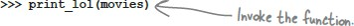
</p>

Invocar a  una función 
===========

* * *

+ name_function()

+ name_function(parameters)

+ name_function(name_parameter1 = value_parameter1, namer_parameter2 =
value_parameter2 )

Argumentos
===========

* * *

+ Un argumento es un valor que pasamos (o enviamos) a la función a modo de entrada  cuando invocamos la función.
+ Usamos	argumnetos	para	que	la	función	haga	cosas	diversas	cuando	la	llamamos  desde distintos puntos o momentos.
+ Colocamos los argumentos en paréntesis después del nombre de la función.


<p align="center">

</p>

Parámetros
===========

* * *

Un	parámetro	es	una	variable	que  usamos en la definición de la función, a modo	de	“variable	referencial”,	y	que luego volvemos a utilizar en el cuerpo de	la	función	para	acceder	a argumentos o valores a los cuales se  aplicará la función en una invocación  concreta.

```python
def saludo(idioma):
    if (idioma == "es"):
        print("Hola")
    elif (idioma == "fr"):  
        print("Bonjour")
    else:
        print("Hello")

```

Retorno de valores
===========

* * *

+ Desde una función se retorna valores por medio de la sentencia return. Como en  nuestro ejemplo:
return five
+ Cuando esta línea se ejecuta, la función pasará el valor de five de retorno a la parte del  programa que la llamó.


+ Una función siempre termina luego que alcanza la sentencia return.
+ Se puede retornar más de un valor listando todos los valores a retornar separados por  coma.

Una función tomará los argumentos, hará algún cómputo y devolverá (retornará) un  valor, que se utilizará como resultado o valor de la función invocada en la expresión de  llamada. Se utiliza la palabra clase return para indicar el valor que se ha de devolver.

```python
def saludo():
    return "hello"
print(saludo(), "Pamela")
print(saludo(), "Karla")

```

Múltiples parámetros y argumentos
===========

* * *

+ En la definición de la función, podemos establecer más de un parámetro.
+ Cuando invocamos una función, usamos tantos argumentos como hayamos definido.  
+ Deben corresponderse el número y el orden de argumentos y parámetros.

```python
def suma(a,b):
    sumaTotal = a+b
    return sumaTotal
x = suma(3,5)
print(x)
```

Tipos de funciones
===========

* * *

1. Funciones que no retornan ningún valor se conocen como procedimientos  o también denominados void.

2. Funciones que retornan valores lógicos (True o False) se denominan como funciones booleanas.

3. Funciones que reciben argumentos y parámetros.

Funciones booleanas 
===========

* * *

<p align="center">
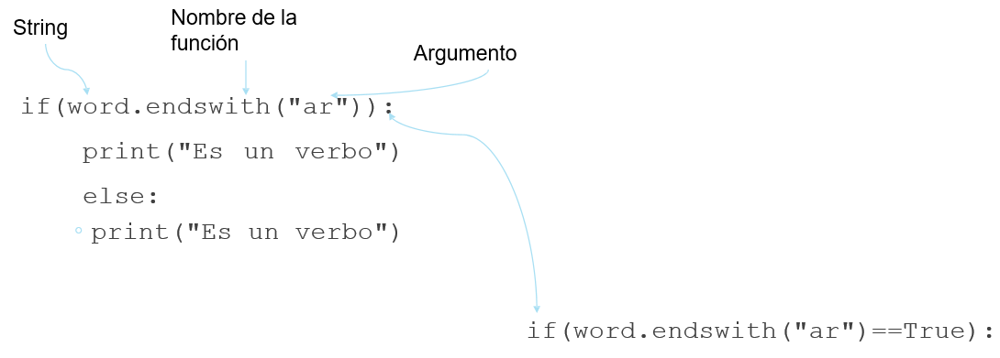
</p>

Dado un string verificar sí el string esta formado sólo por caractéres que correspondan a  números impares.

```python
def validar(s):
    for c in s:
        if not c.isdigit():
            return False
        if int(c) %2 ==0:
            return False
    return True
```

Parámetros por default
===========

* * *

```python
def  printMessage(string, n=2):
    print (string * n)
printMessage("FundProg", 3)
```

<p align="center">
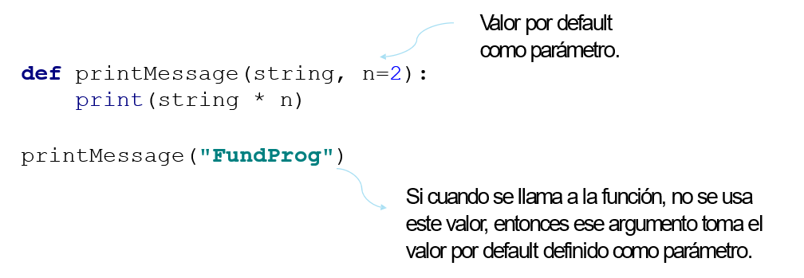
</p>

**NOTA:** Los valores por default deben ubicarse siempre al final de la definición de la función,  después de todos los valores que no son default.

Argumentos de palabra clave 
===========

* * *
```python
def datosPersonales(nombre, edad=18):
    print("Hola", nombre, "tienes", edad, "anios. \n")


datosPersonales("Pamela", 21)  
datosPersonales(21, "Pamela")  
datosPersonales(nombre = "Pamela", edad = 21)  datosPersonales(edad = 21, nombre = "Pamela")

```
La función puede asignar ciertos valores a parámetros específicos, sin importar el  orden	en que los valores se reciban como argumento de palabra clave.

**NOTA:** Python permite nombrar a los argumentos cuando se llama a la función.

```python
def style(text, color="blue", background = "red", style = "bold“)

def style(text, background="red", style="bold“, color="blue"):

```
**NOTA:** El orden en que se escriben no importa cuando se usan keyword arguments.

```python
def style(text, color="blue", background = "red", style =
"bold"):
    print(text)

style("ESPOL", style = "normal")
style("ESPOL", background = "black", justify = "left")
```

Alcance de variables
===========

* * *

Representa las diferentes partes de  un programa que están separadas  entre sí.

**NOTA:** Cada función  tiene su propio  alcance.

<p align="center">
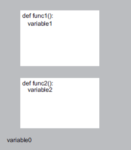
</p>


Tipos de variables
===========

* * *

Existen 2 tipos de variables: locales y globales. 

+ **Variables locales**

La variable i es local a la función, esto  significa que básicamente no existe fuera  de la función.

```python
def f1():
    for i in range(10):  
        print(i)  
        print("\n")

def f2():
    i = 100  
    f1()
    print(i)
f1()
f2()


```

**NOTA:** Cada función define sus propias variables – no importa los  nombres de variables utilizados en otras funciones.

+ **Variables globales**

Al ser tiempoRestante una  variable global, esta puede ser utilizada  en múltiples funciones.

```python

def tiempo():
    global tiempoRestante  
    tiempoRestante = 100

def imprimirTiempo():
    print(tiempoRestante)

tiempoRestante = 30  
tiempo()  
imprimirTiempo()

```

**NOTA:** Si una función desea cambiarle el valor de  tiempoRestante, tenemos que indicar la  variable es global.

Paso de parámetros por valor
===========

* * *

```python
def incrementar(a):
    a = a+1
    return a
b = 7
a = b
x = incrementar(a)  
print(x)

```

Paso de parámetros por referencia
===========

* * *

```python
def incrementar(l2):  
    l2.append(100)

l = [7,3,9,11]
print(l)
incrementar(l)  
print(l)

```

Módulos
===========

* * *

Un modulo es simplemente un texto que contiene código fuente en Python. El principal  requerimiento es que el nombre del archivo termine con .py

<p align="center">
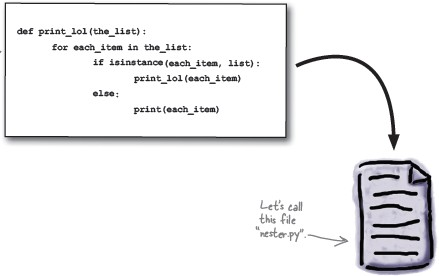
</p>

Uso de módulos
===========

* * *

Se puede utilizar la construcción from-import para poder usar las funciones contenidas en un  módulo.

```python
from módulo import función
from math import cos
```
Aunque se considera una mala práctica, también es posible importar todos las funciones del  módulo.

```python
from math import*
```