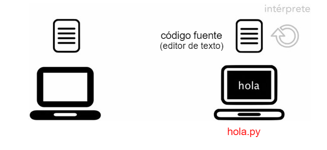
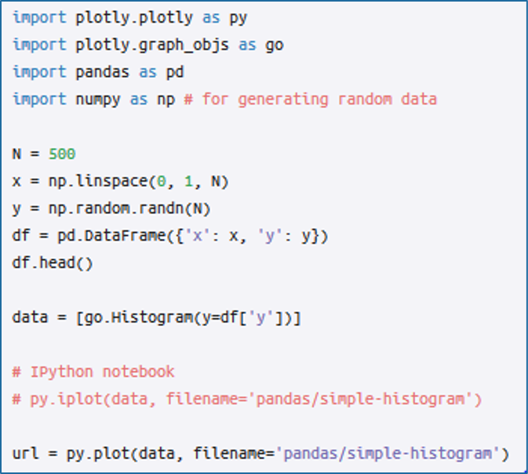
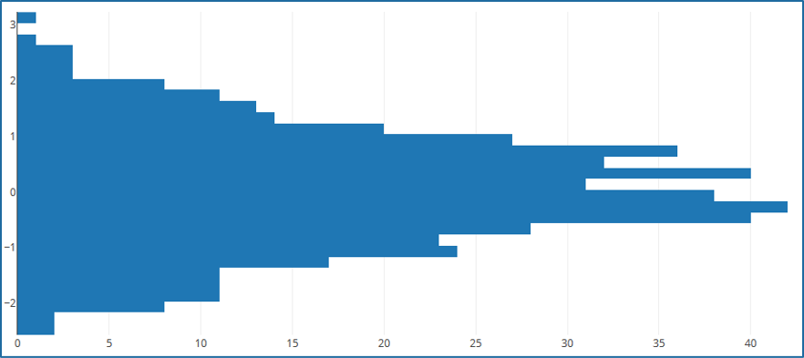

## Introducción a Python

[Regresar](/CodingBootcampsESPOL-RDDW/)

Lenguaje Interpretado
===========

* * *

Los lenguajes de programación interpretados son aquellos que convierten su lenguaje al de la máquina a medida que ejecutan el código. Con esto nos referimos a que el lenguaje que entendemos como programadores, basado en palabras clave, se traduce al lenguaje que entiende el procesador, caracterizado por tener valores ‘1’ y ‘0’. Python es un lenguaje interpretado, lo que significa que ejecuta directamente el código línea por línea. Si existen errores en el código del programa, su ejecución se detiene. Así, los programadores pueden encontrar errores en el código con rapidez.

Generalidades de python
===========

* * *
Entre las características que se destacan en python están: 

+ Es interpretado.
+ Es multiplataforma.
+ Es multiparadigma.
+ Es de tipado dinámico.

Python: Aplicaciones
===========

* * *
Python es usado en prácticamente todos los sectores de la industria y de la ciencia que puedas imaginar, incluyendo:

+ Ciencia de datos.
+ Aprendizaje automático (machine learning).
+ Desarrollo web.
+ Enseñanza de computación y programación.
+ Visión por computadora y procesamiento de imágenes.
+ Desarrollo de videojuegos.

Quizás una de las aplicaciones más populares de Python es ciencia de datos. El poder de las liberías de Python desarrolladas para el análisis y visualización de datos es asombroso. Con una librería de visualización de datos de Python, puedes crear una variedad increíble de gráficos y representaciones visuales. 

Referencias 
===========

* * *

* ¿Cuáles son las características de Python?. Retrieved 13 March 2023, from [https://aws.amazon.com/es/what-is/python/#:~:text=Python%20es%20un%20lenguaje%20interpretado,en%20el%20c%C3%B3digo%20con%20rapidez.](https://aws.amazon.com/es/what-is/python/#:~:text=Python%20es%20un%20lenguaje%20interpretado,en%20el%20c%C3%B3digo%20con%20rapidez.) 

* ¿Para qué se usa Python?. Retrieved 13 March 2023, from[https://www.freecodecamp.org/espanol/news/para-que-se-usa-python-10-usos-del-lenguaje-de-programacion-python/](https://www.freecodecamp.org/espanol/news/para-que-se-usa-python-10-usos-del-lenguaje-de-programacion-python/)