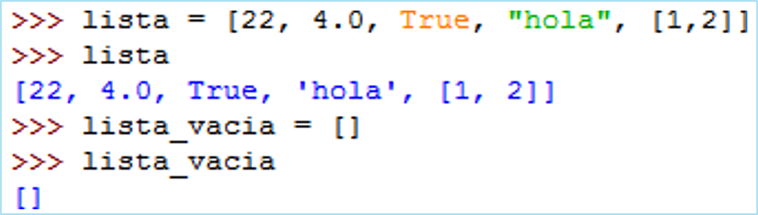
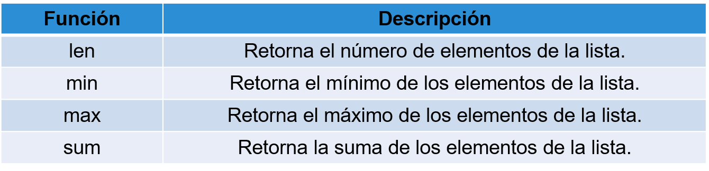

## Listas

[Regresar](/CodingBootcampsESPOL-RDDW/)

 Una lista en Python es un tipo de datos nativos construido dentro del lenguaje de programación Python. Estas listas son similares a matrices (o arrays) que se encuentran en otros lenguajes. Sin embargo, en Python se manejan como variables con muchos elementos.

 <p align="center">

</p>

```python
librería = [“Los ojos de mi princesa”, “Cuentos de eva luna”,
“El Zahir”, “El principito”]
```

+ Las listas son secuencias mutables y ordenadas de elementos.
+ Contiene diferentes tipos de datos: números, cadenas, booleanos y listas.

+ **Creación de listas:**
    + Lista de valores encerrados entre  [] y separados por (,).
    + Lista vacía [].

<p align="center">

</p>

LISTAS: Built-in Function
===========

* * *

<p align="center">

</p>

```python
promedio = sum(L)/len(L)

```

Operadores en listas
===========

* * *
+ **"+"**: añade una lista al final de otras.
+ **"-"**: repite una lista.
+ **in**: Verificar si un ítem esta o no  en la lista.
    + Retorna **true** o **false**.

```python
>>> pares = [2,4,6,8]
>>> impares = [1,3,5,7,9]
>>> pares + impares
>>> [2, 4, 6, 8, 1, 3, 5, 7, 9]


>>> ["go"]+["oo"]*3+["ol"]
['go', 'oo', 'oo', 'oo', 'ol']


>>> 0 in pares
False
>>> 7 in impares  True
```

Operaciones en listas
===========

* * *
+ **for loop**: iterar cada ítem de la lista.

pares = [2,4,6,8]

```python
for valor in pares:  p
    rint(valor)
print("Fin!")

```

```python
for i in range(len(pares)):  
    print(pares[i])
print("Fin!")

```

Acceder a ítems
===========

* * *

+ **Índice positivo [índice]:**
    + Desde cero hasta el parámetro -1.
    + Número entero
    + “Indice -1” ultimo ítem.

```python
>>> pares = [0,2,4,6,8]
>>> pares[-1]  8
>>> pares[1] = 9
>>> pares
[0,9,4,6,8]
```

+ **Slicing:**
    + Hasta el segundo número  pero no incluido.

```python
>>> pares[1:3]  
[2, 4]
>>> pares[:2]
[0, 2]
>>> pares[3:]  
[6, 8]
>>> pares[:]  
[0, 2, 4, 6, 8]

```

Métodos de listas
===========

* * *

+ **index(x)**

Retorna la primera ocurrencia de x.

```python
>>> l = [['a', 'b', 'c', 'd', 'e', 'b', 'e', 'c']
>>> l.index('e')  
4
```

+ **count(x)**

Retorna el número de veces que ocurre x en la lista.

```python
>>> l = [['a', 'b', 'c', 'd', 'e', 'b', 'e', 'c']
>>> l.count('b')  
2
```
+ **append(x)**

Añade un nuevo elemento al final de la lista.

```python
>>> l1 = ['a', 'b', 'c']
>>> l1.append(‘d')
>>> print(l1)
['a', 'b', 'c', 'd']
```
+ **extend(x)**

Toma una lista como argumento y añade todos los elementos.

```python
>>> l1 = ['a', 'b', 'c']
>>> l2 = ['d', 'e']
>>> l1.extend(l2)
>>> print(l1)
['a', 'b', 'c', 'd', 'e']
```
+ **insert(p,x)**

Inserta x en el	índice p de la lista.

```python
>>> l = ['a', 'b', 'c', 'd', 'e']
>>> l.insert(3, 'z')
>>> print(l)
['a', 'b', 'c', 'z', 'e']
```
+ **sort()**

Ordena los valores en la lista de menor a mayor.

```python
>>> l = ['a', 'c', 'd', 'b', 'e']
>>> l.sort()
>>> print(l)
['a', 'b', 'c', 'd', 'e']
```
+ **reverse()**

Reversa la lista.

```python
>>> l = ['a', 'c', 'd', 'b', 'e']
>>> l.reverse()
>>> print(l)
['e', 'd', 'c', 'b', 'a']
```

+ **del**

Eliminar uno o más ítems desde una lista.

```python
>>> l = ['a', 'b', 'c', 'd', 'e']
>>> del l[1]
>>> print(l)
['a', 'c', 'z', 'e']
```

+ **pop(x)**

Remueve la primera ocurrencia de x y retorna el valor.

```python
>>> l = ['a', 'b', 'c', 'd', 'e']
>>> x = l.pop(2)
>>> print(x)  c
>>> print(l)
['a', 'b', 'd', 'e']
```
+ **remove(x)**

Remueve la primera ocurrencia de x en la lista.

```python
>>> l = ['a', 'b', 'c', 'd', 'e']
>>> l.remove('b')
>>> print(l)
['a', 'c', 'd', 'e']
```