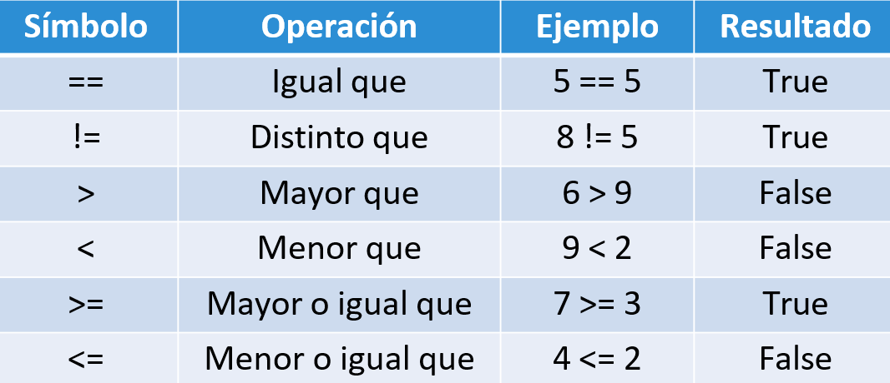

## Variable y tipo de datos

[Regresar](/CodingBootcampsESPOL-RDDW/)

Tipo de datos primitivos
===========

* * *
En cualquier lenguaje de programación de alto nivel se manejan tipos de datos. Los tipos de datos definen un conjunto de valores que tienen una serie de características y propiedades determinadas. Entre los datos primitivos están: numéricos, lógicos y cadena de caracteres.

### Tipos numéricos

Python define tres tipos de datos numéricos básicos: enteros, números de punto flotante (simularía el conjunto de los números reales, pero ya veremos que no es así del todo) y los números complejos.

| **Tipo** | **Nombre** | **Descripción** | **Ejemplo**|
|----------|----------|----------|----------|
| Enteros    | int   | Números sin parte​ fraccionaria   | 52  |
| Punto flotante    | float   | Números con parte fraccionaria  | 6.37 |
| Complejos    | complex   | Números con parte real y parte imaginaria   | (9-3j) |

### Datos lógicos

En Python la clase que representa los valores booleanos es bool. Esta clase solo se puede instanciar con dos valores/objetos: True para representar verdadero y False para representar falso.

| **Tipo** | **Nombre** | **Descripción** | **Ejemplo**|
|----------|----------|----------|----------|
| Booleano    | bool   | Representación de los valores lógicos Verdadero o Falso.   | True, False  |

### Cadena de caracteres

Otro tipo básico de Python, e imprescindible, son las secuencias o cadenas de caracteres. Este tipo es conocido como string aunque su clase verdadera es str.

| **Tipo** | **Nombre** | **Descripción** | **Ejemplo**|
|----------|----------|----------|----------|
| Cadena    | str   | Expresiones formada por caracteres.   | "Hola"  |

Constantes
===========

* * *

Las constantes de Python son contenedores de datos como las variables. En principio, una constante está diseñada para tener un valor constante que no pueda cambiar durante la ejecución de un programa.

```python
>>> print(2023)
2023
>>> print(9.7)
9.7
```

Variables
===========

* * *
Las variables son contenedores para almacenar valores de datos. Python no tiene ningún comando para declarar una variable.
Una variable se crea en el momento en que le asigna un valor por primera vez. Tiene un nombre asociado a un valor que:

* Inician con letra ó _.
* Distinción entre mayúscula y minúscula.

<p align="center">

</p>

Python keywords
===========

* * *
Python tiene un conjunto de palabras clave que son palabras reservadas que no se pueden usar como nombres de variables, nombres de funciones o cualquier otro identificador. 

<p align="center">

</p>

Asignación (=) en python
===========

* * *
<p align="center">

</p>

<p align="center">

</p>

<p align="center">

</p>

Otras asignaciones
===========

* * *

* Asignación en la misma línea:
x=5; y=9; z=12

* Asignación múltiples:
day, month, year = “miércoles”,”marzo”, 2023

* Asignación del mismo valor:
largo = ancho = 4

* Asignación de intercambio:
base = 15; altura = 30  base, altura = altura, base

Operadores Aritméticos 
===========

* * *
Un operador aritmético toma dos operandos como entrada, realiza un cálculo y devuelve el resultado.
<p align="center">

</p>

Operadores Relacionales
===========

* * *
Un operador relacional se emplea para comparar y establecer la relación entre ellos. Devuelve un valor booleano (true o false) basado en la condición.
<p align="center">

</p>

Operadores Lógicos
===========

* * *
Se utiliza un operador lógico para tomar una decisión basada en múltiples condiciones. Los operadores lógicos utilizados en Python son  and, or y not.

<p align="center">

</p>

Operadores de incremento y decremento
===========

* * *
<p align="center">

</p>

Entrada y salida de datos 
===========

* * *

+ Salidas en python 
La función print() es sin duda una de las instrucciones más sencillas y que usaremos en el curso, ya que nos permite mostrar información por consola como mensajes, números o valores de una variable. para su uso solo le pasamos en los argumentos lo que deseamos mostrar en consola.

```python
#Mostramos un texto con print()
print('Uso de entradas y salidas')
print('Esto es un número')
print(102584)
```

+ Entradas en python 
La función input() permite obtener información del en la terminal desde el teclado, al momento de ejecutarse esta línea en la consola esperara que ingresemos el texto que necesitemos y demos un enter para continuar y guardar el valor capturado en una variable de programa.

```python
#Pedimos un texto con input()
print('Escribe tu nombre')
print(input())
```

Conversión de datos
===========

* * *

Puede haber ocasiones en las que desee especificar un tipo en una variable. Esto se puede hacer con fundición. Python es un lenguaje orientado a objetos y, como tal, utiliza clases para definir tipos de datos, incluidos sus tipos primitivos.

Por lo tanto, la conversión en python se realiza mediante funciones de constructor:

+ int() : construye un número entero a partir de un literal entero, un literal flotante (eliminando todos los decimales) o un literal de cadena (siempre que la cadena represente un número entero)
+ float() : construye un número flotante a partir de un literal entero, un literal flotante o un literal de cadena (siempre que la cadena represente un flotante o un entero)
+ str() : construye una cadena a partir de una amplia variedad de tipos de datos, incluidas cadenas, literales enteros y literales flotantes.

```python
x = int(1)   
y = int(2.8) 
x = float(1)
y = str(2)
```
Formato de salida (old)
===========

* * *
<p align="center">

</p>

```python
print("The numbers are: %d" %(25, 50))​

print("El valor de pi es: %5.2f" % (3.1415926535897793))​

print("The cities are: %s, %s" %('Quito', 'Guayaquil'))
```

Formato de salida (new)
===========

* * *
<p align="center">

</p>

```python
print("The numbers are: {:d} “.format(25, 50))​
print("El valor de pi es: {:.2f}.“.format (math.pi))​
print("The cities are: {1}, {0}“.format('Quito', 'Guayaquil'))
```
Secuencia de escape
===========

* * *
<p align="center">

</p>

```python
print("This is\'nt True")
This is'nt True
```
Múltiples líneas 
===========

* * *
```python
print("""\
tipo: [OPTIONS]
    -d
    -f
    -s
)
```
* -d, representa enteros(int)
* -f, representa reales(float)
* -s, representa strings(str)

Concatenación(+)
===========

* * *
<p align="center">

</p>

Repetición(+)
===========

* * *
<p align="center">

</p>

Concatenación y repetición
===========

* * *
<p align="center">

</p>

Índices - String
===========

* * *

saludo = “CODING BOOTCAMP 2023”
<p align="center">

</p>

Slicing
===========

* * *

saludo = “CODING BOOTCAMP 2023”
saludo[0:2] #Desde pos 0(incluído)-2(sin incluir)
saludo[6:9] #Desde pos 6(incluído)-9(sin incluir)
saludo[ :2] #Desde inicio 0 hasta 2(sin incluir)
saludo[4: ] #Desde pos 4 hasta el final

Métodos de string
===========

* * *

mensaje = “CODING BOOTCAMP 2023”

<p align="center">

</p>

```python
>>> "CODING" in mensaje  True
>>> "z" in mensaje
False
```

Métodos de string 
===========

* * *
<p align="center">

</p>

Los siguientes métodos devuelven true o false. 
<p align="center">

</p>

Math Library
===========

* * *
<p align="center">

</p>

```python
# Convertir de grados a radianes

>>> import math
>>> grados = int(input("Ingrese la cantidad de grados a
convertir: "))
Ingrese la cantidad de grados a convertir: 50
>>> radianes = (50 * math.pi)/180
>>> print("Al convertir %d grados en radianes, obtuvimos %.3f" %  (grados, radianes))
Al convertir 50 grados en radianes, obtuvimos 0.873

```
Aleatoriedad 
===========

* * *

**import** random => librería de números aleatorios
<p align="center">

</p>

```python
# Simular el lanzamiento de un dado

>>> import random
>>> dado = random.randint(1,6)
>>> print("El resultado del lanzamiento es: %d" %dado)  El resultado del lanzamiento es: 2
```
<p align="center">

</p>

Referencias 
===========

* * *

* Python variables. Retrieved 13 March 2023, from [https://www.w3schools.com/python/python_variables.asp](https://www.w3schools.com/python/python_variables.asp) 

* Python keywords. Retrieved 13 March 2023, from [https://www.w3schools.com/python/python_ref_keywords.asp](https://www.w3schools.com/python/python_ref_keywords.asp) 

* Python casting. Retrieved 13 March 2023, from [https://www.w3schools.com/python/python_casting.asp](https://www.w3schools.com/python/python_casting.asp)