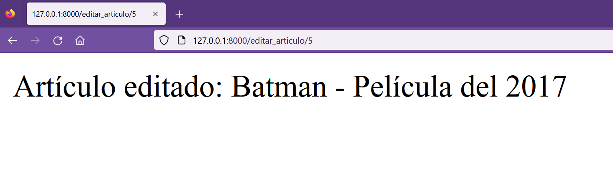

## Actualizar registros

[Regresar](/CodingBootcampsESPOL-RDDW/)

* En el archivo views.py que se encuentra en la subcarpeta miapp del directorio AprendiendoDjango, crearemos una nueva función con el nombre editar_articulo, como parámetro de la función se le pasará el id del artículo a editar.

```h
def editar_articulo(request, id):
    articulo = Article.objects.get(pk=id)
    articulo.title = "Batman"
    articulo.content = "Película del 2017"
    articulo.public = True
    articulo.save()
    return HttpResponse(f"Artículo editado: {articulo.title} - {articulo.content}")
```
* Ahora se añade un nuevo path al archivo urls.py.

```h
path('editar_articulo/<int:id>', views.editar_articulo, name="editar_articulo")
```

* En el navegador accede a la ruta correspondiente a editar_articulo y edita el artículo con id igual a 5.

<p align="center">

</p>