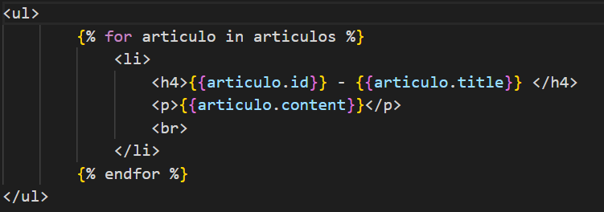
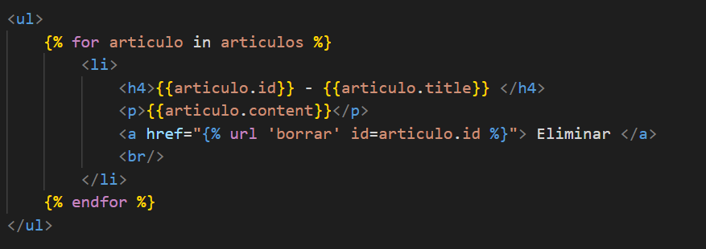

## Borrar elementos

[Regresar](/CodingBootcampsESPOL-RDDW/)


En la sección  anterior de [listar articulos](./listar-articulos.md) habiamos realizado ciertas modificaciones a la función articulos del archivo views.py, pero quedará de la siguiente forma.

```h
def articulos(request):

    articulos = Article.objects.all()

    return render(request, 'articulos.html', {
        'articulos' : articulos
    })
```

* En el template de articulo.html incorporar el cambio relacionado a que también se muestre el contenido de los artículos.


<p align="center">

</p>

* En el archivo views.py crearemos una nueva función con el nombre borrar_articulo en la que en base al id se borre el artículo.

```h
def borrar_articulo(request, id):
    articulo = Article.objects.get(pk=id)
    articulo.delete()
    return redirect('articulos')
```

* Ahora añadimos la vista de borrar_articulo a una nueva url, añadiendo un nuevo path dentro del array de urlpatterns del archivo urls.py.

```h
path('borrar_articulo/<int:id>', views.borrar_articulo, name="borrar")
```

* En el archivo articulos.html añadimos un href. 

<p align="center">

</p>