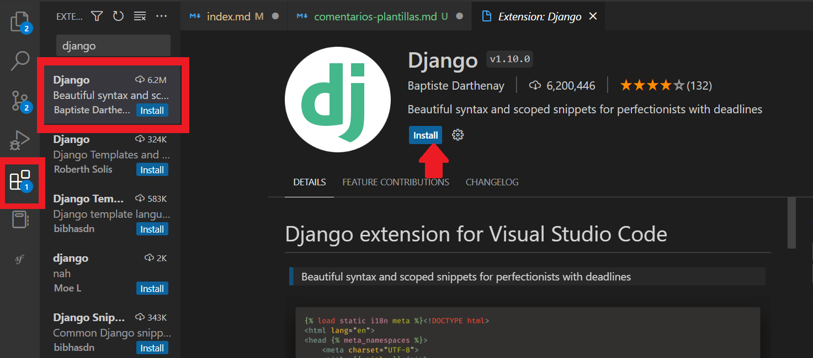
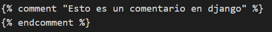
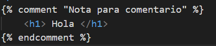

## Comentarios en plantillas

[Regresar](/CodingBootcampsESPOL-RDDW/)

Los comentarios tienen innumerables ventajas: su fácilidad de uso, el añadir en cualquier clase y, por supuesto, podemos personalizar las plantillas de formularios y de respuestas. 

**Recomendación:**
Si estás usando Visual Studio Code como editor de texto para el proyecto en el que hemos estado trabajando, se sugiere instalar la extensión Django. Esta extensión nos permitirá ver la diferencia de los comentarios en las plantillas de Django. 
<p align="center">

</p>

* Recordemos que en la unidad anterior se trabajó con el proyecto AprendiendoDjango, en esta unidad continuaremos con el mismo proyecto.
* Ahora dentro de la carpeta miapp se encuentra la subcarpeta templates y ahi encontraremos el archivo index.html.

* Iniciaremos con la creación de comentarios. 

```html
<!-- Esto es un comentario en HTML -->
```

* El anterior ejemplo fue de un comentario en html. Ahora se realizará un comentario en django. Cabe recalcar que los comentarios no se visualizan en la aplicación. 

<p align="center">

</p>

* Dentro del bloque de comentarios también se puede colocar etiquetas o más código pero sabemos que al ser parte del comentario no serán visualizados. 

<p align="center">

</p>