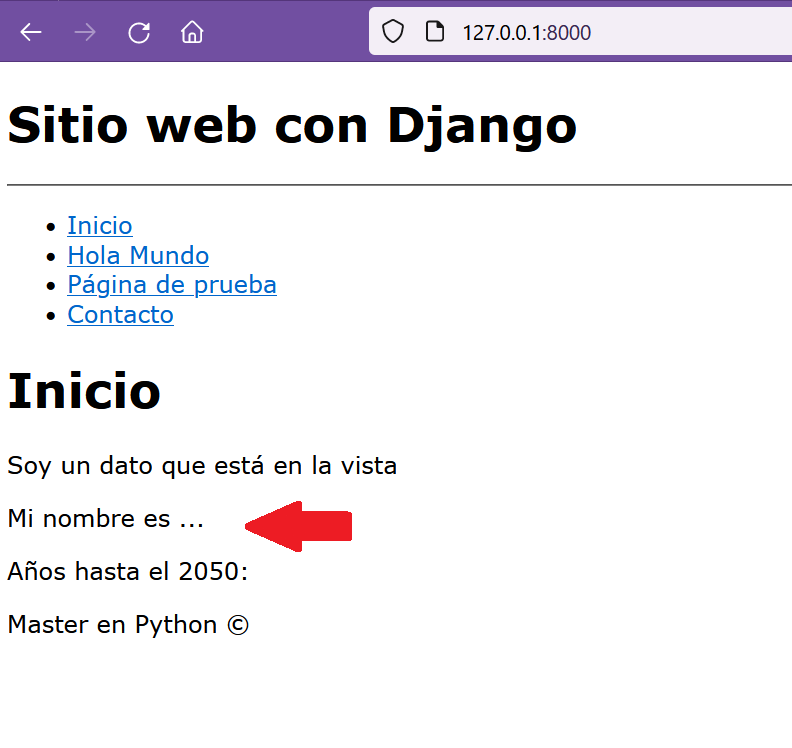
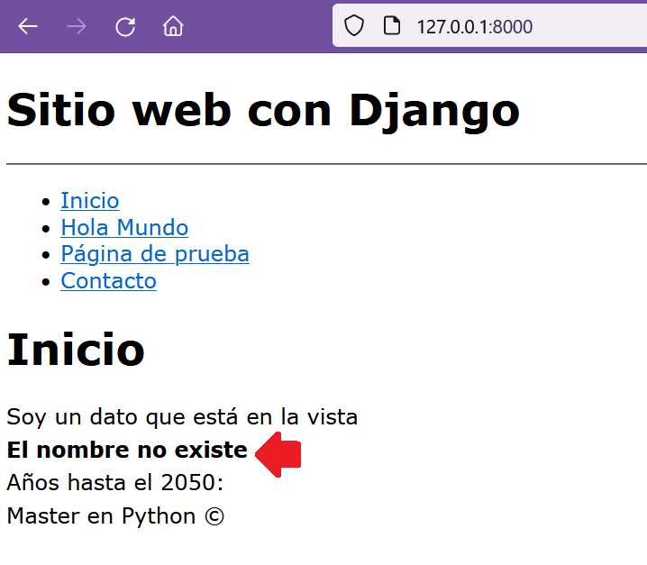
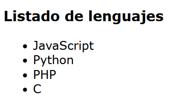

## Condicionales y bucles en las plantillas de Django

[Regresar](/CodingBootcampsESPOL-RDDW/)


Condicional IF
===========

* * *

* Continuamos trabajando dentro de la carpeta AprendiendoDjango, nos ubicamos dentro del archivo views.py y antes del return de la función index colocaremos el siguiente código, luego se añade la variable nombre dentro dle return. 

```h
nombre = "Mi nombre es ..."
    return render(request, "index.html", {
        "title" : "Inicio",
        "mi_variable" : "Soy un dato que está en la vista",
        "nombre": nombre
    })
```

* En la plantilla de index.html introduzca el siguiente código. 

```
<p> {{nombre}} </p>
```
* Abrimos la terminal en el directorio de AprendiendoDjango y ejecutamos el comando `python manage.py runserver` ahora abrimos el navegador con el url que nos muestra luego de ejecutar el comando y se visualizará la nueva modificación. 

<p align="center">

</p>

* Le daremos estilo a los párrafos, dentro de la carpeta static en el archivo styles.css, introduciremos el siguiente código.

```css
p{
    margin-top: 5px;
    margin-bottom: 5px;
}
```

* Ahora se hacemos uso de los condicionales, con el ejemplo anterior primero validaremos que si existe el nombre se muestre el contenido de la variable nombre, añade las siguientes modificaciones en el index.html.

```h

    <p> {{nombre}} </p>
{{ endif }}
```
* También se puede añadir el condicional else de la siguiente forma. 

```h

    <p> {{nombre}} </p>

    <strong> El nombre no existe </strong>

```

* Modificaremos el return de la función index que se encuentra en el archivo views.py, eliminando la variable nombre, ejecutamos el servidor y visualizamos los cambios.

```h
return render(request, "index.html", {
        "title" : "Inicio",
        "mi_variable" : "Soy un dato que está en la vista"
    })
```

<p align="center">

</p>

Bucle For
===========

* * *

Utilizaremos el bucle for para recorrer un método de la vista. Seguimos con el proyecto integrador, trabajando específicamente en la carpeta AprendiendoDjango en el archivo view.py.

* Creamos una lista que contenga lenguajes de progrmación y a su vez modificamos el return de la función index, en el que se agregará la variable lenguaje creada anteriormente. 

```h
 nombre = "Mi nombre es ..."
    lenguajes = ["JavaScript", "Python", "PHP", "C"]
    return render(request, "index.html", {
        "title" : "Inicio",
        "mi_variable" : "Soy un dato que está en la vista",
        "nombre": nombre,
        "lenguajes":lenguajes
    })
```

* Modificamos el template index.html para mostrar el contenido de la variable lenguajes. Y ejecutamos el servidor para visualizar los cambios.

```h
{{lenguajes}}
```

<p align="center">

</p>

* En el index.html agregamos un buble for para enlistar cada lenguaje de la lista de elmguaje que fue creada en el archivo views.py. 

```h
<h3> Listado de lenguajes </h3>
<ul>
    

        <li> {{lenguaje}} </li>
    
</ul>
```

<p align="center">

</p>

Funcionalidades extras del bucle For
===========

* * *

* Una de las funcionalidades extra es verificar si la lista anterior está vacia, esto se lo hará añadiendole la instrucción de empty. 

```django
<ul>
    

        <li> {{lenguaje}} </li>
    
        <p> NO HAY LENGUAJES QUE MOSTRAR </p>
    
</ul>
```
* Otra funcionalidad extra es extraer el primer elemento de la lista. La instrucción forloop.first nos permite validar lo anterior. Y si se desea obtener el último de la lista se reemplaza el first por last (forloop.last).

```django
<ul>
    

        <li> {{lenguaje}} {{forloop.first}}</li>
    
        <p> NO HAY LENGUAJES QUE MOSTRAR </p>
    
</ul>
```