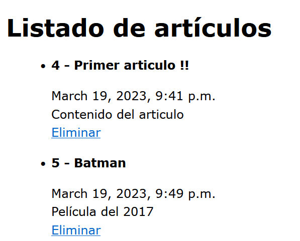

## Consultas con condiciones, filter y lookups

[Regresar](/CodingBootcampsESPOL-RDDW/)

En Django tenemos el método filter() que nos permite hacer consultas mediante condiciones.

* Modificamos la función articulos() del archivo views.py  para realizar un filtro y obtener el artículo con nombre "Batman".

```h
def articulos(request):

    articulos = Article.objects.all()
    articulos = Article.objects.filter(title="Batman")

    return render(request, 'articulos.html', {
        'articulos' : articulos
    })
```
* A la plantilla de articulos.html, le añadimos código para que también muestre la fecha.

```h
<span>{{articulo.created_at}}</span>
```

* Para cambiar el idioma a español, en el archivo settings.py modificamos la variable languaje_code a en-es.

```h
LANGUAGE_CODE = 'en-es'
```

* También se puede hacer uso de los lookups que sirve para la búsqueda de un campo.

```h
def articulos(request):

    articulos = Article.objects.all()
    articulos = Article.objects.filter(title__contains="Articulo")

    return render(request, 'articulos.html', {
        'articulos' : articulos
    })
```

* Ahora se usurá lookup para obtener los artículos con id mayor a 3, gt es el lookup para obtener el "greater than". Si desea que sea mayor o igual utilize el gte. O si requiere que sea menor a 3 utilize el lookup lt.

```h
def articulos(request):

    articulos = Article.objects.all()
    articulos = Article.objects.filter(id__gt=3)

    return render(request, 'articulos.html', {
        'articulos' : articulos
    })
```

<p align="center">

</p>


Exclude
===========

* * * 

Internamente, un QuerySetpuede construirse, filtrarse, dividirse y, en general, transmitirse sin llegar a la base de datos. En realidad, no se produce ninguna actividad en la base de datos hasta que haga algo para evaluar el conjunto de consultas.

* Creamos un nuevo artículo desde el navegador utilizando el siguiente enlance:

http://127.0.0.1:8000/crear_articulo/Articulo/Contenido%20vacio/True

* En el archivo views.py haremos una consulta de los artículos con titulo que sea igual a "Articulo" y esté publicado. Además, se utilizará el exclude los que no estén publicado.

```h
def articulos(request):

    articulos = Article.objects.all()
    articulos = Article.objects.filter(id__gt=3)
    articulos = Article.objects.filter(
        title="Articulo"
    ).exclude(
        public=False
    )

    return render(request, 'articulos.html', {
        'articulos' : articulos
    })
```

* En la plantilla de articulos.html se incluirá etiquetas con el fin de que muestre si está publicado o no.

<p align="center">

</p>

<p align="center">

</p>


Referencias
===========

* * *

* QuerySet API reference. Retrieved March 20, 2023, from [https://docs.djangoproject.com/en/4.1/ref/models/querysets/](https://docs.djangoproject.com/en/4.1/ref/models/querysets/)