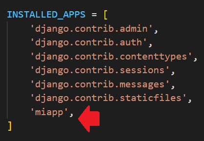
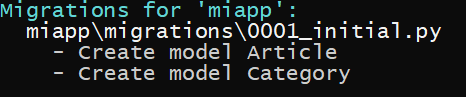
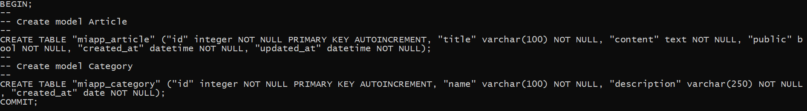
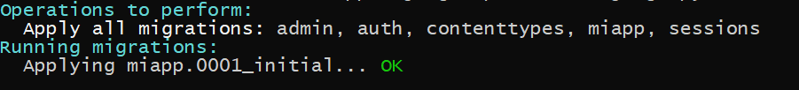
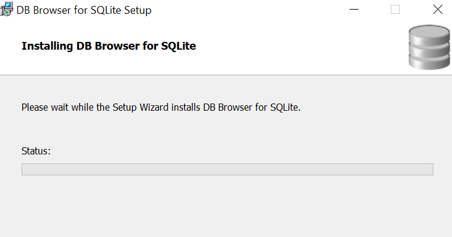
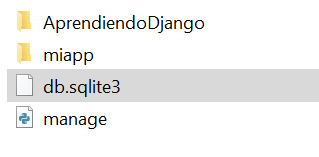
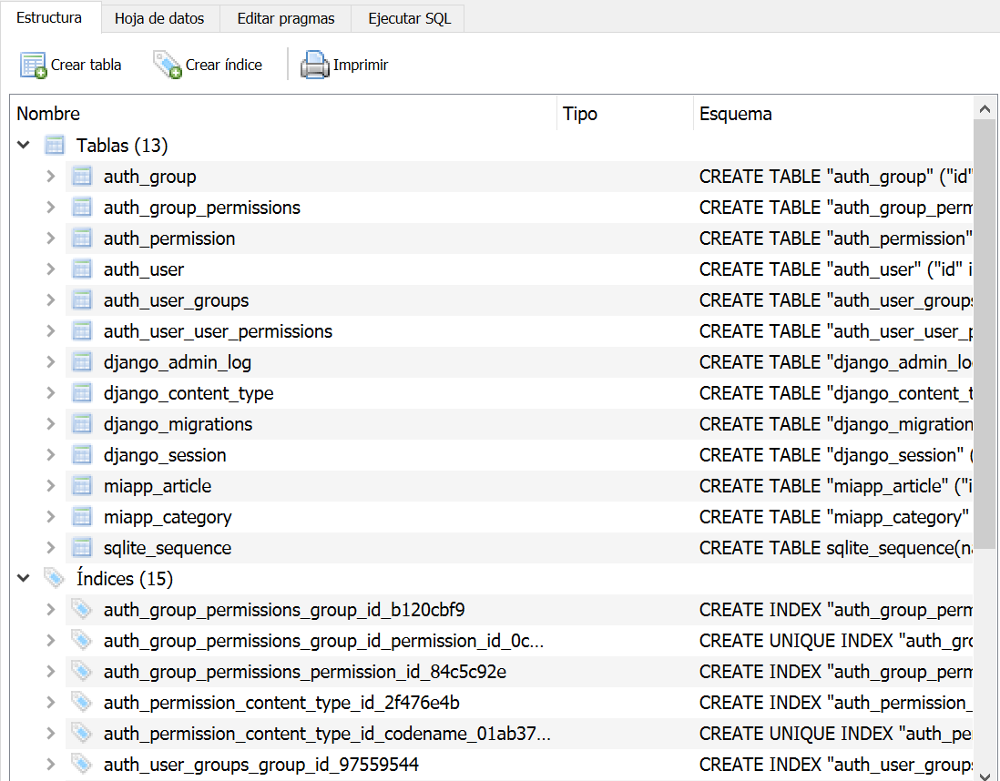
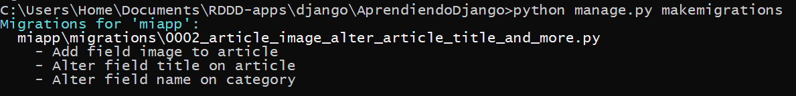
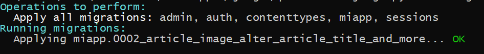
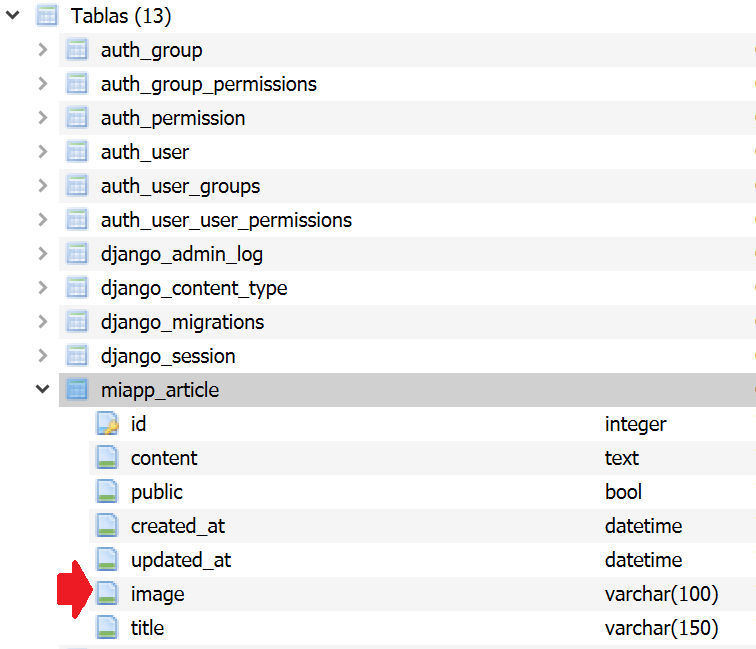

## Crear modelos

[Regresar](/CodingBootcampsESPOL-RDDW/)


Las aplicaciones web de Django acceden y administran los datos a través de objetos de Python a los que se hace referencia como modelos. Los modelos definen la estructura de los datos almacenados, incluidos los tipos de campo y los atributos de cada campo, como su tamaño máximo, valores predeterminados, lista de selección de opciones, texto de ayuda para la documentación, texto de etiqueta para formularios, etc. 

* Seguiremos trabajando con la carpeta miapp que fue creada en el proyecto AprendiendoDjango. 

* En la carpeta miapp se encuentra el archivo models.py en donde estaremos creando las clases que representarán los modelos, nos basaremos en una aplicación tipo blog. Las clases serán de Article y Category. 

```h
class Article(models.Model):
    title = models.CharField(max_length=100)
    content = models.TextField()
    public = models.BooleanField()
    created_at = models.DateTimeField(auto_now_add=True)
    updated_at = models.DateTimeField(auto_now=True)

class Category(models.Model):
    name = models.CharField(max_length=100)
    description = models.CharField(max_length=250)
    created_at = models.DateField()
```

* Con respecto al tipo de dato existen diversos opciones para Field y los puede vsiulizar en la [documentación de django](https://docs.djangoproject.com/en/4.1/ref/models/fields/)


Crear tablas basadas en modelos
===========

* * * 

* Continuamos revisando el archivo settings.py que se encuentra en la carpeta AprendiendoDjango. Dentro del array INSTALLED_APPS asegurarse de que se encuentra la aplicación **miapp** que fue creada en temas anteriores. 

<p align="center">

</p>

* Ahora es momento de crear las migraciones ya que cuando hagamos cambios en la base de datos será necesario crear una migración por cada cambio que se realize. Las migraciones son útiles cuando se trabaja en equipo ya que solo ejeecutas las migraciones y ya obtienes los nuevos cambios.

* Abre la línea de comandos y dirigite al proyecto de AprendiendoDjango y ejecuta el siguiente comando para realizar las migraciones.

```
python manage.py makemigrations
```
<p align="center">

</p>

* Para sincronizar la migración con el sistema gestor de base de datos ejecuta el siguiente comando en la consola.

```
python manage.py sqlmigrate miapp 0001
```
<p align="center">

</p>

* Para que finalmente se guarden los cambios en la base de datos ejecuta el siguiente comando. 

```
python manage.py migrate
```

<p align="center">

</p>

* En tu navegador web dirigite a la página oficial de [DB Browser for SQLite](https://sqlitebrowser.org/dl/) y en la sección de Downloads descarga el archivo correspondiente a tu sistema operativo. Ejecutas el archivo, la instlación es sencilla solo debes darle next en cada paso hasta completar la instalación. 

<p align="center">

</p>

* Ahora abriremos la aplicación de DB Browser for SQLite, en Visual Studio Code en el proyecto de AprendiendoDjango aparece la base de datos **db.sqlite3** y se hacer hacer clic derecho y dar a la opción de "Reveal in File Explorer".

<p align="center">

</p>

* De ahi el archivo de db.sqlite3 se debe arrastar a la aplicación de DB Browser for SQLite.

<p align="center">

</p>

Cambios en las estructuras de tablas y modelos
===========

* * * 

Supongamos el caso en que se requiera hacer un cambio en la tabla Article en la que se desea añadir el campo image y cambiar la longitud de otros campos, para eso dentro de la clase Article debe añadirle los siguientes cambios

```h
class Article(models.Model):
    title = models.CharField(max_length=150)
    image = models.ImageField(default="null")
    content = models.TextField()
    public = models.BooleanField()
    created_at = models.DateTimeField(auto_now_add=True)
    updated_at = models.DateTimeField(auto_now=True)

class Category(models.Model):
    name = models.CharField(max_length=110)
    description = models.CharField(max_length=250)
    created_at = models.DateField()
```

* Para que los cambios se visualizen en la base de datos se debe ejecutar el siguiente comando en la terminal. 

```
python manage.py makemigrations
```

<p align="center">

</p>
* En caso de mostrar un error por falta de un componente de python ejecute.

```
python -m pip install Pillow
```
* Es momento de ejecutar en la terminal la migración 0002.

```
python manage.py sqlmigrate miapp 0002
```
* Para la visualización de los cambios en la base de datos ejecute lo siguiente. 

```
python manage.py migrate
```

<p align="center">

</p>

* Vuelva a arrastar el archivo db.sqlite3 a la aplicación de DB Browser for SQLite. Y así visualizarás los nuevos cambios en la base de datos.

<p align="center">

</p>