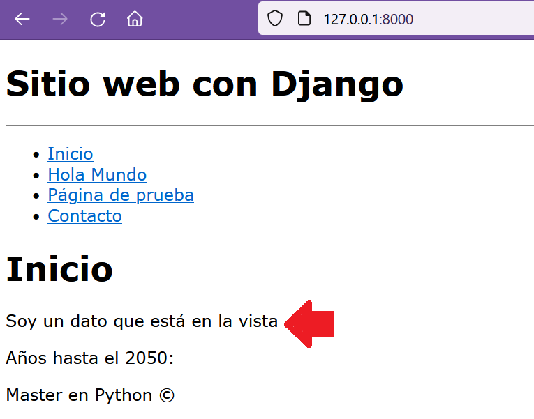

## Datos de vistas y visualizarlos en plantilla

[Regresar](/CodingBootcampsESPOL-RDDW/)

* Recordemos que estamos trabajando con la vista index y en base a la función de index se debe modificar el return, es decir añadirle un nuevo parámetro al return para pasarle las variables correspondientes.

```h
return render(request, "index.html", {
        "mi_variable" : "Soy un dato que está en la vista"
    })
```

* Ahora dentro de la carpeta templates modificaremos el archivo index.html. El código que se mostrará a continuación deberá ser incluido debajo de la etiqueta h1. Dado que mediante en render le pasamos la variable "mi variable" se puede ahora mostrarla en el template.

```
{{mi_variable}}
```
* Abrimos la terminal en el directorio de AprendiendoDjango y ejecutamos el comando `python manage.py runserver` ahora abrimos el navegador con el url que nos muestra luego de ejecutar el comando y se visualizará el contenido de la variable "mi_variable" que fue definida en la vista. 
<p align="center">

</p>

* Ahora ya sabemos como renderizar datos de la vista a la plantilla(template), dentro de la misma función index de la vista añadiremos otra variable.

```h
return render(request, "index.html", {
        "title" : "Inicio",
        "mi_variable" : "Soy un dato que está en la vista"
    })
```

* Es momento de modificar el template de index.html.

```
<h1 class="tittle"> {{title}} </h1>
```