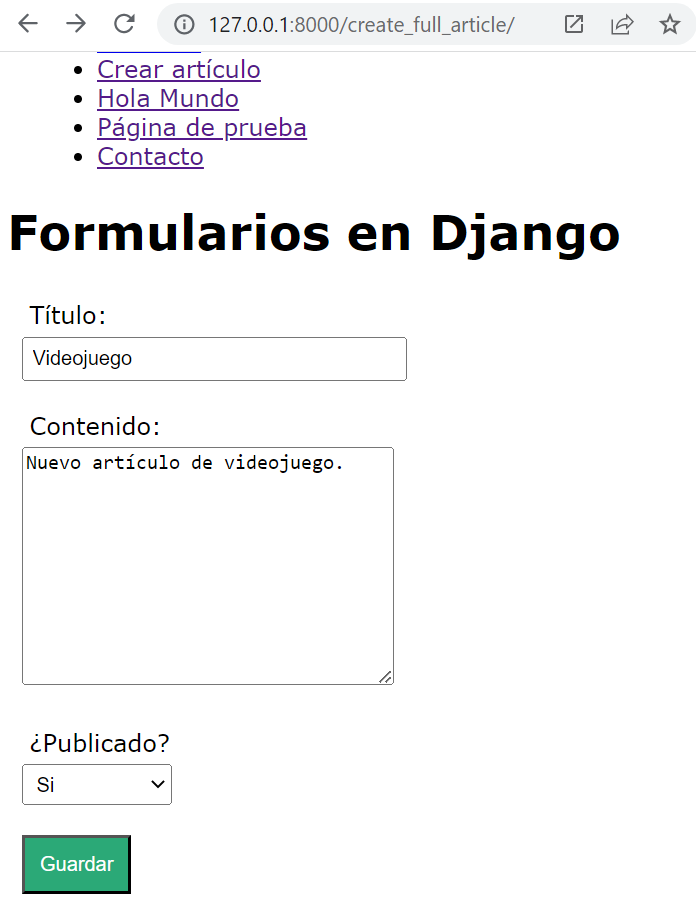
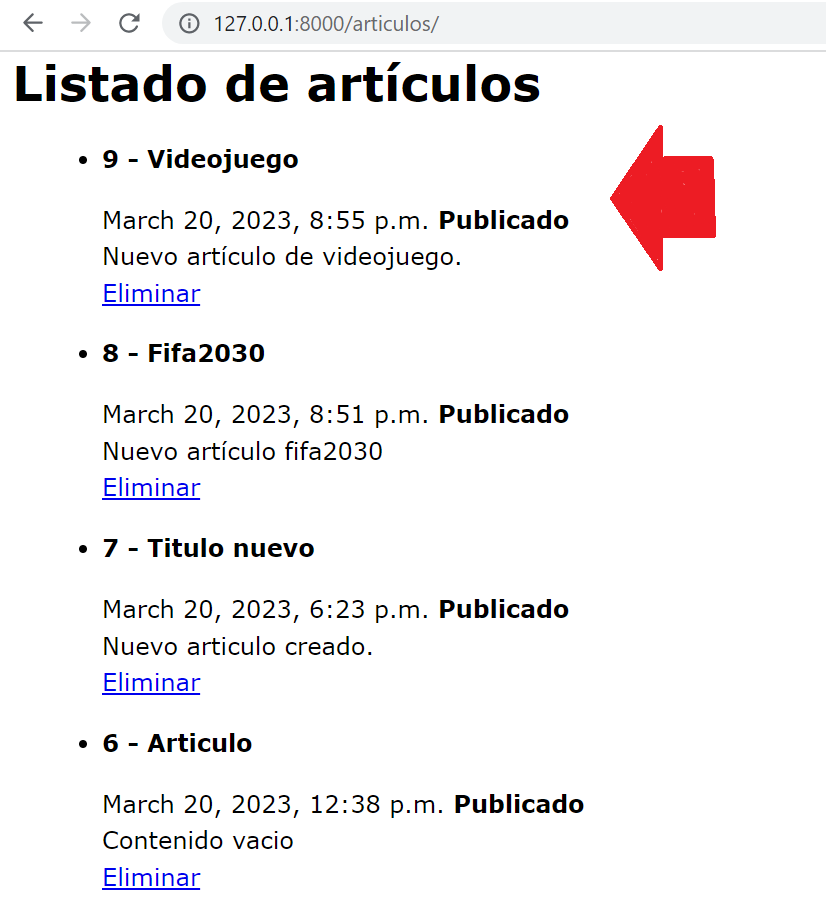
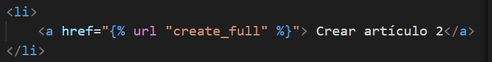
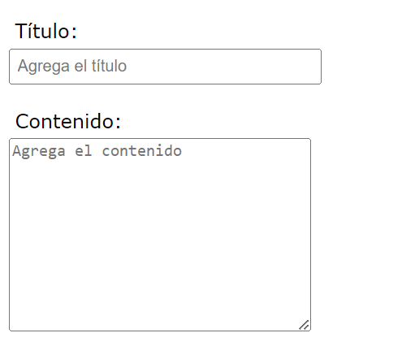
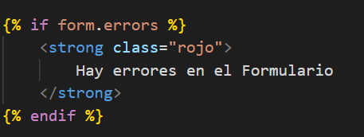
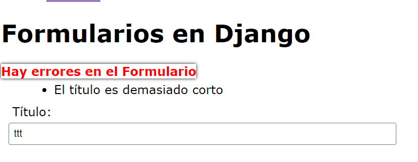

## Django Form API

[Regresar](/CodingBootcampsESPOL-RDDW/)

* Para recibir la información de nuestro formulario realizaremos una condicional para validar que los datos sean por el método POST. Caso contrario, se mandará un formulario vacio. 

```py
def create_full_article(request):
    if request.method == 'POST':
        formulario = FormArticle(request.POST)
        if formulario.is_valid():
            data_form = formulario.cleaned_data
            title = data_form.get('title')
            content = data_form['content']
            public = data_form['public']

            #Guardar los datos en la base de datos
            articulo = Article(
                title = title,
                content = content,
                public = public
            )
            articulo.save()
            return redirect('articulos')
            #return HttpResponse(articulo.title + ' - ' + articulo.content + ' - ' + str(articulo.public) )
    else:
        formulario = FormArticle()
    return render(request, 'create_full_article.html', {
        'form' : formulario
    })
```

* Accede a la url de [create_full_article](http://127.0.0.1:8000/create_full_article/) e ingresa un nuevo artículo y verás que efectivamente se guardó en la base de datos porque te muestra el artículo recientemente guardado. 

<p align="center">

</p>

<p align="center">

</p>

* En el archivo layout.html agregaremos una nueva opción en el la navegación. 

<p align="center">

</p>

Personalizar formularios
===========

* * * 

Otro tipo de validación dentro de los formularios es max_length ó required que se lo usará dentro del campo del titulo. También se puede hacer uso de los widgets para dar atributos a los campos, los widgets permite cambiar el formato a nivel visual de algún campo. 
* En el archivo forms.py realizamos las siguientes modificaciones.

```py
title = forms.CharField(
        label = "Título",
        max_length=20,
        required=False,
        widget=forms.TextInput(
            attrs={
                'placeholder' : 'Agrega el título',
                'class' : 'titulo_form_article'
            }
        )
    )
    content = forms.CharField(
        label = "Contenido",
        widget=forms.Textarea(
            attrs={
                'placeholder' : 'Agrega el contenido',
                'class' : 'contenido_form_article'
            }
        )
    )
```

<p align="center">

</p>

* Otra alternativa es utilizar el siguiente código que te permitirá realizar lo anterior sin extender demasiado el contenido del atributo. 

```py
content = forms.CharField(
        label = "Contenido",
        widget=forms.Textarea
    )
    content.widget.attrs.update({
        'placeholder' : 'Agrega el contenido',
        'class' : 'contenido_form_article'
    })
```

Validar formularios en Django
===========

* * * 

* En el archivo create_full_article.html realizaremos un condicional que verifique si el formulario tiene errores.

<p align="center">

</p>

* En el archivo styles.css que se encuentra en la carpeta static, añadiremos estilo a la clase **rojo** que creamos para mostrar el error.

```css
.rojo{
    color: red;
    box-shadow: 0px 0px 4px black;
}
```

* Ahora se procederá a hacer las validaciones en el archivo forms.py. Pero, antes debes realizar el siguiente import al inicio del archivo forms.py. Revisa la documentación de [validators](https://docs.djangoproject.com/en/4.1/ref/validators/). 

```py
from django.core import validators
```
* Dentro del atributo title agregamos lo siguiente.

```py
validators=[
    validators.MinLengthValidator(4, 'El título es demasiado corto'),
    validators.RegexValidator('^[A-Za-z0-9ñ ]*$', 'El título está mal formado', 'invalid_title')
]
```
* Si queremos crear un título con menos de 4 carácteres saldrá el error.

<p align="center">

</p>

* Ahora realizaremos algunas validaciones para el atributo content. 

```py
 content = forms.CharField(
        label = "Contenido",
        widget=forms.Textarea,
        validators=[
            validators.MaxLengthValidator(20,'Sobrepasaste el límite de carácteres')
        ]
    )
```