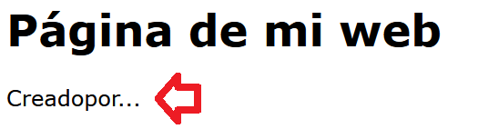
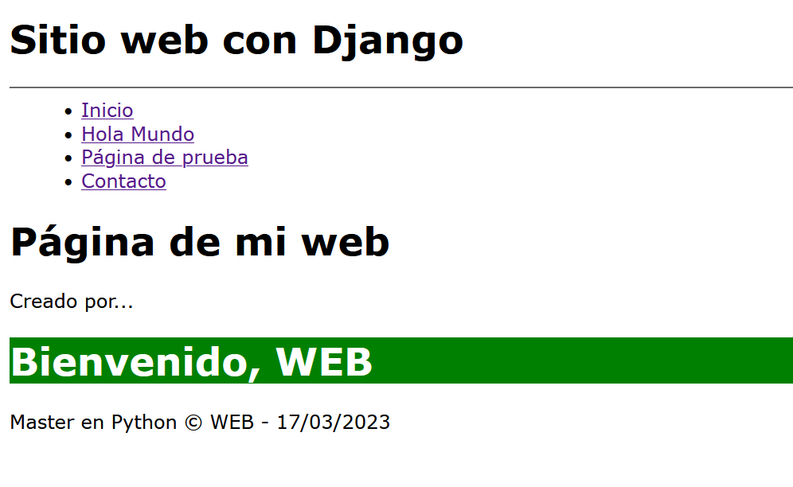

## Filtros en las templates 

[Regresar](/CodingBootcampsESPOL-RDDW/)

Filtros por defecto
===========

* * * 

Django Template Engine proporciona filtros que se utilizan para transformar los valores de variables y argumentos de etiquetas. Y la sintaxis de los filtros es el siguiente.

```django
{{ variable_name | filter_name }}
```

* Dentro de la carpeta templates, modificaremos el archivo pagina.html. El filtro a usar en este ejemplo es el "cut" que nos permite eliminar los espacios.

```django
<p>{{"Creado por..."|cut:" "}}</p>
```

<p align="center">

</p>
Recordemos que los filtros son pequeñas funciones a usar dentro de los templates. 

* Ahora se usará un filtro que si un texto viene vacio por defecto, entonces le mandamos un texto haciendo referencia a que no existe. 


```django
{{texto|default:"No hay nada."}}
```

En la [documentación de django](https://docs.djangoproject.com/en/4.1/ref/templates/builtins/) encontrarás los demás filtros que puedes usar dentro del proyecto. 

Filtro personalizado
===========

* * *

* En la carpeta miapp se creará la subcarpeta templatetags y de ahi creamos los archivos "__init__.py" y "filters.py". 

* En el archivo filters.py agregamos el siguiente código. 


```django
from django import template

register = template.Library()

@register.filter(name="saludo")
def saludo(value):
    largo = ''
    if len(value) >= 8:
        largo= '<p> Tu nombre es muy largo</p>'
    return f"<h1 style='background:green;color:white;'> Bienvenido, {value} </h1>" +largo
```


* El filtro que hemos creado ya puede ser usado en cualquiera de las plantillas, lo cargaremos en el archivo pagina.html. 

```django

{{"WEB"|saludo|safe}}
```
* Reiniciamos la ejecución del servidor para visualizar los cambios.

<p align="center">

</p>