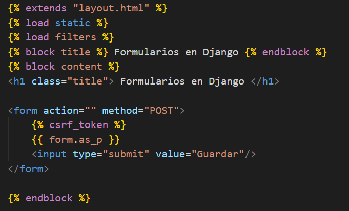
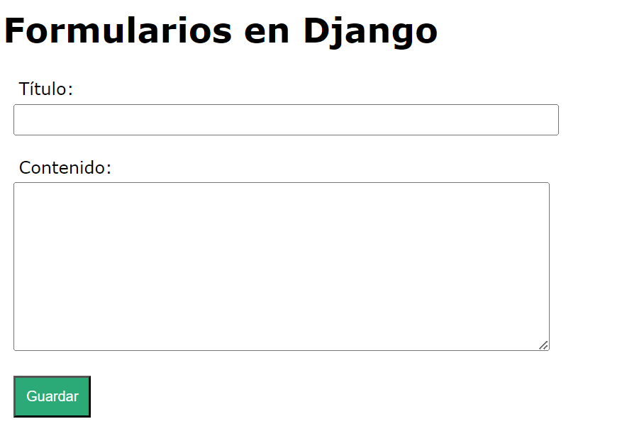
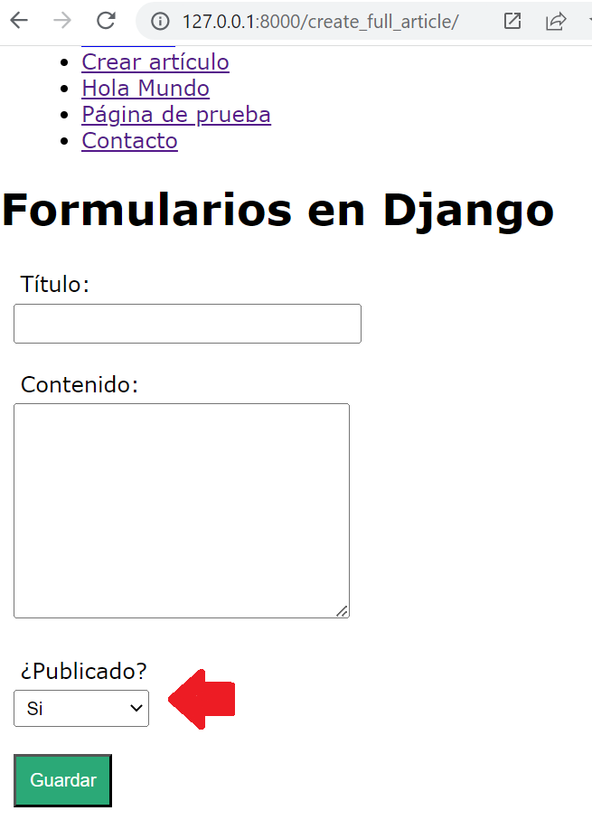

## Formulario basado en clases

[Regresar](/CodingBootcampsESPOL-RDDW/)

El formulario basado en clases de python es una solución más mantenible, eficaz, la forma de recoger los datos es más limpia y además se valida todas las opciones.

* En la carpeta **miapp** crearemos un nuevo archivo con el nombre de forms.py. En dicho archivo se definirán las clases y estructura que tendrá el formulario.

* Al inicio de archivo se procederá a importar forms. 

```py
from django import forms
```

* Se procede a crear la clase FormArticle con los atributos que tendrá el formulario.

```py
class FormArticle(forms.Form):
    title = forms.CharField(
        label = "Título"
    )
    content = forms.CharField(
        label = "Contenido",
        widget=forms.Textarea
    )
```

* En el archivo views.py crearemos la función **create_full_article**

* Al inicio del archivo views.py se importará el objeto form definido anteriormente.

```py
from miapp.forms import FormArticle
```

* La función create_full_article quedará de la siguiente manera.

```py
def create_full_article(request):
    formulario = FormArticle()
    return render(request, 'create_full_article.html', {
        'form' : formulario
    })
```
* Dentro del directorio **templates** se creará una nueva plantilla con el nombre de create_full_article.html.

<p align="center">

</p>

* La vista no ha sido añadida a una ruta por tal razón, crearemos un nuevo path en el archivo urls.py.

```py
path('create_full_article/', views.create_full_article, name="create_full")
```
* Accedes a la url de [create_full_article](http://127.0.0.1:8000/create_full_article/) y visualizarás el formulario ya creado.

<p align="center">

</p>

Campo de tipo Select
===========

* * * 

* Para añadir el campo Select continuamos modificando la clase **FormArticle** del archivo forms.py

```py
public_options = [
        (1, 'Si'),
        (0, 'No')
    ]
    public = forms.TypedChoiceField(
        label = "¿Publicado?",
        choices = public_options
    )
```
* Recargamos la página de create_full_article y vemos que ya aparece el campo de "¿Publicado?".

<p align="center">

</p>