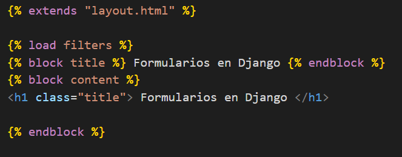
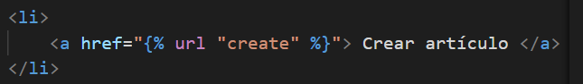
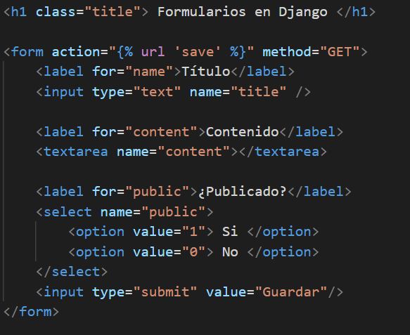
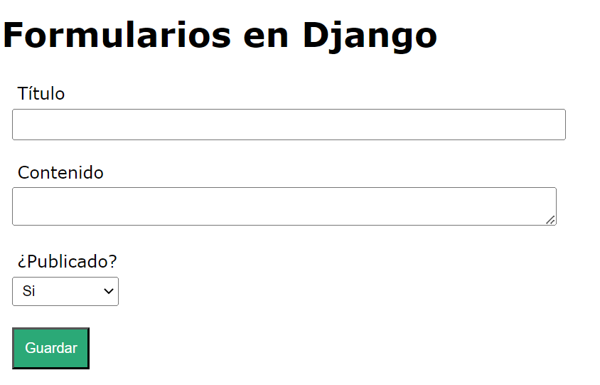

## Formularios, crear vistas y urls

[Regresar](/CodingBootcampsESPOL-RDDW/)

* Crearemos una nueva función para trabajar con los formularios, asi que en el archivo views.py introduciremos el siguiente código. 

```py
def save_article(request):
    articulo = Article(
        title = title,
        content = content,
        public = public
    )
    articulo.save()
    return HttpResponse(f"Artículo creado: {articulo.title} - {articulo.content}")

def create_article(request):
    return render(request, 'create_article.html')
```

* Ahora en la carpeta templates se creará un nuevo archivo create_article.html. 

<p align="center">

</p>

* Creamos las rutas en el archivo urls.py agregando las 2 rutas correspondientes a las vistas creadas anteriormente. 

```py
path('save_article/', views.save_article, name="save"),
path('create_article/', views.create_article, name="create")
```
* Arranca el servidor utilizando el comando `python manage.py runserver` debes ejecutar este comando en la línea de consola y ubicarte en el proyecto de AprendiendoDjango. 

* En el archivo layout.html agregaremos la url de create_article a la barra de navegación. 

<p align="center">

</p>

Formulario en HTML
===========

* * * 

* En el archivo create_article.html crearemos el formulario utilizando el siguiente código. 


<p align="center">

</p>

Estilos del formulario
===========

* * * 

* Para darle estilos a nuestro formulario nos drigimos a la subacarpeta **static** del directorio miapp, en la se ecnuentra el archivo styles.css en la que se añadirá lo siguiente. 

```css
form{
    width: 40%;
    padding-left: 10px;

}

input,
label{
    display:block;
    padding:5px;
}

input[type="text"],
textarea,
select{
    width: 100%;
    margin-bottom:15px;
}

select{
    width: 100px;
    padding: 5px;
}

input[type="submit"],
input[type="button"],
button{
    padding: 10px;
    margin-top: 5px;
    background: #2ba977;
    color:white;
}

input[type="submit"]:hover,
input[type="button"]:hover,
button:hover{
    cursor:pointer;
    background: #1f7e58;
    transition: 300ms all;
}

```

<p align="center">

</p>