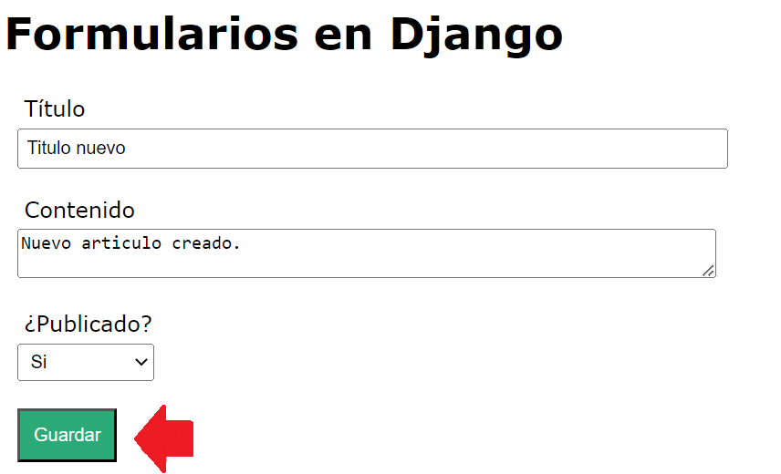
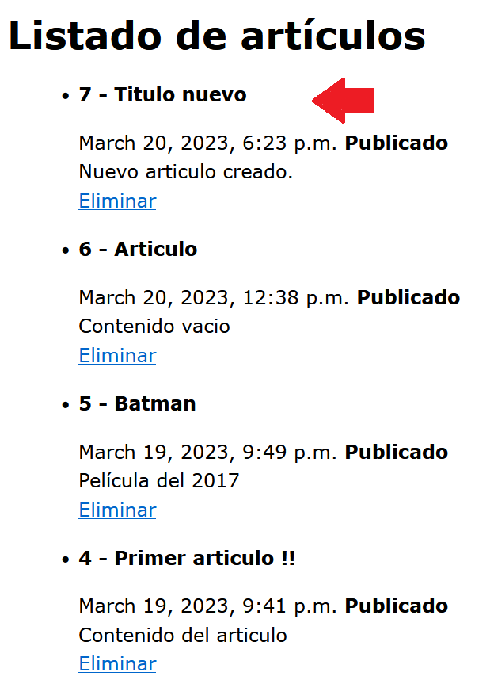
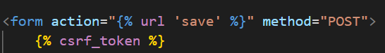

## Métodos GET, POST

[Regresar](/CodingBootcampsESPOL-RDDW/)

Recibir datos del formulario por GET
===========

* * * 

El método utilizado por HTTP para enviar los datos puede ser: post o get.
El método GET unicamente debe usarse para cuando los formularios no cambian datos de usuario (por ejemplo, un formulario de búsqueda). También, este es recomendado para cuando desee guardar, marcar o compartir el URL.

* En el archivo views.py modificaremos la función save_article() para recibir el título, contenido y publicado del articulo mediante el método GET.

```py
def save_article(request):
    if request.method == 'GET':
        title = request.GET['title']
        content = request.GET['content']
        public = request.GET['public']
        articulo = Article(
            title = title,
            content = content,
            public = public
        )
        articulo.save()
    

        return HttpResponse(f"Artículo creado: {articulo.title} - {articulo.content}")

    else:
        return HttpResponse("<h2>No se ha podido crear el artículo </h2>")
```
* Acedemos a la url para ingresar un nuevo artículo mediante el [formulario](http://127.0.0.1:8000/create_article/).

<p align="center">

</p>

* Modificamos la función articulos() en views para listar todos los artículos ordenados por el id ultimamente creado.

```py
def articulos(request):

    articulos = Article.objects.all().order_by('-id')
    return render(request, 'articulos.html', {
        'articulos' : articulos
    })
```

<p align="center">

</p>

Obtener datos del formulario por POST
===========

* * * 
El método POST siempre debe usarse si los datos enviados van a resultar en un cambio en la base de datos del servidor porque esto puede ser mas resistente a un ataque de solicitud de falsificación entre sitios (cross-site forgery request attacks).

*  Modificamos la función save_article para usar el método POST.

```PY
def save_article(request):
    if request.method == 'POST':
        title = request.POST['title']
        content = request.POST['content']
        public = request.POST['public']
        articulo = Article(
            title = title,
            content = content,
            public = public
        )
        articulo.save()
    

        return HttpResponse(f"Artículo creado: {articulo.title} - {articulo.content}")

    else:
        return HttpResponse("<h2>No se ha podido crear el artículo </h2>")
```

* Ahora se añadirá el siguiente código dentro de la etiqueta form del archivo create_article.html.

<p align="center">

</p>
* Acedemos a la url para ingresar un nuevo artículo mediante el [formulario](http://127.0.0.1:8000/create_article/). Además notarás que cuando ya se te renderize a la página que muestra el artciulo creado la información ya no se visualizará por la url y esto se debe a que se está utilizando el método post.

Referencias
===========

* * *

* Tutorial de Django Parte 9: Trabajo con formularios. Retrieved March 20, 2023, from [https://developer.mozilla.org/es/docs/Learn/Server-side/Django/Forms](https://developer.mozilla.org/es/docs/Learn/Server-side/Django/Forms)