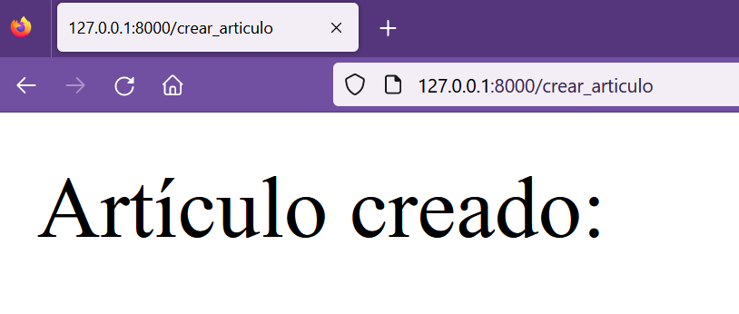
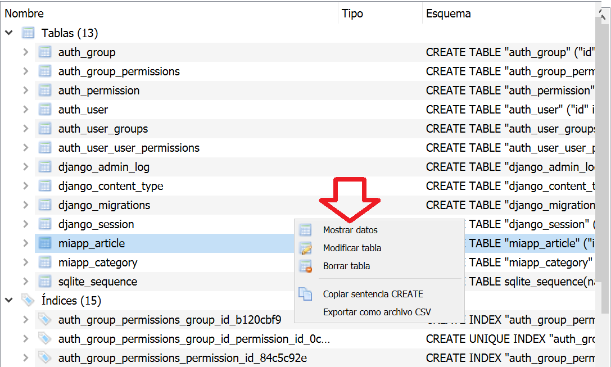
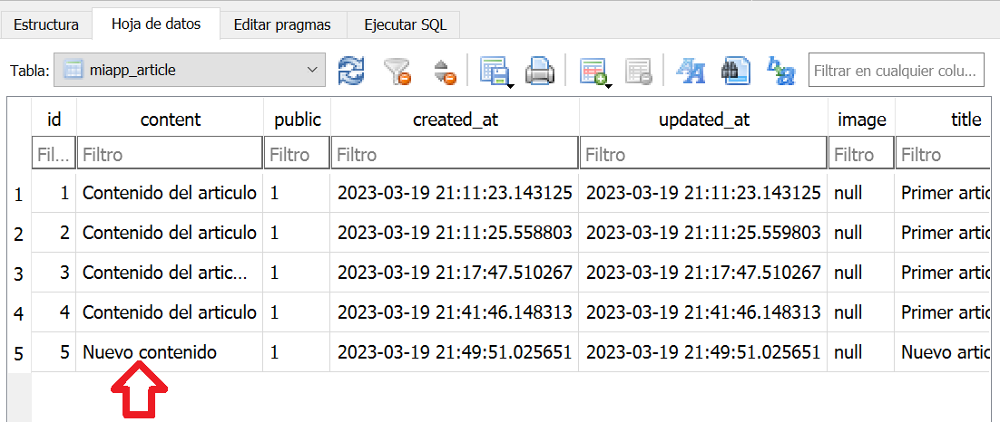

## Guardar datos en la base de datos usando los modelos 

[Regresar](/CodingBootcampsESPOL-RDDW/)

<p align="center">

</p>

* Empezaremos editando el archivo view.py que se ecnuentra en la carpeta miapp. 

* Crearemos una nueva vista que será crear_articulo, que creará un artículo en la tabla Article.

```h
def crear_articulo(request):
    return HttpResponse("Usuario creado: ")
```

* Ahora se creará una ruta para la vista crear_articulo. Abrimos el archivo urls.py añadiendo el siguiente código en el array de rutas. 

```h
path('crear_articulo', views.crear_articulo, name="crear_articulo")
```
* Abrimos la terminal y nos dirigimos al proyecto de AprendiendoDjango y ejecutar el siguiente comando. Y acceder al a la url que aparece con la ejecución del comando.

```
python manage.py runserver
```

* Se accede a la ruta de crear_articulo.

<p align="center">

</p>

* Volvemos al archivo views.py para hacer uso de los modelos creados anteriormente. Como primer paso importar el modelo para que pueda ser usado. Coloca la siguiente línea de código al inicio del archivo.

```h
from miapp.models import Article
```

* Ahora ya se puede hacer uso del objeto Article en la función crear_articulo coloca lo siguiente.

```h
def crear_articulo(request):
    articulo = Article(
        title = 'Primer articulo!!',
        content = 'Contenido del articulo',
        public = True
    )
    articulo.save()
    return HttpResponse("Usuario creado: ")
```

* En la aplicación de DB Browser for SQlite busca la tabla miapp_article y da clic derecho y selecciona la opción de "mostrar datos" y verás que se guardó la información.

<p align="center">

</p>


Guardar registros usando parámetros de la url
===========

* * * 

* En el archivo view.py hacemos una modificación en el return de la función crear_articulo.

```django
return HttpResponse(f"Artículo creado: {articulo.title} - {articulo.content}")
```
* Ahora veremos como guardar datos pasandole los atributos mediante la url. Debemos dirigirnos al archivo url.py y añadirle los atributos de title y content a la url.

```h
path('crear_articulo/<str:title>/<str:content>/<str:public>', views.crear_articulo, name="crear_articulo")
```

* En el archivo views.py debemos pasarle los parámetros, modifica la función crear_articulo.

```django
def crear_articulo(request, title, content, public):
    articulo = Article(
        title = title,
        content = content,
        public = public
    )
    articulo.save()
    return HttpResponse(f"Artículo creado: {articulo.title} - {articulo.content}")
```

* En tu navegador accede a la url correspondiente a la ruta crear_articulo y añade los nuevos parámetros en este caso se usó: **http://127.0.0.1:8000/crear_articulo/Nuevo%20articulo/Nuevo%20contenido/True**

* Revisa la base de datos y se reflejará el nuevo artículo.

<p align="center">

</p>
