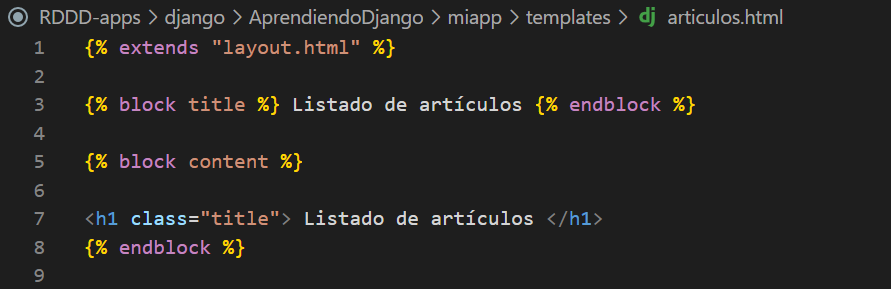
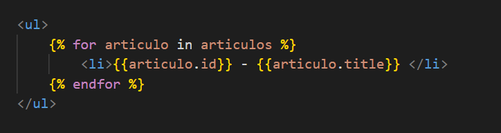
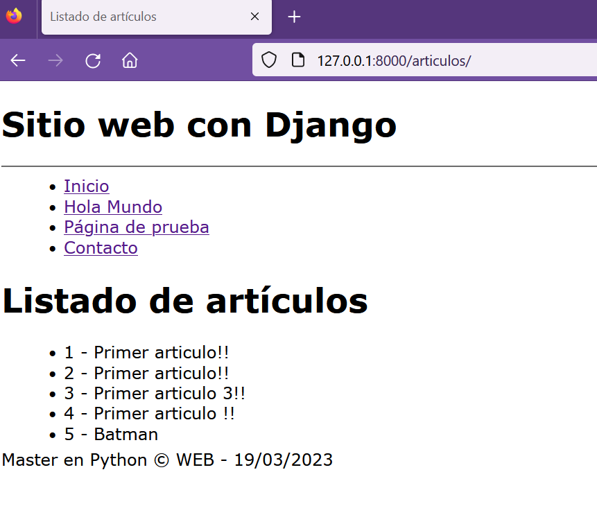
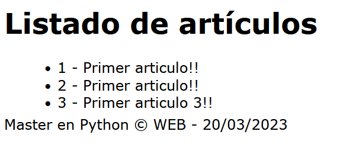

## Listar todos los artículos

[Regresar](/CodingBootcampsESPOL-RDDW/)

* En el archivo views.py que se encuentra en la subcarpeta miapp del directorio AprendiendoDjango, crearemos una nueva función con el nombre **articulos**. El método all() nos permite obtener todos los datos de la base de datos. En el render le pasaremos el nombre de la template y como tercer parámetro un diccionario con las variables que se requieran.

```h
def articulos(request):

    articulos = Article.objects.all()

    return render(request, 'articulos.html', {
        'articulos' : articulos
    })
```

* En el directorio de **miapp** se encuentra la subcarpeta templates, ahí crearemos el archivo articulos.html.

<p align="center">

</p>

* Es momento de crear la ruta en el array de urlpatterns que se encuentra en urls.py.

```h
path('articulos/', views.articulos)
```

* En la plantilla de articulos.html agregaremos el código para listar todos los artículos.

<p align="center">

</p>

* Actualizamos la página en el navegador y visualizaremos todos los artículos.

<p align="center">

</p>

Order by
===========

* * * 

Order by es una cláusula de sql que nos permite ordenar los registros dependiendo del parámetro que se desea. 

* En el archivo view.py realizar el siguiente cambio para ordenar por id.

```h
def articulos(request):

    articulos = Article.objects.order_by()

    return render(request, 'articulos.html', {
        'articulos' : articulos
    })
```
* Ahora se ordenará por title.

```h
def articulos(request):

    articulos = Article.objects.order_by('title')

    return render(request, 'articulos.html', {
        'articulos' : articulos
    })
```

Limit
===========

* * * 

También podemos usar la cláusula limit para limitar la cantidad de registros. Esto se realiza utilizando los corchetes y especificando la cantidad que se desea.

```h
def articulos(request):

    articulos = Article.objects.order_by('id')[:3]

    return render(request, 'articulos.html', {
        'articulos' : articulos
    })
```

<p align="center">

</p>

Si solo quiero sacar un elemento se debe especificar lo siguiente [0:1].