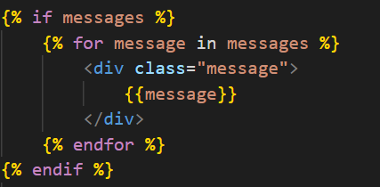
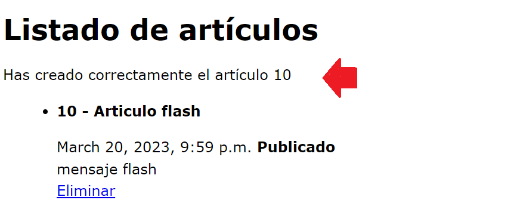
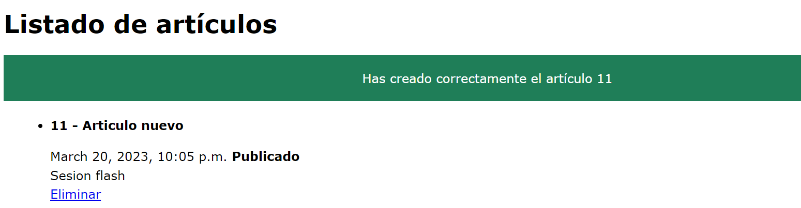

## Mensajes flash / sessiones flash

[Regresar](/CodingBootcampsESPOL-RDDW/)

Muy comúnmente en las aplicaciones web, debe mostrar un mensaje de notificación único (también conocido como "mensaje flash") al usuario después de procesar un formulario u otros tipos de entrada del usuario.

Para esto, Django brinda soporte completo para mensajes basados ​​en cookies y sesiones, tanto para usuarios anónimos como autenticados. El marco de mensajes le permite almacenar mensajes temporalmente en una solicitud y recuperarlos para mostrarlos en una solicitud posterior (generalmente la siguiente). Cada mensaje tiene una etiqueta específica levelque determina su prioridad (p. ej. info, warning, o error).

*  En el archivo views.py de la subcarpeta miapp debemos al inicio del archivo realizar el siguiente import.

```py
from django.contrib import messages
```
* Se agrega el siguiente mensaje flash antes del redirect en la función create_full_article().
```py
    articulo.save()

    # Crear mensaje flash(sesión que se muestra una sola vez)
    messages.success(request, f'Has creado correctamente el artículo {articulo.id}' )
    return redirect('articulos')
```

* En la carpeta templates se encuentra el archivo articulos.html en donde agregaremos el código para mostrar el mensjae flash. 

<p align="center">

</p>

<p align="center">

</p>

* Añadiremos estilo a la clase message que son los mensajes flash, utiliza el código y agrégalo en el archivo styles.css.

```css
.message{
    padding: 20px;
    background: #1f7e58;
    color:white;
    text-align: center;
    margin-bottom: 10px;
}
```
<p align="center">

</p>

Referencias
===========

* * *

* The messages framework. Retrieved March 20, 2023, from [https://docs.djangoproject.com/en/4.1/ref/contrib/messages/](https://docs.djangoproject.com/en/4.1/ref/contrib/messages/)