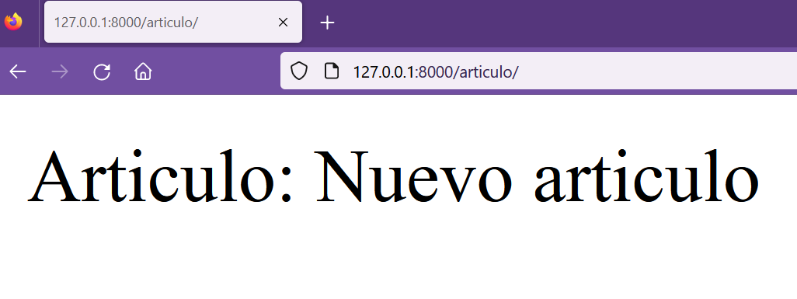

## Obtener datos y elementos de la base de datos

[Regresar](/CodingBootcampsESPOL-RDDW/)

* En el archivo views.py que se encuentra en la subcarpeta miapp del directorio AprendiendoDjango, crearemos una nueva función con el nombre articulo.

```h
def articulo(request):
    return HttpResponse(f"Articulo:")
```

* Ahora se creará la url correspondiente añadiendo la nueva ruta al array de urlpatterns.

```h
path('articulo/', views.articulo, name="articulo")
```

* Para mostrar un artículo se debe hacer una consulta en la base de datos y eso lo haremos en la función articulo del archivo views.py. La función get() nos permitirá extraer un solo registro de la base de datos. En este caso el artículo de primary key = 5.

```h
def articulo(request):
    articulo = Article.objects.get(pk=5)
    return HttpResponse(f"Articulo: {articulo.title}")
```

<p align="center">

</p>

* Se pueden añadir distintas condiciones como por ejmplo que el title sea "Nuevo articulo" y que el atributo public sea True.

```h
def articulo(request):
    articulo = Article.objects.get(title="Nuevo articulo", public=True)
    return HttpResponse(f"Articulo: {articulo.title}")
```

* Añadiremos un try para manejar el caso en que nos de una excepción.

```h
def articulo(request):
    try:
        articulo = Article.objects.get(title="Nuevo articulo", public=True)
        response = f"Artículo <br/>: {articulo.id} - {articulo.title}"
    except: 
        response = "<h1> Artículo no encontrado </h1>"
    return HttpResponse(response)
```