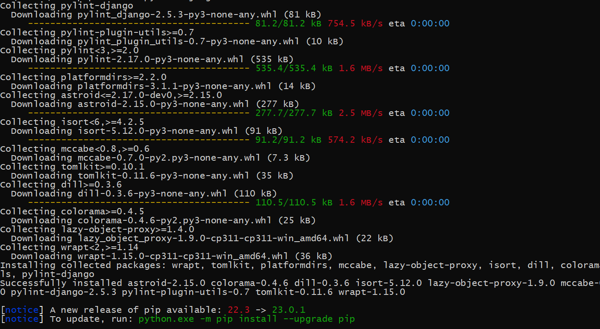
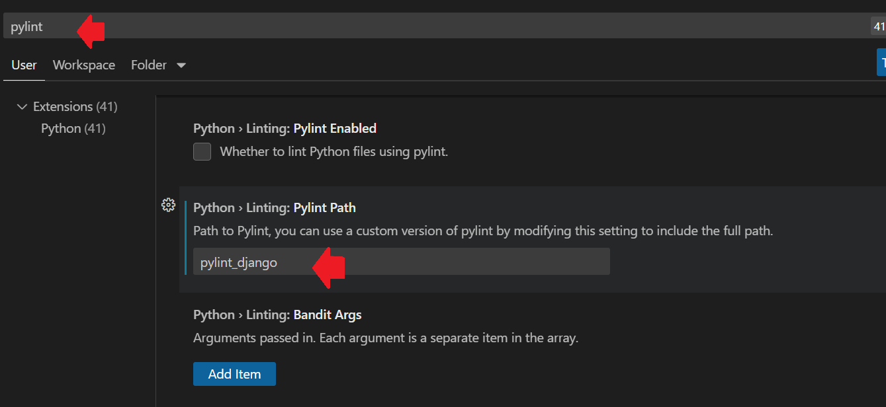

## Pylint para Django

[Regresar](/CodingBootcampsESPOL-RDDW/)

Pylint-django es un complemento de Pylint para mejorar el análisis de código cuando se analiza código usando Django. También lo utiliza la herramienta Prospector.

* Para instalar el plugin pylint-django, necesitas abrir la consola de comandos, y ejecutas el siguiente comando.

```
pip install pylint-django
```

<p align="center">

</p>

* Como estamos usando el editor de texto de Visual Studio Code debemos hacerle una configuración. Por tal razón, en el menú de navegación dirigirse a la pestaña de "File" y de ahí clic en "preferencias" y opción "settings". Después buscar la sección de "Extensions" y escogemos la extensión de Python. 

* Luego en el buscador colocamos la palabra pylint y en la opción de "Linting: Pylint Path" colocamos python django, ahora si esta lista la configuración para empezar con la creación de modelos.

<p align="center">

</p>