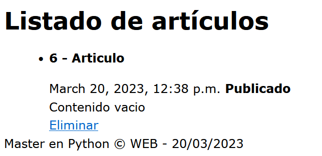

## Ejecutar SQL desde Django

[Regresar](/CodingBootcampsESPOL-RDDW/)


* Django nos permite realizar consultas sql, para ejmplicarse este tema añadiremos el siguiente código antes del return de la función articulo() del archivo views.py.

```py
 articulos = Article.objects.raw("SELECT * FROM miapp_article WHERE title='Articulo' AND public=1")
```
La consulta anterior nos dará el artículo con título igual a "Articulo" y que esté publicado. 

<p align="center">

</p>

OR en consultas con el ORM
===========

* * * 

* Para hacer uso de consultas con OR, se empezará realizando un import al inicio del archivo views.py.

```py
from django.db.models import Q
```
* Modificaremos la función articulos() para hacer uso del OR. El símbolo que caracteriza al OR es **|**. 

```py
def articulos(request):

    articulos = Article.objects.all()
    articulos = Article.objects.filter(id__gt=3)

    articulos = Article.objects.filter(
        Q(title__contains="2") | Q(title__contains="3")
    )

    return render(request, 'articulos.html', {
        'articulos' : articulos
    })
```