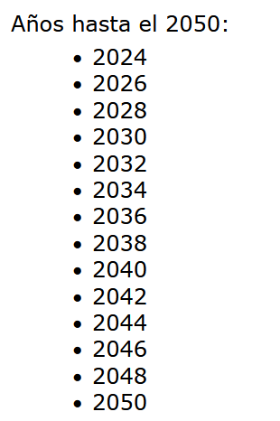
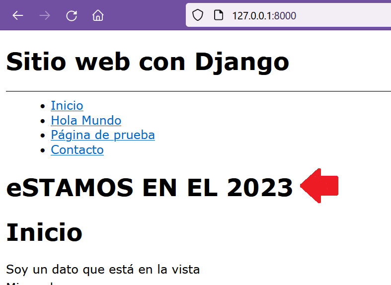

## Ejercicio con las templates tags

[Regresar](/CodingBootcampsESPOL-RDDW/)

* Continuamos modificando la carpeta AprendiendoDjango específicamente la función index, en la que pasamos a comentar el código que mostraba los años hasta el 2050, para los comentarios se hará uso de las triples comillas. Se iniciará creando la variable año y la variable hasta que incluye el año actual hasta el 2052, de ahí esa variable debe ser usada dentro del render para mostrarla en el template de index.html. 

```py
year = 2023
hasta = range(year, 2051)


return render(request, "index.html", {
        "title" : "Inicio",
        "mi_variable" : "Soy un dato que está en la vista",
        "nombre": nombre,
        "lenguajes":lenguajes,
        "years":hasta
})
```
*  En el archivo index.html insertamos el siguiente código que nos permitirá mediante el bucle for mostrar los años hasta el 2050 pero con la condición de que sean los años pares. 

```html
<p> Años hasta el 2050: </p>
<ul>
    
          
            <li> {{year}}</li>
        
    

</ul>
```

<p align="center">

</p>

Include templates django
===========

* * *

* Dentro de la carpeta miapp creamos una plantilla con el nombre de fecha_actual.html que estará dentro de la carpeta templates y contendrá la siguiente línea de código. 

```h
<h1> Bienvenido {{nombre}} </h1>
<h1>  ESTAMOS EN EL 2023  </h1>
```

* La plantilla anterior se puede incluir dentro de otra plantilla en este caso se la incluirá en la plantilla index.html. 

```py

```

<p align="center">

</p>

Urls en template
===========

* * *

Moficamos el layout.html utilizando url para cada item de la barra de navegación. 

```html
<ul>
        <li>
            <a href=""> Inicio </a>
        </li>
        <li>
            <a href=""> Hola Mundo </a>
        </li>
        <li>
            <a href=""> Página de prueba </a>
        </li>
        <li>
            <a href=""> Contacto </a>
        </li>
    </ul>
```

Fechas
===========

* * *

* Modificamos el archivo layout.html dentro del footer para colocar la fecha con las isntrucción now.

```html
Master en Python &copy; WEB - 
```