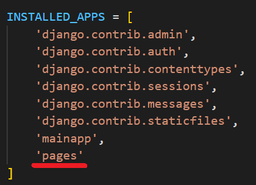

## Crear app para las páginas

[Regresar](/CodingBootcampsESPOL-RDDW/)

* Crearemos una app para gestionar las páginas. Abre la terminal y ubicate en la carpeta **ProyectoDjango** y ejecuta el siguiente comando.

```
python manage.py startapp pages
```

* Ahora añadiremos la app **pages** creada anteriormente a la lista de INSTALLED_APPS del archivo settings.py que se encuentra en la subcarpeta ProyectoDjango.

<p align="center">

</p>

Modelo para la entidad de Página
===========

* * *

* En la carpeta **pages** se encuentra el archivo models.py en donde codificaremos nuestro modelo.

```py
class Page(models.Model):
    title = models.CharField(max_length=50, verbose_name="Título")
    content = models.TextField(verbose_name="Contenido")
    slug = models.CharField(unique=True, max_length=150, verbose_name="URL")
    visible = models.BooleanField(verbose_name="¿Visible?")
    created_at = models.DateTimeField(auto_now_add=True, verbose_name="Creado el")
    updated_at = models.DateTimeField(auto_now=True, verbose_name="Actualizado el")

    class Meta:
        verbose_name = "Página"
        verbose_name_plural = "Páginas"
    
    def __str__(self):
        return self.title
```