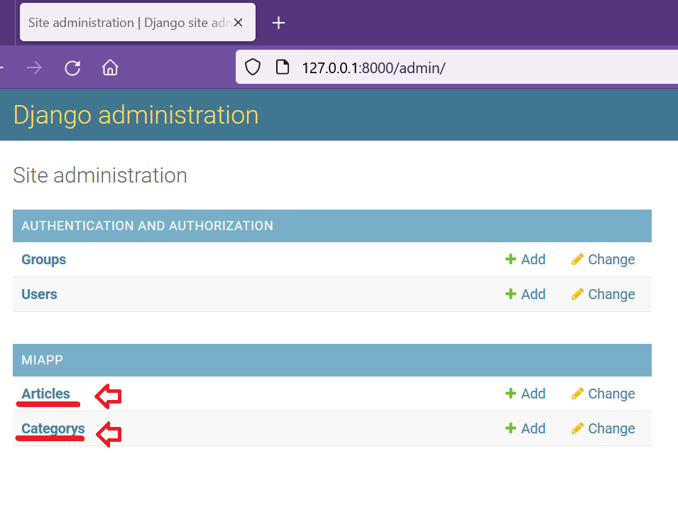
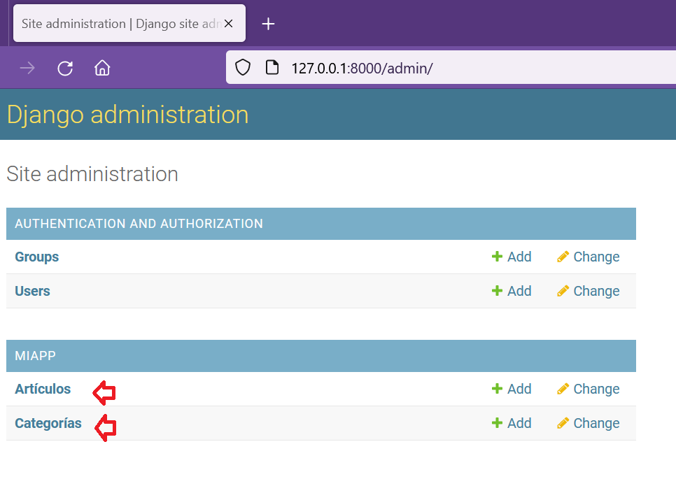
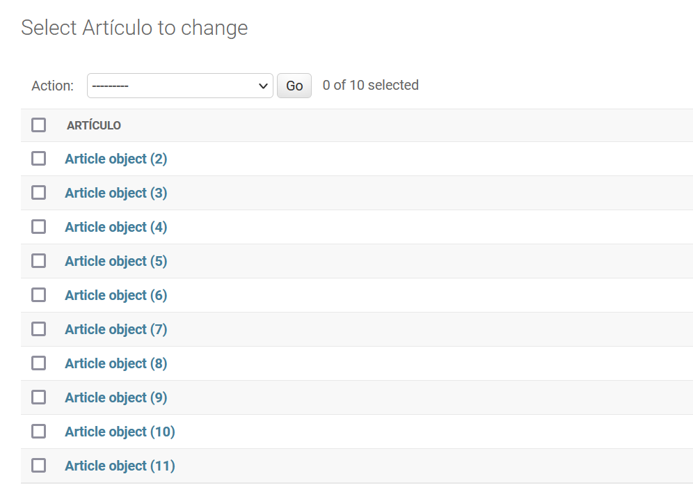
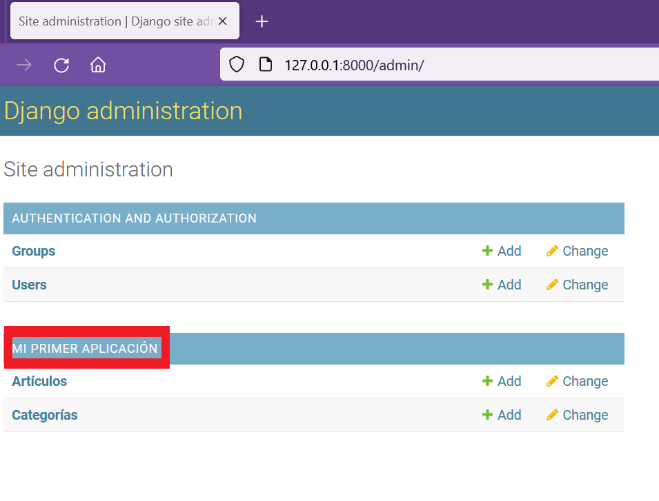

## Clase Meta en los modelos de Django

[Regresar](/CodingBootcampsESPOL-RDDW/)

* En la sección anterior creamos el [panel de administración](./django-admin-panel.md) y Django para cargar nuestros objetos los coloca en ingles, por esa razón ahora realizaremos la modificación para que sean visualizados en español. 

<p align="center">

</p>

Model Meta es básicamente la clase interna de su clase de modelo. Model Meta se usa básicamente para cambiar el comportamiento de los campos de su modelo, como cambiar las opciones de orden, verbose_name y muchas otras opciones, revisa la documentación oficial de la [clase meta](https://docs.djangoproject.com/en/4.1/ref/models/options/). Es completamente opcional agregar una clase Meta a su modelo. Las ocpiones que utilizaremos serán las de verbose_name y verbose_name_plural.

* En la carpeta miapp se encuentra el archivo models.py en el que estaremos agregando la clase meta. Dentro de la clase Article colocaremos el siguiente código.

```py
class Meta:
        verbose_name = "Artículo"
        verbose_name_plural = "Artículos"
```
* En la clase category agregamos algo similar.

```py
class Meta:
        verbose_name = "Categoría"
        verbose_name_plural = "Categorías"
```

* Ejecutamos el servidor con el comando `python manage.py runserver` debes abrir la terminal y dirigirte a la carpeta de AprendiendoDjango. O si ya tenías ejecutado el servidor solo debes actualizar la página del [panel de administración](http://127.0.0.1:8000/admin/).

<p align="center">

</p>

* Además podemos realizar una ordenación de los objetos por id utilizando la opción de **ordering** de la clase meta. Agregamos la opción de ordering en la clase Article.

```py
class Meta:
        verbose_name = "Artículo"
        verbose_name_plural = "Artículos"
        ordering = ['id']
```

<p align="center">

</p>

Manipular propiedades de los modelos
===========

* * *

* Notamos que las propiedades de los modelos también se encuentran en inglés. Por tal razón, en cada atributo se le añadirán como parámetro el **verbose_name**. 

```py
class Article(models.Model):
    title = models.CharField(max_length=150, verbose_name="Título")
    image = models.ImageField(default="null", verbose_name="Imagen")
    content = models.TextField(verbose_name="Contenido")
    public = models.BooleanField(verbose_name="¿Publicado?")
```

Cambiar el nombre de las apps
===========

* * *

En el panel de administración se visuliza el nombre de la app que se configuró como **miapp** pero también podemos modificar dicho nombre. 

* Dentro de la carpeta miapp se encuentra el archivo apps.py en la que se añadirá la opción de verbose_name. 

```py
class MiappConfig(AppConfig):
    default_auto_field = 'django.db.models.BigAutoField'
    name = 'miapp'
    verbose_name = "Mi primer aplicación"
```
* Para que se haga visible dicho cambio, abrimos el archivo settings.py de la subcarpeta AprendiendoDjango. En la lista de INSTALLED_APPS modificamos el elemento 'miapp' por que se encuentra a continuación:

```py
'miapp.apps.MiappConfig'
```

<p align="center">

</p>

Referencias
===========

* * *

* Meta Class in Models – Django. Retrieved March 22, 2023, from [https://www.geeksforgeeks.org/meta-class-in-models-django/](https://www.geeksforgeeks.org/meta-class-in-models-django/)