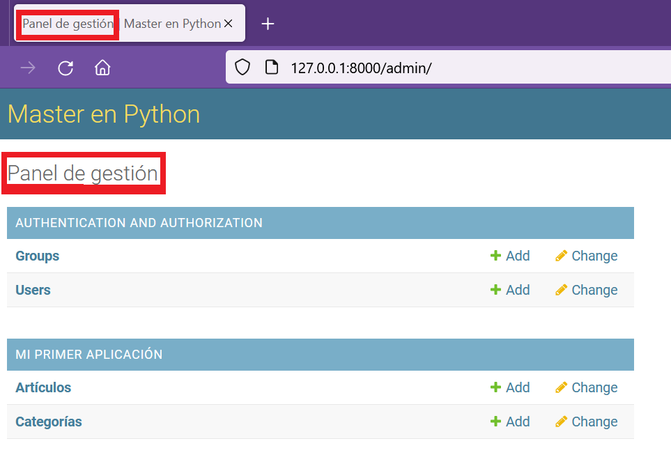

## Configuración básica del panel de Administración

[Regresar](/CodingBootcampsESPOL-RDDW/)

Cambiar título del panel
===========

* * *

* La modificación del título del panel la realizaremos en el archivo urls.py.

```py
# Configurar el título del panel 

admin.site.site_header = "Master en Python"
```

Con la modificación anterior ahora el título del panel será **Master en Python**. 

<p align="center">

</p>

Cambiar subtítulo del panel
===========

* * *

* Añadiremos una configuración adicional en el archivo urls.py para cambiar el subtítulo del panel de administración y que aparezca en la página y también en el título de la pestaña.

```py
title = "Master en Python"
admin.site.site_title = title
admin.site.index_title= "Panel de gestión"
```

<p align="center">

</p>

Mejorar configuración del panel
===========

* * *

Las configuraciones de cambiar el título y subtítulo del panel de administración se realizaron el archivo urls.py pero no es buena práctica ya que este archivo es exclusivamente para el manejo de rutas.

Por el motivo anterior, ahora abriremos el archivo admin.py de la carpeta miapp en la que agregaremos la configuración que estaba codificada en el archivo urls.py

```py
title = "Master en Python"
admin.site.site_title = title
admin.site.index_title= "Panel de gestión"
```