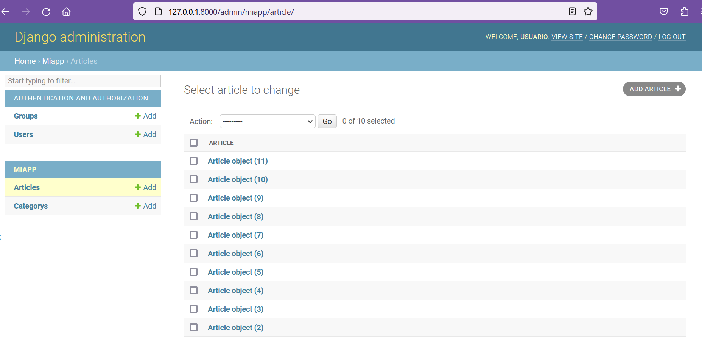

## Django Admin Panel

[Regresar](/CodingBootcampsESPOL-RDDW/)

Una de las partes más poderosas de Django es la interfaz de administración automática. Lee los metadatos de sus modelos para proporcionar una interfaz rápida y centrada en el modelo donde los usuarios de confianza pueden administrar el contenido de su sitio. El uso recomendado por el administrador se limita a la herramienta de administración interna de una organización. No está diseñado para construir todo el frente.

El administrador tiene muchos ganchos para la personalización, pero tenga cuidado de intentar usar esos ganchos exclusivamente. Si necesita proporcionar una interfaz más centrada en el proceso que abstraiga los detalles de implementación de las tablas y los campos de la base de datos, probablemente sea el momento de escribir sus propias vistas.

<p align="center">

</p>

* Django internamente genera una serie de apps por defecto que construyen el panel de administración. En el archivo settings.py notarás que una de las app instaladas es la de admin. 

<p align="center">

</p>

* La visualización la puedes realizar ejecutando el servidor, es decir, abrir la terminal y estando en la carpeta AprendiendoDjango, luego ejecutar el comando:
 ```
 python manage.py runserver
 ```

* Ya ejecutado el servidor accede al enlace del [panel de administración](http://127.0.0.1:8000/admin/login/) que por defecto trae Django. 

<p align="center">

</p>

* Ahora detenemos el servidor, así que debes abrir la consola y presionar Ctrl + C.

* Para ingresar mediante el panel de navegación será necesario crear un superusuario, por ello, ejecuta el siguiente comando en la consola.

```
 python manage.py createsuperuser
 ```

* Ya en ejecución el comando nos pedirá el nombre del usuario a configurar, en este caso se configurará con el nombre de **usuario**, usted puede colocar su nombre pero para fines educativos se colocará como nombre usuario. Además, también nos pedirá el correo electrónico la cual se colocará: **usuario@usuario.com**. Y también deberás agregar una contraseña. 

<p align="center">

</p>

* Volvemos a ejecutar el servidor con el comando `python manage.py runserver`. Luego, accedemos a la url del [panel de administración](http://127.0.0.1:8000/admin/login/) y colocamos y accedemos con el usuario creado anteriormente. 

<p align="center">

</p>

<p align="center">

</p>

* Ahora gestionaremos para que en panel de administración aparezcan los artículos agregados en sesiones anteriores. Abriremos el archivo admin.py que se encuentra en la carpeta **miapp**. 

* Iniciaremos importando los modelos al inicio del archivo admin.py.

```py
from .models import Article, Category
 ```

* Usamos la función register() para cargar los modelos en el panel de administración. 

```py
admin.site.register(Article)
admin.site.register(Category)
```
<p align="center">

</p>

* Con el servidor ya en ejecución, accedemos al [panel de administración de miapp](http://127.0.0.1:8000/admin/miapp/) y visualizamos que se han cargado los modelos de artículos y categorías.

<p align="center">

</p>


* El panel de navegación nos ofrece múltiples opciones como editar o modificar los campos ya sea de un artículo o categoría.

<p align="center">

</p>

<p align="center">

</p>

* Añadiremos una nueva categoría con los datos que se visulizarán en la imagen.

<p align="center">

</p>

Referencias
===========

* * *

* The Django admin site. Retrieved March 21, 2023, from [https://docs.djangoproject.com/en/4.1/ref/contrib/admin/](https://docs.djangoproject.com/en/4.1/ref/contrib/admin/)