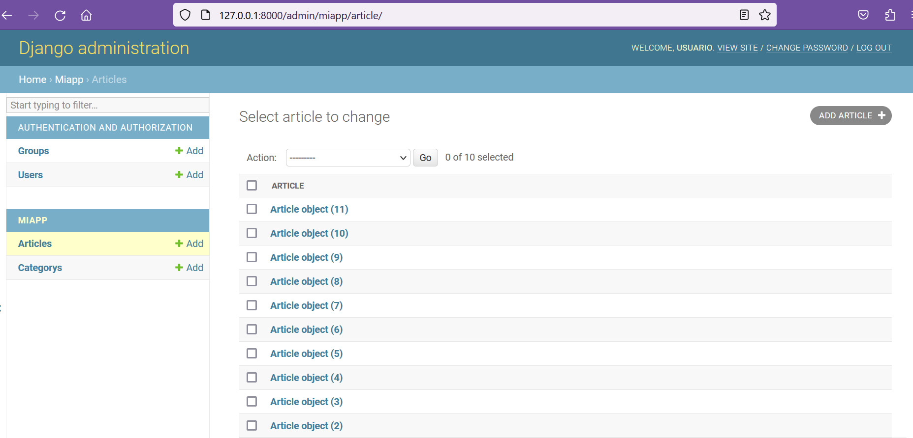
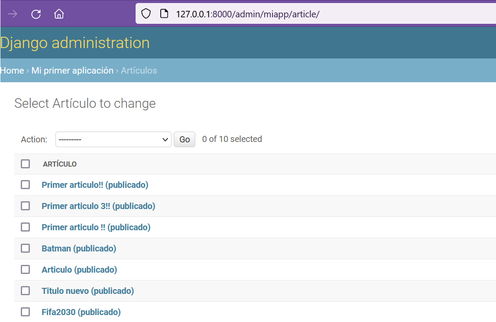
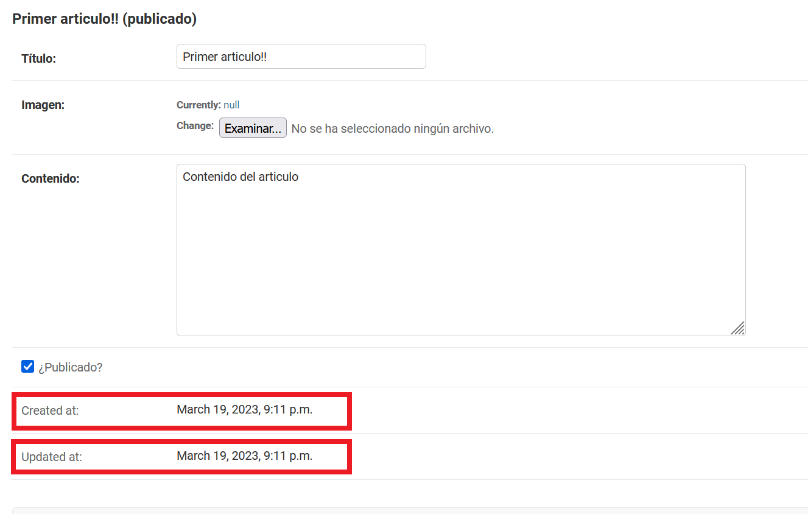
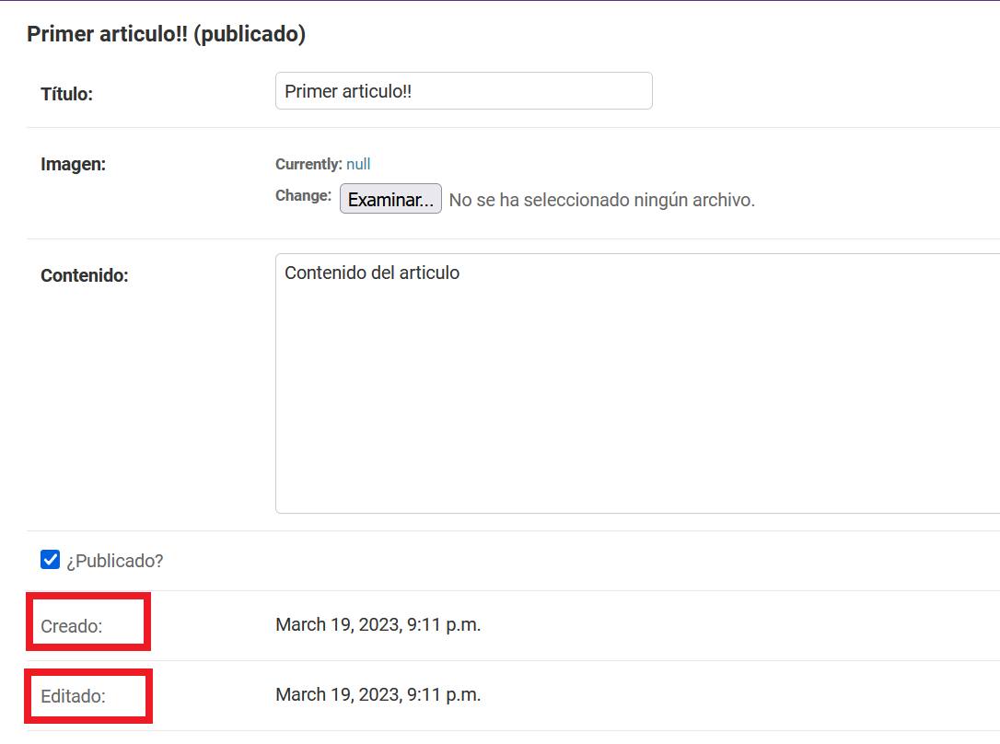

## Método para imprimir objetos (modelos)

[Regresar](/CodingBootcampsESPOL-RDDW/)

* Continuamos trabajando dentro de **miapp** específicamente en el archivo models.py. Recordemos que si accedemos al modelo de Artículos lo que se nos muestra son los objetos de clase Article.

<p align="center">

</p>

* En la clase Article definiremos un nuevo método que nos permita visualizar el contenido de los objetos. 

```py
def __str__(self):
        if self.public:
            public = "(publicado)"
        else:
            public = "(privado)"
        return f"{self.title} {public} "
```

<p align="center">

</p>

Mostrar campos de solo lectura
===========

* * *

Dentro de cada clase definidos atributos, ciertos de ellos no son editables y por tal razón no aparecen en el panel de navegación cuando se quiere hacer una edición o visualización de algún elemento.

* Realizaremos una configuración en el archivo admin.py, creando la clase ArticleAdmin y pasándola como parámetro. 

```py
class ArticleAdmin(admin.ModelAdmin):
    readonly_fields = ('created_at' , 'updated_at')
admin.site.register(Article, ArticleAdmin)
```

<p align="center">

</p>

* Como se visualiza en la imagen anterior  los campos de created_at y updated_at están en inglés por tal razón modificaremos para que se muestre en español. Añade el **verbose_name** a dichos atributos que se encuentran definidos en la clase Article del archivo models.py.

```py
created_at = models.DateTimeField(auto_now_add=True, verbose_name="Creado")
    updated_at = models.DateTimeField(auto_now=True, verbose_name="Editado")
```

<p align="center">

</p>
