## Menú desplegable de categorías

[Regresar](/CodingBootcampsESPOL-RDDW/)

* En la carpeta mainapp se encuentra el archivo layout.html(RDDD-apps\django\ProyectoDjango\mainapp\templates\layouts\layout.html) en el que agregaremos la sección para las categorías. 

<p align="center">
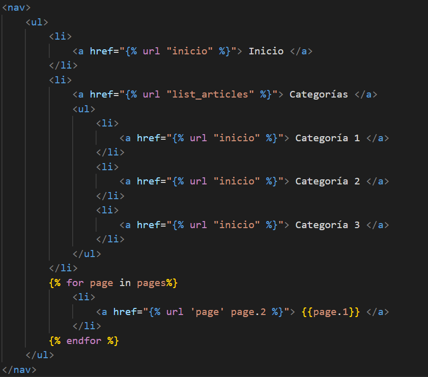
</p>

* En el archivo styles.css(RDDD-apps\django\ProyectoDjango\mainapp\static\css\styles.css) agrega los siguientes estilos.

```css
nav > ul{
    list-style: none;
    text-decoration: none;
}

nav > ul > li{
    line-height: 40px;
    float: left;
}

nav > ul > li > a{
    display: block;
    padding-left: 15px;
    padding-right: 10px;
    color: white;
}


nav > ul > li > a:hover{
    background: #2ba977;
    box-shadow: 0px 0px 5px #333333 inset;
    transition: all 300ms;
}

nav > ul > li > ul{
    display: none;
    position: absolute;
    color: white;
    text-align: left;
    width: 160px;
    box-shadow: 0px 2px 2px gray;
}

nav > ul > li:hover > ul{
    display: block;
    color: white;
    margin: 0px;
    list-style: none;
}

nav > ul > li:hover > ul > li{
    background: #F2F1F0;
    border-bottom: 1px solid #d6d6d6;
    padding: 8px;
    line-height: 25px;
    font-size: 13px;
    transition: all 300ms;
}

nav > ul > li:hover > ul > li > a{
    color: #666;
    transition: all 300ms;
}

nav > ul > li:hover > ul > li:hover{
    background-color: #2ba977;
}

nav > ul > li:hover > ul > li:hover a{
    display: block;
    color: white;
}
```

Cargar categorías reales con un procesador de contexto
===========

* * *

Haciendo uso del context processors cargaremos las categorías reales que se encuentran en la base de datos.

* Dentro de la carpeta **blog**(RDDD-apps\django\ProyectoDjango\blog) crea un nuevo archivo processor.py.

```py
from blog.models import Category

def get_categories(request):
    categories = Category.objects.values_list('id', 'name')
    return{
        'categories' : categories 
    }
```

* En el archivo settings.py(RDDD-apps\django\ProyectoDjango\ProyectoDjango\settings.py) agrega el context processors que se definió en la carpeta blog.

<p align="center">
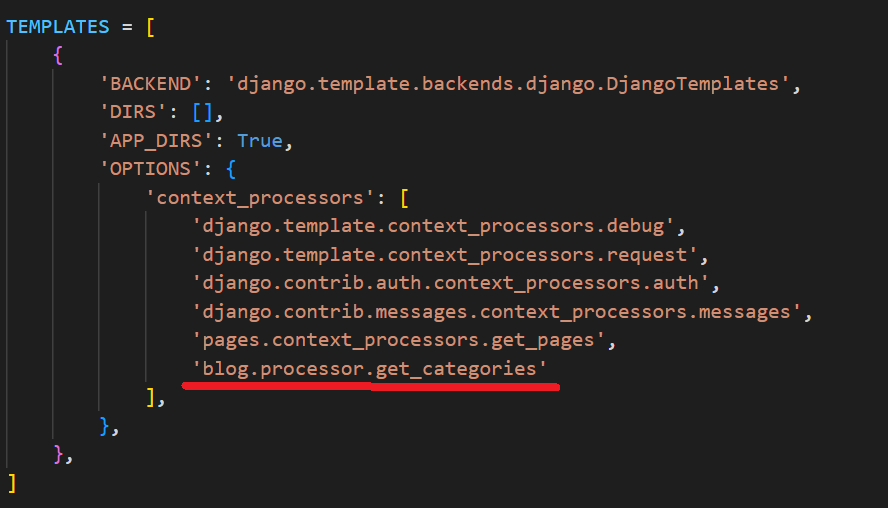
</p> 

* En el archivo layout.html(RDDD-apps\django\ProyectoDjango\mainapp\templates\layouts\layout.html) añade un bucle for para que sean añadidas las categorías.

<p align="center">
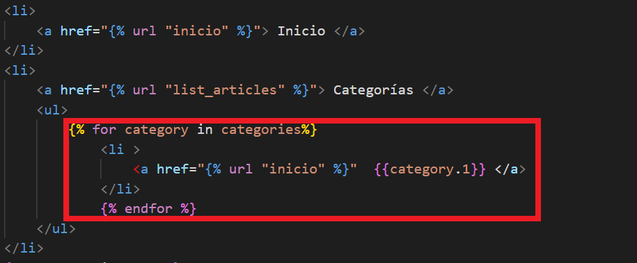
</p>

<p align="center">
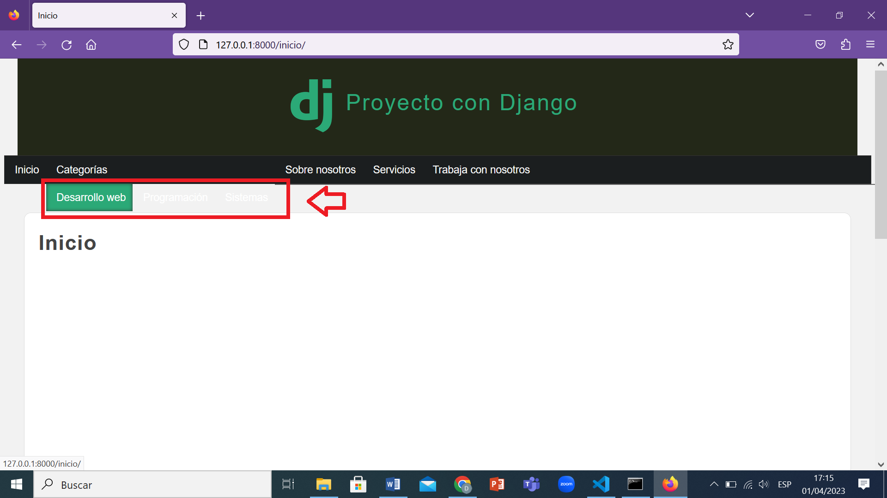
</p>

Subconsultas en Django
===========

* * *

Dado el escenario de que se tuvieramos miles de categorías y no todas tienen artículos creados, entonces, dichas categorías no deben ser mostradas en la barra de navegación.

* En el archivo processor.py de la carpeta blog, modifícalo de tal forma que tenga la siguiente estructura.

```py
from blog.models import Category, Article

def get_categories(request):
    categories_in_use = Article.objects.filter(public=True).values_list('categories' , flat=True)
    categories = Category.objects.filter(id__in=categories_in_use).values_list('id', 'name')
    return{
        'categories' : categories,
        'ids' : categories_in_use
    }
```

Página para cada categoría
===========

* * *

* En el archivo views.py(django\ProyectoDjango\blog\views.py) inserta las siguientes instrucciones.

```py
def category(request, category_id):
    category = Category.objects.get(id=category_id)
    return render(request, 'categories/category.html', {
        'category' : category
    })
```
* En la siguiente ruta(django\ProyectoDjango\blog\templates\categories) crea el archivo category.html.

<p align="center">
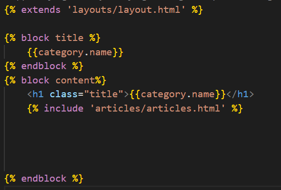
</p>

* En la carpeta article crea el archivo article.html.(django\ProyectoDjango\blog\templates\categories\article.html)

<p align="center">
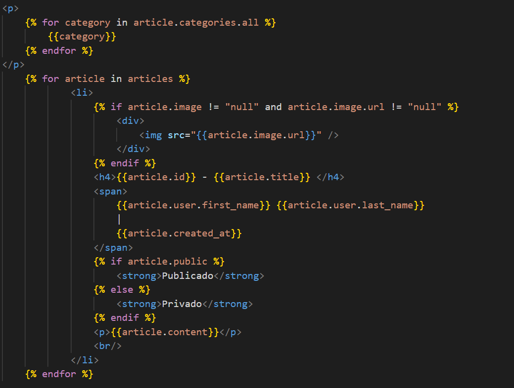
</p>

* En el archivo urls.py(django\ProyectoDjango\blog\urls.py) debemos cargar la ruta para la view que creamos anteriormente. 

<p align="center">
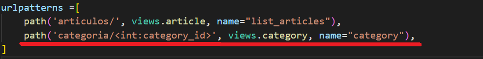
</p>

* Modifica el archivo layout.html(django\ProyectoDjango\mainapp\templates\layouts\layout.html).

<p align="center">
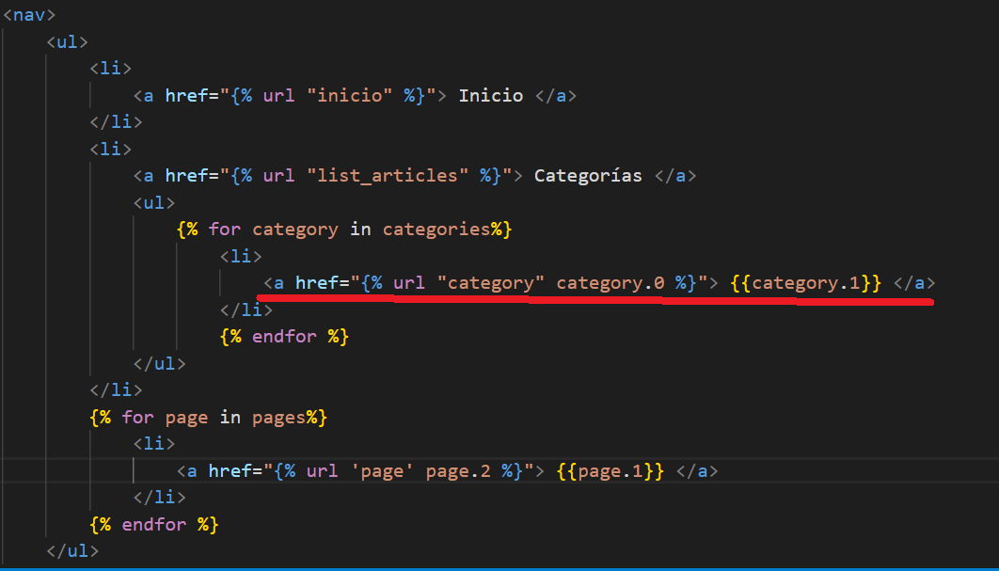
</p>

<p align="center">
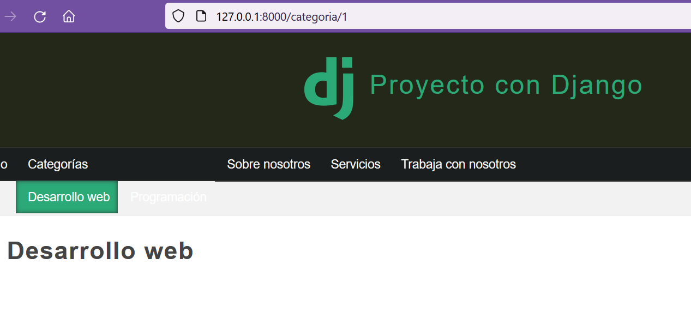
</p>

Mostrar error 404
===========

* * *

Vamos a realizar una configuración para mostrar un página de error 404 en vez de que aprezca la página por defecto en caso de que no exista el id en una categoría.

<p align="center">
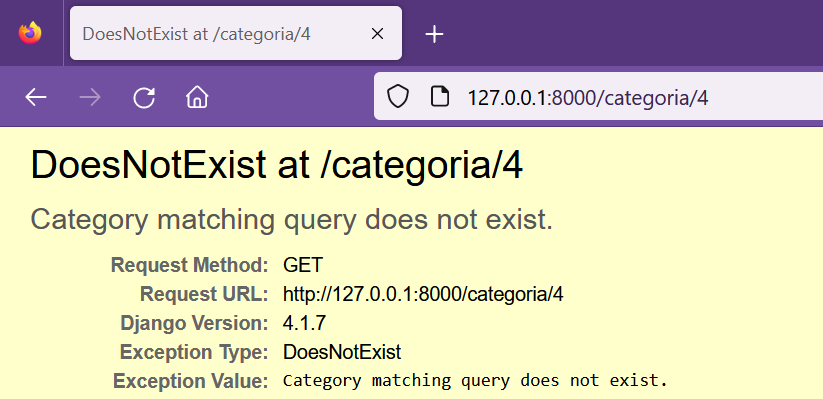
</p>

En el archivo views.py añade el import para el **get_object_or_404**, además se debe usar en la función category.

```py
from django.shortcuts import render, get_object_or_404
def category(request, category_id):
    category = get_object_or_404(Category, id=category_id)
    return render(request, 'categories/category.html', {
        'category' : category
    })
```
<p align="center">
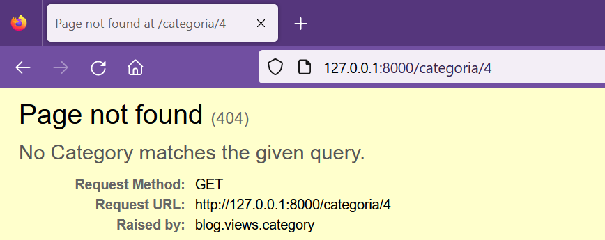
</p>

Datos relacionados entre modelos y relaciones inversas
===========

* * *

Para mostrar el contenido de la categoría añada la siguiente instrucción en el archivo category.html(django\ProyectoDjango\blog\templates\categories\category.html).

<p align="center">
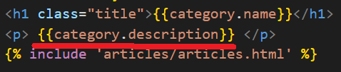
</p>

* En el archivo views.py añade la instrucción de filtrado para obtener los artículos relacionados a dicha categoría y se pueda visualizar.

```py
def category(request, category_id):
    category = get_object_or_404(Category, id=category_id)
    articles =  Article.objects.filter(categories=category_id)
    return render(request, 'categories/category.html', {
        'category' : category,
        'articles' : articles
    })
```